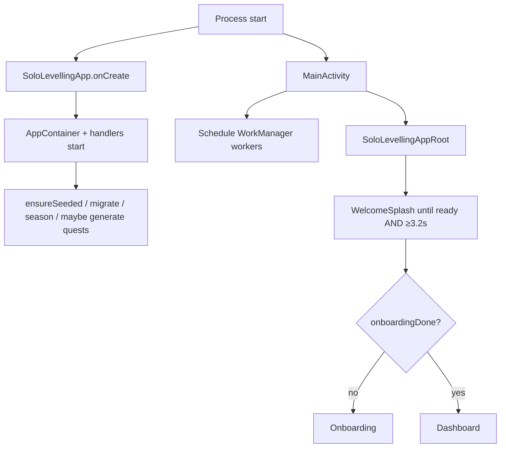

# Solo Levelling — Application Documentation

> Generated from repository analysis of the **actual implementation**. Prefer this document and the running code over older PRD wording when they disagree.  
> Related: [SYSTEM_DESIGN.md](./SYSTEM_DESIGN.md) · [JSON_DATA_REFERENCE.md](./JSON_DATA_REFERENCE.md) · [ARCHITECTURE_ANALYSIS.md](./ARCHITECTURE_ANALYSIS.md) · [../README.md](../README.md) · in-package specs under `app/src/main/java/com/example/solo_levelling/docs/`

**Legend:** Statements without a label are **verified from code**. Items marked **(inference)** are reasonable conclusions. Items marked **Not determined from the repository** could not be confirmed.

---

## 1. Application Overview

**Solo Levelling** is an offline-first Android app that turns real-life habits (career study, workouts, nutrition, focus, journaling) into an RPG-style progression system: daily quests, XP, seven attributes, ranks, streaks, achievements, bosses, and seasons.

Branding in the current UI shell uses **“Sovereign OS”** (dark cyber aesthetic). Package / application ID: `com.example.solo_levelling`. Version: **1.0.2** (versionCode 3).

There is **no backend**, **no remote authentication**, and **no `INTERNET` permission**. A single local player (`PLAYER_ID = 1`) is hardcoded.

---

## 2. Purpose

| Question | Answer |
|----------|--------|
| What problem does it solve? | Makes discipline and skill-building measurable and motivating via game loops (quests → XP → level/rank/attributes). |
| Primary purpose | Local life RPG / habit OS for one user on one device. |
| Inspiration | Solo Leveling fiction (naming/theme); product is a personal productivity MVP, not a multiplayer game. |

---

## 3. Core Features

| Feature | Summary |
|---------|---------|
| Onboarding | Multi-step wizard: name, module toggles (career / workout / diet), optional career & fitness setup → seeds data and generates today’s quests. |
| Dashboard | Level, rank, XP, streak, today’s priority, quests, suggestions, module shortcuts. |
| Quests | Today / weekly / milestone / recovery / boss tabs; complete & undo. |
| Character | Profile, attributes (STR, END, INT, VIT, DISC, FOC, WIS), XP ledger. |
| Analytics | Weekly review, improvement snapshot, season, JSON export via share sheet. |
| Career | Roadmap nodes, DSA problems, system design topics (module-gated). |
| Fitness / Nutrition | Workout logging & diet logging (shared `FitnessScreen`, different initial tab). |
| Modules (Life hub) | Focus timer, journal, metrics (steps/weight), skills, bosses. |
| Achievements | Criteria-based unlocks with bonus XP. |
| Streaks | Daily completion streak; break → recovery overlay + recovery quests (weekly limit). |
| Settings | Targets, schedule, modules, notifications, export, progress wipe. |
| Background jobs | `DailyQuestWorker`, `DayBoundaryWorker` (WorkManager). |
| Local notifications | System channel for level/rank/achievement/recovery/quest-ready events (if enabled). |

---

## 4. Users / Actors

| Actor | Role |
|-------|------|
| **Single local player** | The only end user. No accounts, no multi-user. |
| **Android system** | Launches app, runs WorkManager, delivers notifications. |
| **Developer / QA** | Builds via Gradle; runs JVM unit tests / optional instrumented tests. |

There are no admin, guest, or API consumer roles in the current implementation.

---

## 5. Repository Structure

```
solo-levelling/
├── README.md
├── docs/                          # This documentation set
├── app/
│   ├── build.gradle.kts
│   └── src/
│       ├── main/
│       │   ├── AndroidManifest.xml
│       │   ├── java/com/example/solo_levelling/
│       │   │   ├── SoloLevellingApp / AppContainer / MainActivity
│       │   │   ├── core/          # SystemDefaults, EventBus, clock
│       │   │   ├── data/          # JsonDatabase, entities, seed catalogs
│       │   │   ├── domain/        # services, handlers, logic, ports
│       │   │   ├── ui/            # Compose screens + ViewModels
│       │   │   ├── work/          # WorkManager workers
│       │   │   ├── notifications/
│       │   │   └── docs/          # Product PRD / coverage / UI design notes
│       │   └── res/               # themes, fonts, drawables, raw audio
│       ├── test/                  # JVM unit tests (~49 files)
│       └── androidTest/           # Smoke instrumented test
├── design-app/                    # Design exploration (HTML/PNG); not runtime
├── gradle/                        # Version catalog
└── gradlew*
```

**87** Kotlin sources under main; **49** unit test files; **1** instrumented test class.

---

## 6. Application Modules

### 6.1 Bootstrap & DI

| Piece | Path | Role |
|-------|------|------|
| `SoloLevellingApp` | `AppContainer.kt` (same file) | Application; creates `AppContainer`, notification channel, calls `start()`. |
| `AppContainer` | `AppContainer.kt` | Manual DI: DB, services, handlers, V3 ports. |
| `MainActivity` | `MainActivity.kt` | Schedules workers; `setContent` → Compose root. |
| `SoloLevellingAppRoot` | `ui/SoloLevellingAppRoot.kt` | Splash gate, NavHost, overlays, snackbars. |

### 6.2 Domain services (wired in `AppContainer`)

| Service | Responsibility |
|---------|----------------|
| `ProgressionService` | Award/reverse XP; daily cap; level/rank/attributes; ledger uniqueness. |
| `QuestCompletionService` | Complete/undo with mutex; status checks; undo window. |
| `QuestVerificationService` | MANUAL / TIMER / COUNT / METRIC_THRESHOLD / AUTOMATIC; auto-complete attempts. |
| `QuestGenerationService` | Spawn instances from templates + schedule + module flags. |
| `OnboardingService` | Seed, complete onboarding, migrate module flags, reset progress. |
| `ModuleService` | Career, workouts, diet, focus, journal, metrics, bosses, skills. |
| `AnalyticsService` | Weekly review, personal score, improvement, `exportJson()`. |
| `AdaptiveService` | Completion-rate based XP scaling & suggestions. |
| `DayBoundaryService` | Missed quests, streak decay, recovery spawn at day boundary. |
| `SeasonService` | Active season XP tracking. |

### 6.3 Event handlers

| Handler | Listens for | Effect |
|---------|-------------|--------|
| `StreakHandler` | Quest completed/undone | Update streak; spawn recovery on break. |
| `AchievementHandler` | Quests, streak, level, boss | Evaluate defs → unlock + XP. |
| `BossProgressHandler` | Quest completed/undone | Weighted boss progress. |
| `NotificationHandler` | Level/rank/achievement/recovery/ready/boss | Local notifications. |
| `SyncOutboxHandler` | **All** events | Append to `sync_outbox.json` (transport is no-op). |
| `SeasonHandler` | XP awarded/reversed | Season XP deltas. |

### 6.4 UI modules

Screens live under `ui/<feature>/`. Shared chrome: `ui/components/SovereignChrome.kt`. Theme: `ui/theme/`. Navigation: `ui/navigation/`.

---

## 7. Navigation / Routing

### Routes (`AppRoute.kt`)

| Route string | Screen | Primary bottom tab? |
|--------------|--------|---------------------|
| `onboarding` | OnboardingScreen | No (gate) |
| `dashboard` | DashboardScreen | HOME |
| `quests` | QuestsScreen | QUESTS |
| `analytics` | AnalyticsScreen | PROGRESS |
| `character` | CharacterScreen | SELF |
| `more` | MoreScreen | MORE |
| `career` | CareerScreen | Secondary |
| `fitness` | FitnessScreen (Workout) | Secondary |
| `nutrition` | FitnessScreen (Diet) | Secondary |
| `modules` | ModulesScreen | Secondary |
| `history` | HistoryScreen | Secondary |
| `achievements` | AchievementsScreen | Secondary |
| `settings` | SettingsScreen | Secondary |

Primary tabs are fixed (not reduced when modules are disabled). Disabled module deep-links redirect to `dashboard` (`redirectForDisabledModuleRoute`).

Wide layout (≥840dp): navigation rail replaces bottom bar **(verified in ModuleNavigation)**.

Overlays (not routes): `WelcomeSplash`, `LevelUpHost`, `StreakRecoveryHost`.

---

## 8. Complete User Flows

### 8.1 Cold start



### 8.2 Onboarding

1. NAME (non-blank) → GOALS (≥1 module enabled).  
2. Optional CAREER steps if career enabled.  
3. Optional WORKOUT / DIET steps if those modules enabled.  
4. SUMMARY → `OnboardingService.completeOnboarding` → navigate to Dashboard (onboarding popped).

Invalid steps disable forward navigation; no dedicated error screen.

### 8.3 Daily quest loop

1. Quests generated at bootstrap (if onboarded), by `QuestGenerationService`, and by `DailyQuestWorker`.  
2. User completes quest from Dashboard or Quests.  
3. `QuestCompletionService` → XP via `ProgressionService` → `DomainEvent`s → streak/achievements/boss/season/outbox/notifications.  
4. Possible LevelUp / RankUp overlay; streak snackbars at root.

### 8.4 Undo quest

Within **15 minutes** of completion: undo reverses XP/attributes and emits `QuestUndone` / `XpReversed`. Outside window → failure snackbar.

### 8.5 Streak break & recovery

Day boundary / miss → `StreakBroken` → `StreakRecoveryHost` (reflect → diagnostics → reinit) → navigate to Quests. Recovery quests limited to **3/week**.

### 8.6 Module work

More hub (or Dashboard FAB/shortcuts) → Career / Fitness / Nutrition / Modules → log actions → module service awards XP when applicable.

### 8.7 Settings & wipe

Edit configs → persist in `user.json`. Wipe requires typing exact phrase `CONFIRM_WIPE` → `resetAllProgress` → navigate to Onboarding. Name/configs preserved; progress/quests/logs cleared (workout **routine** retained in current clear logic — verified in data-layer exploration).

### 8.8 Export

Analytics/Settings build JSON string in memory → Android share intent. **No import path.**

### 8.9 Background

- `DailyQuestWorker`: generate daily quests; may emit `DailyQuestsReady`.  
- `DayBoundaryWorker`: run day-boundary logic then regenerate today’s quests.

Exact WorkManager periodicity details: see worker source; schedule is set from `MainActivity`.

---

## 9. Feature-by-Feature Behavior

### Dashboard

- **State:** `DashboardViewModel` observes profile, quests, streak, season, suggestions, modules.  
- **Actions:** complete quests, open shortcuts, FAB dial (add task / log workout / add meal / weight).  
- **Empty:** `SystemIdleEmpty` when no missions.  
- **Errors:** snackbars for completion failures / daily cap.

### Quests

- Tabs for channels (today, weekly, milestones, recovery, bosses).  
- Complete/undo with result messages.  
- Empty per tab via `SystemIdleEmpty`.

### Character

- Read-oriented profile + attributes + ledger.  
- Empty attributes message if none initialized.

### Analytics

- Loads review/improvement via `LaunchedEffect` (no ViewModel).  
- Export share.  
- **(inference)** MONTH chip appears non-interactive in current UI.

### Career / Fitness / Nutrition / Modules / History / Achievements / Settings / More

See screen inventory in §7; each uses ViewModels (except Analytics) and `ModuleService` / domain logic as appropriate. Module routes gated by `module_career` / `module_workout` / `module_diet` config flags.

---

## 10. Business Rules

| Rule | Value / behavior | Location |
|------|------------------|----------|
| Single player ID | `1L` | `SystemDefaults.PLAYER_ID` |
| Daily XP cap | **500** | `SystemDefaults.DAILY_XP_CAP` |
| Quest undo window | 15 minutes | `QUEST_UNDO_MINUTES` |
| Weekly recovery limit | 3 | `WEEKLY_RECOVERY_LIMIT` |
| Streak grace days | 0 default; overridable via config key `STREAK_GRACE_DAYS` | `STREAK_GRACE_DAYS` |
| Level XP need | `floor(100 × level^1.35)` | `xpForNextLevel` |
| Ranks | E@1, D@6, C@11, B@21, A@36, S@51, SS@76, MONARCH@100 | `RANK_THRESHOLDS` |
| XP uniqueness | `(sourceType, sourceId)` — duplicates rejected | `ProgressionService` / XpDao |
| Completable statuses | `AVAILABLE`, `IN_PROGRESS` | `QuestCompletionService` |
| Attributes | STR, END, INT, VIT, DISC, FOC, WIS | `AttributeCode` |
| Min one module | Cannot disable all modules in Settings/Onboarding | UI + flags |
| Wipe confirm | Exact string `CONFIRM_WIPE` | `SettingsScreen` |
| Level soft ceiling in calc | Loop stops above level 500 in `levelFromTotalXp` | `SystemDefaults` |

Seeded defaults: **10** quest templates (incl. recovery), **8** achievements, **12** career nodes, **13** DSA starters, **7** system design topics (`SeedData.kt`).

---

## 11. Forms and Validation

| Area | Mechanism |
|------|-----------|
| Shared helpers | `EntryValidation` — non-blank, positive numbers, `firstError` aggregator. |
| Onboarding | `isOnboardingStepValid` — name, ≥1 module, career intent, workout plan / diet body metrics. |
| Settings wipe | Exact confirm phrase. |
| Module inputs | Validation messages → snackbars. |

There is no separate form framework; Compose local state + service calls.

---

## 12. API / Backend Behavior

**None.** No HTTP client dependencies in `app/build.gradle.kts`. No REST endpoints.

Future seams (no-op today):

| Port | Impl | Intended future |
|------|------|-----------------|
| `MetricIngestPort` | `LocalMetricIngest` | Health Connect / wearables |
| `CalendarPort` | `NoOpCalendarPort` | Calendar OAuth busy blocks |
| `SyncTransportPort` | `NoOpSyncTransport` | Push `sync_outbox.json` |

---

## 13. Authentication

**Not implemented.** No login, tokens, sessions, or route auth. Local device ownership is the only “security” boundary (app-private `filesDir`).

---

## 14. Data Models

Key entities (`data/db/entity/Entities.kt`):

- **Player:** `PlayerProfileEntity` (merged identity + progression), `AttributeStatEntity`, `StreakStateEntity`, `UserConfigEntity`
- **Quests:** `QuestTemplateEntity`, `QuestInstanceEntity`
- **XP:** `XpLedgerEntryEntity` (append-only source of truth)
- **Achievements:** `AchievementDefEntity`, `PlayerAchievementEntity`
- **Career:** `CareerNodeEntity`, `DsaProblemEntity`, `SystemDesignTopicEntity`
- **Fitness:** `WorkoutRoutineEntity`, `WorkoutLogEntity`, `DietLogEntity`, meals/foods/sets
- **Life:** `FocusSessionEntity`, `JournalEntryEntity`, `MetricLogEntity`, `SkillEntity`, `BossEntity`, `SeasonEntity`
- **Sync:** `SyncOutboxEntity`

Enums: `QuestStatus`, `QuestType`, `VerificationType`, `AttributeCode` (`domain/model/Models.kt`).

Persistence shapes for JSON wrappers: see [JSON_DATA_REFERENCE.md](./JSON_DATA_REFERENCE.md).

---

## 15. JSON Data

- **Checked-in application JSON:** none.  
- **Runtime:** Gson-serialized files under `{filesDir}/db/` created on device.  
- **Static catalogs:** Kotlin objects (`SeedData`, `WorkoutCatalog`, `FoodCatalog`), not `.json` files.  
- Full inventory: [JSON_DATA_REFERENCE.md](./JSON_DATA_REFERENCE.md).

---

## 16. Storage

| Store | What | Lifetime |
|-------|------|----------|
| `filesDir/db/*.json` | All user & progress data | Until wipe / uninstall |
| In-memory `JsonDatabase` collections + Flows | Hot cache of same data | Process lifetime |
| WorkManager | Job schedules | System-managed |
| Notification channel | System channel id `system_events` | Device |
| Share intent | Ephemeral export string | Not persisted by app |

No Room, SharedPreferences, or DataStore in the active app dependencies/code path.

---

## 17. Loading / Empty / Error States

| Pattern | Behavior |
|---------|----------|
| Loading | Splash (≥3.2s + seed ready). Screens generally render Flow defaults immediately — **no** widespread `CircularProgressIndicator`. |
| Empty | `SystemIdleEmpty` with bracketed copy + optional CTA. |
| Errors | Snackbars; disabled buttons; Settings wipe `AlertDialog`. No dedicated full-screen error routes. |
| Silent failures | Splash audio; some `runCatching` paths (e.g. analytics snapshot for level-up). |

---

## 18. Edge Cases & Scenarios

| Scenario | Behavior |
|----------|----------|
| Daily XP exhausted | Award truncated / completion may report daily cap. |
| Duplicate XP source | Insert rejected (`SQLiteConstraintException` used as uniqueness signal). |
| Duplicate quest instance same day | Insert returns `-1`. |
| Malformed task/log JSON | Skipped on load (task/workout/diet logs). |
| Malformed core files (`user.json` / `progress.json`) | Gson may throw during `loadAll` → **(inference)** app crash risk. |
| Navigate to disabled module | Redirect Dashboard. |
| Disable all modules | Rejected. |
| Undo after overlay | `XpReversed` / `QuestUndone` clears pending level-up overlay. |
| Legacy flat workout/nutrition files | Migrated once to per-day logs; legacy files deleted. |
| Previous Room install | README advises uninstall for clean JSON store. |

---

## 19. External Integrations

| Integration | Status |
|-------------|--------|
| Network APIs | Absent |
| Auth providers | Absent |
| Analytics SDKs | Absent |
| Health Connect | Port only; local metrics JSON |
| Android Share | Export JSON |
| Local notifications | Implemented |
| MediaPlayer | Splash SFX `R.raw.okiro_deep` |

---

## 20. Configuration

| Config | Notes |
|--------|-------|
| `local.properties` | Gitignored Android SDK path; **not** read by app logic. Do not commit. |
| `gradle.properties` | JVM / AndroidX flags only. |
| `SystemDefaults` | Hardcoded game rules. |
| `user_config` in `user.json` | Runtime tunables (targets, modules, schedule, notifications, onboarding fields). |
| Build | `minSdk 23`, `targetSdk 37`, `compileSdk 37`, Java 11 bytecode + desugaring. |

No feature-flag service. No secrets in app source.

---

## 21. Testing

| Layer | Framework | Coverage |
|-------|-----------|----------|
| Unit | JUnit 4, coroutines-test, Robolectric | Domain services, logic, JsonDatabase, navigation helpers, some ViewModels/UI pure helpers |
| Instrumented | AndroidJUnit4 + Espresso/Compose test deps | Package-name smoke only (`ExampleInstrumentedTest`) |

Commands (from README / Gradle):

```bash
./gradlew assembleDebug
./gradlew installDebug
./gradlew test
./gradlew :app:testDebugUnitTest
./gradlew :app:connectedDebugAndroidTest   # device/emulator
```

**Gaps:** Almost no Compose UI / E2E coverage; handlers like notifications/sync lightly or untested; Analytics screen lightly covered.

---

## 22. Common Development Workflows

1. Open in Android Studio or use `./gradlew installDebug`.  
2. Prefer JDK 17 or 21 (README: Robolectric unreliable on very new JDKs such as 25).  
3. After Room-era installs, uninstall before testing JSON persistence.  
4. Inspect device data: app private `filesDir/db/` (via Device File Explorer).  
5. Run focused unit tests under `app/src/test/java/com/example/solo_levelling/...`.  
6. UI redesign references: `design-app/DESIGN.md` and `docs/ui-ux-design-system.md` (in package).

---

## 23. Known Limitations / Technical Debt

| Item | Notes |
|------|-------|
| Doc drift | Older docs/`implementation-coverage` may still mention Room; runtime is `JsonDatabase`. README table still lists legacy flat `workouts.json` / `nutrition.json` as primary — code uses `workouts/logs/` + `diet/logs/`. |
| Unused catalog deps | `libs.versions.toml` may list Room/DataStore/KSP unused by `app/build.gradle.kts`. |
| Sync outbox | Persisted but never transported. |
| Corrupt core JSON | Limited resilience on critical files. |
| UI test debt | Logic-heavy unit tests; weak UI automation. |
| Backup | `allowBackup="true"`; `backup_rules.xml` / `data_extraction_rules.xml` are largely empty sample stubs — **(inference)** Auto Backup may include app file data unless excluded elsewhere. |
| Analytics MONTH UX | **(inference)** unfinished. |

---

## 24. Glossary

| Term | Meaning |
|------|---------|
| Hunter | Default player name / theme term for the user. |
| Sovereign OS | Current UI shell branding. |
| Quest template | Recurring definition used to spawn dated instances. |
| Quest instance | A scheduled quest for a specific date (`tasks/task-*.json`). |
| XP ledger | Append-only list of XP events; source of truth for progression. |
| Attribute | One of seven stats progressed via rewards JSON on quests. |
| Module | Feature area gated by config: career, workout, diet. |
| EventBus | In-process `SharedFlow` of `DomainEvent` (not Android LocalBroadcast). |
| Recovery quest | Special quest after streak break; weekly capped. |
| Day boundary | Midnight-adjacent job that marks misses and decays streak. |

---

## 25. Quick Start for a New Developer

1. Read this file + [SYSTEM_DESIGN.md](./SYSTEM_DESIGN.md) + root [README.md](../README.md).  
2. Skim `AppContainer.kt` (wiring) and `SystemDefaults.kt` (rules).  
3. Trace one complete quest: `QuestsScreen` → `QuestCompletionService` → `ProgressionService` → `EventBus` → `StreakHandler` / `AchievementHandler`.  
4. Open `JsonDatabase.kt` companion constants for on-disk layout; read [JSON_DATA_REFERENCE.md](./JSON_DATA_REFERENCE.md).  
5. Build: `./gradlew assembleDebug` and install on API 23+ emulator.  
6. Complete onboarding, finish a quest, force-stop/relaunch to confirm JSON persistence.  
7. Run `./gradlew :app:testDebugUnitTest`.  
8. For product intent vs gaps, compare `app/.../docs/app-architecture.md` with `implementation-coverage.md` — **prefer code when they conflict**.

---

*Document reflects the repository as analyzed. When behavior changes, update these docs alongside the code.*
