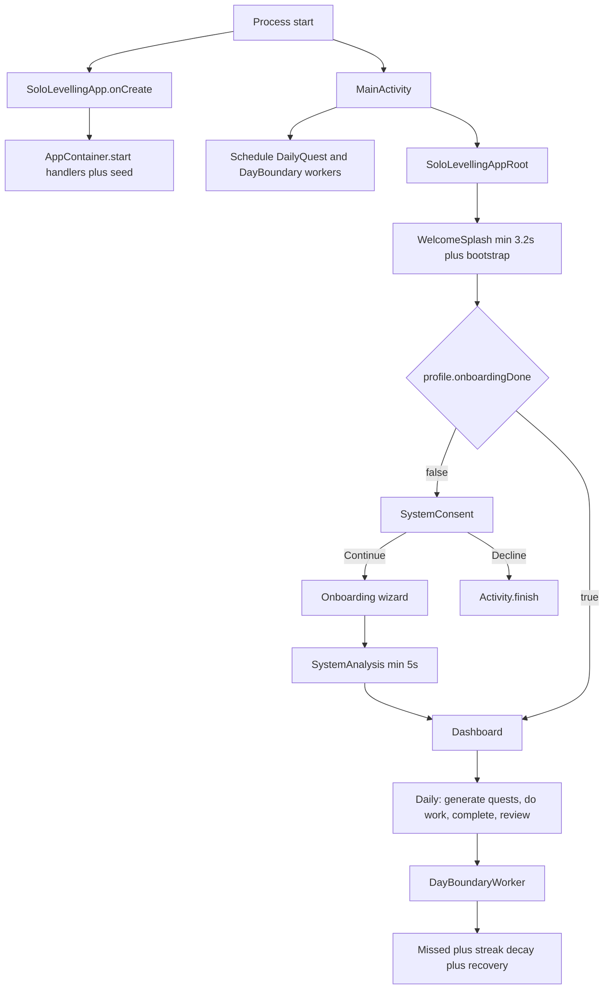
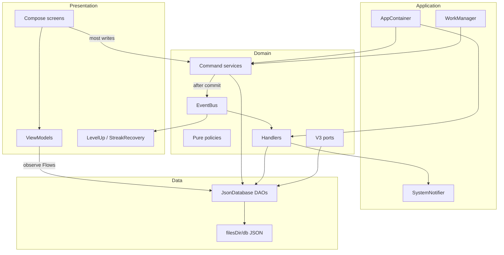
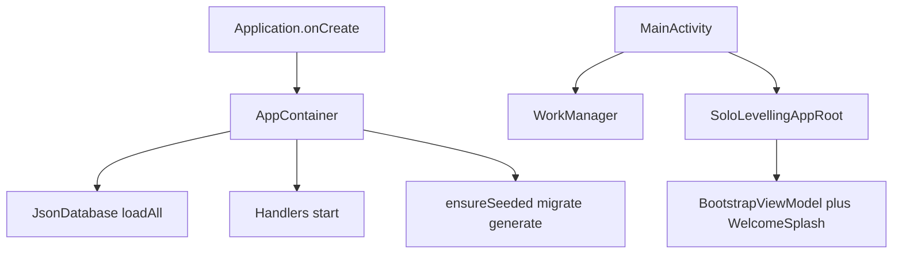
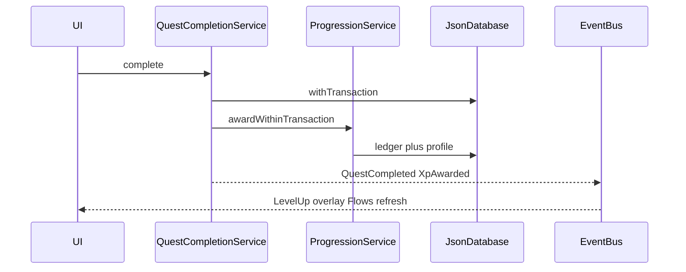
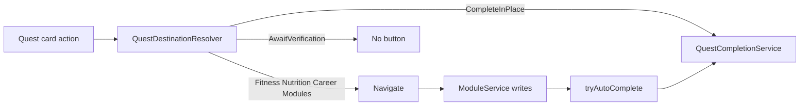
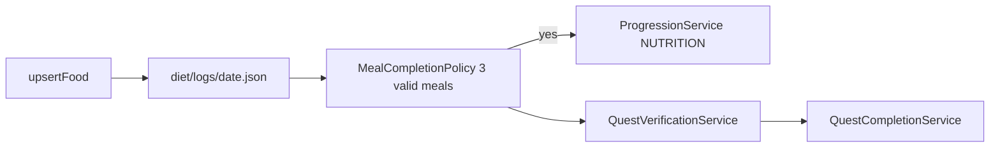
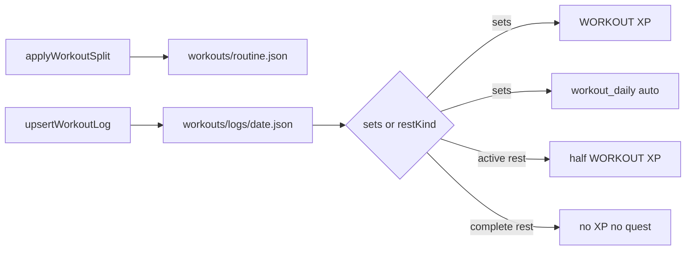
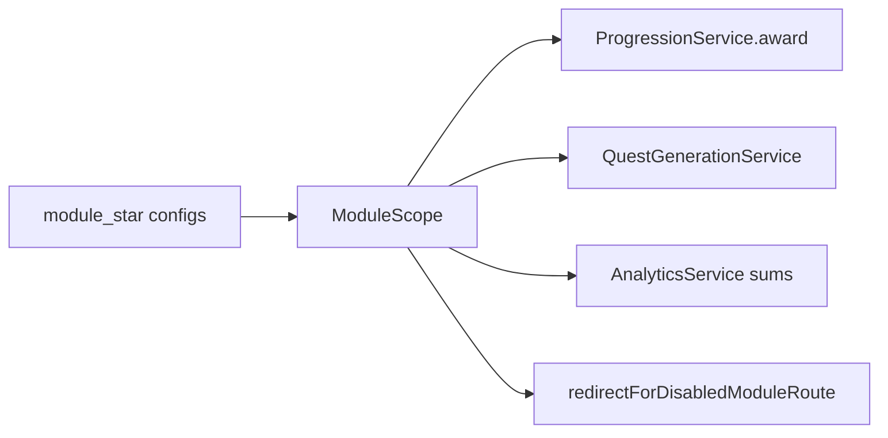
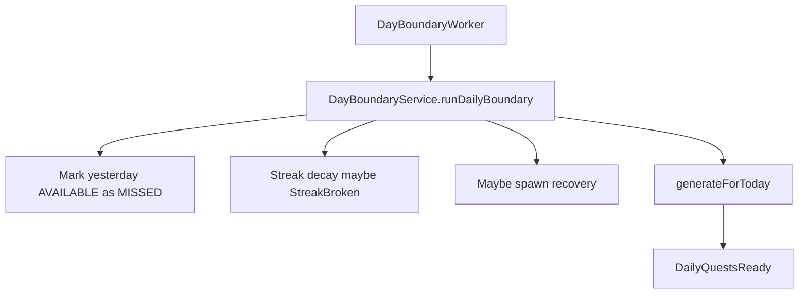
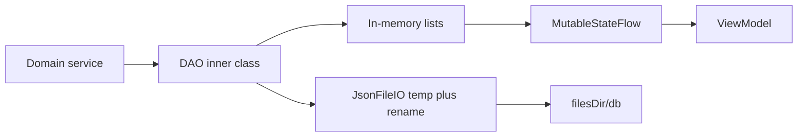

# Solo Levelling — Complete Architecture Analysis

> **Canonical onboarding reference:** [architecture-and-system-design.md](./architecture-and-system-design.md)  
> This file remains the deep change-oriented map (diet/workout/quest routing, isolation, “how to change X”). Prefer the canonical doc first for new developers.
>
> Related: [SYSTEM_DESIGN.md](./SYSTEM_DESIGN.md) · [APP_DOCUMENTATION.md](./APP_DOCUMENTATION.md) · [JSON_DATA_REFERENCE.md](./JSON_DATA_REFERENCE.md) · [README.md](../README.md)

**Generated:** 2026-08-18 from repository inspection.  
**Source of truth:** Kotlin under `app/src/main/java/com/example/solo_levelling/`.  
**When docs disagree with code, code wins.** Known drift is listed in [§37](#37-documentation-vs-code).

This is an analysis of **what exists**. It is not a backlog. Do not treat every weakness as something to fix in one pass.

---

## Contents

1. [Executive summary](#1-executive-summary)
2. [Product purpose](#2-product-purpose)
3. [User journey](#3-user-journey)
4. [Feature inventory](#4-feature-inventory)
5. [Architecture overview](#5-architecture-overview)
6. [Layer-by-layer architecture](#6-layer-by-layer-architecture)
7. [Dependency flow](#7-dependency-flow)
8. [Navigation](#8-navigation-architecture)
9. [Modules](#9-module-architecture)
10. [Quests](#10-quest-architecture)
11. [Progression](#11-progression-architecture)
12. [Attributes](#12-attribute-architecture)
13. [Workout](#13-workout-architecture)
14. [Diet](#14-diet-architecture)
15. [Career](#15-career-architecture)
16. [Life modules](#16-life-modules-architecture)
17. [Analytics](#17-analytics-architecture)
18. [Onboarding](#18-onboarding-architecture)
19. [Consent](#19-consent-architecture)
20. [Persistence / JSON](#20-persistence--json-architecture)
21. [EventBus](#21-eventbus-architecture)
22. [Background workers](#22-background-worker-architecture)
23. [Notifications](#23-notification-architecture)
24. [UI](#24-ui-architecture)
25. [Data-flow diagrams](#25-data-flow-diagrams)
26. [Business rules](#26-important-business-rules)
27. [Module isolation](#27-module-isolation-rules)
28. [Cross-module dependencies](#28-cross-module-dependencies)
29. [Architectural weaknesses](#29-current-architectural-weaknesses)
30. [UX / wiring weaknesses](#30-current-ux--wiring-weaknesses)
31. [Potential bugs](#31-potential-bugs)
32. [Technical debt](#32-technical-debt)
33. [Testing gaps](#33-testing-gaps)
34. [Recommended improvements](#34-recommended-architecture-improvements)
35. [Safe areas for future changes](#35-safe-areas-for-future-changes)
36. [Do not change casually](#36-areas-that-should-not-be-changed-casually)
37. [Documentation vs code](#37-documentation-vs-code)
38. [Sources of truth](#38-sources-of-truth)
39. [How to change X](#39-how-to-change-x)
40. [How to work on this repository safely](#40-how-to-work-on-this-repository-safely)

---

## 1. Executive Summary

Solo Levelling is a **single-player, offline Android life OS** packaged as an RPG. Real actions (DSA, workouts, meals, focus, journal) become quests that award XP, attributes, ranks, streaks, and achievements.

It is a **layered monolith**:

```
Compose UI
  → ViewModels (mostly reads)
  → domain command services
  → JsonDatabase DAOs
  → JSON files under filesDir/db/
```

After a successful transaction, services publish **`DomainEvent`s** on an in-process **`EventBus`**. Handlers apply side effects (streak, achievements, boss, season, notifications, sync outbox).

There is **no backend, no Room, no Repository layer, no Command bus, no INTERNET permission, no auth**. One hardcoded player: `SystemDefaults.PLAYER_ID = 1`.

Three **opt-in modules** (Career, Workout, Diet) plus a **GLOBAL layer** that always runs (focus, journal, untagged quests, bosses, achievements, recovery). Module isolation is real for **new XP and new quest generation**, but **not complete**: attributes are not rebuilt on module toggle; History / Character / export show unfiltered ledger; GLOBAL systems still affect streaks and weekly scores.

DI is manual in [`AppContainer.kt`](../app/src/main/java/com/example/solo_levelling/AppContainer.kt).

---

## 2. Product Purpose

The product exists to make personal growth **visible, measurable, and rewarding** without becoming the activity itself.

Philosophy encoded in the running app:

```
real-world action
  → evidence in module logs
  → quest verification
  → XP ledger
  → level / rank / attributes / streak
  → weekly review
  → next action
```

| Question | Answer |
|----------|--------|
| Who is it for? | One local player on one device |
| What is it? | Personal growth OS with RPG loops |
| What is it not? | Multiplayer game, calorie-restriction coach, networked SaaS |
| Why RPG chrome? | Motivation (Sovereign OS / SYSTEM copy). The achievement is real-life consistency. |

Modules the app tries to improve: Career, Fitness, Nutrition, Focus, Discipline, Reflection, health habits, Skills, Consistency.

---

## 3. User Journey



- Returning users skip consent / onboarding / analysis.
- Progress wipe in Settings sets `onboardingDone = false` and navigates to **consent**, not onboarding.
- Splash runs on every cold start (minimum ~3.2 seconds).

---

## 4. Feature Inventory

| Surface | Route / host | What it does |
|---------|--------------|----------------|
| Consent | `system_consent` | FTUE copy gate. **Not persisted.** Continue or exit app. |
| Onboarding | `onboarding` | Name, module toggles, optional career / fitness / diet setup. |
| System Analysis | `system_analysis` | 5s ritual + `OnboardingService.completeOnboarding`. |
| Dashboard | `dashboard` | Level, XP, streak, today’s quests, module shortcuts, suggestions. |
| Quests | `quests` | Today / weekly / milestone / recovery / bosses; complete / undo. |
| Character | `character` | Profile, 7 attributes, XP ledger (**unfiltered**). |
| Analytics | `analytics` | Weekly review, personal score, season, export. |
| Career | `career` | Roadmap (mostly read-only), DSA, system design. |
| Fitness | `fitness` | Split, training day, sets, rest, history. |
| Nutrition | `nutrition` | Same `FitnessScreen`, diet tab; meals, foods, macros. |
| Life hub | `modules` | Focus, journal, metrics, bosses; DSA / skills if career on. |
| Achievements | `achievements` | Criteria unlocks + bonus XP. |
| History | `history` | Workout / diet sections gated; recent XP **unfiltered**. |
| More | `more` | Secondary hub. |
| Settings | `settings` | Targets, modules, notifications, rebuild, wipe, export. |
| Overlays | not routes | `LevelUpHost`, `StreakRecoveryHost`. |
| Workers | WorkManager | Daily quest gen, day-boundary miss / decay. |

---

## 5. Architecture Overview



**Deviation from textbook MVVM:** ViewModels are **read-heavy**. Most mutations happen in composables via `container.*` (for example `questCompletion.complete`, `modules.upsertFood`). That is the current pattern, not an accident.

---

## 6. Layer-by-Layer Architecture

| Layer | Path | Role |
|-------|------|------|
| Application | [`AppContainer.kt`](../app/src/main/java/com/example/solo_levelling/AppContainer.kt), [`MainActivity.kt`](../app/src/main/java/com/example/solo_levelling/MainActivity.kt) | Process entry, manual DI, worker schedule, notification channel |
| Core | [`core/`](../app/src/main/java/com/example/solo_levelling/core/) | `SystemDefaults`, `AppClock`, `EventBus`, `DomainEvent` |
| Domain services | [`domain/service/`](../app/src/main/java/com/example/solo_levelling/domain/service/) | Authoritative writes and rules |
| Domain logic | [`domain/logic/`](../app/src/main/java/com/example/solo_levelling/domain/logic/) | Pure policies (dates, meals, streaks, boss math) |
| Domain handlers | [`domain/handler/`](../app/src/main/java/com/example/solo_levelling/domain/handler/) | EventBus subscribers |
| Domain ports | [`domain/port/`](../app/src/main/java/com/example/solo_levelling/domain/port/) | `LocalMetricIngest` (live); calendar / sync are no-ops |
| Domain copy | [`domain/copy/SystemMessages.kt`](../app/src/main/java/com/example/solo_levelling/domain/copy/SystemMessages.kt) | SYSTEM voice strings |
| Data | [`data/db/`](../app/src/main/java/com/example/solo_levelling/data/db/), [`data/seed/`](../app/src/main/java/com/example/solo_levelling/data/seed/) | JSON store, entities, catalogs |
| UI | [`ui/`](../app/src/main/java/com/example/solo_levelling/ui/) | Compose screens, ViewModels, Sovereign chrome |
| Work | [`work/`](../app/src/main/java/com/example/solo_levelling/work/) | `DailyQuestWorker`, `DayBoundaryWorker` |
| Notifications | [`notifications/SystemNotifier.kt`](../app/src/main/java/com/example/solo_levelling/notifications/SystemNotifier.kt) | Local notices |

### Domain command surface

| Service | Responsibility |
|---------|----------------|
| `ProgressionService` | Ledger, daily cap 500, level / rank / attributes, module gating, rebuild |
| `QuestCompletionService` | Complete / undo, mutex, date policy, milestone gate |
| `QuestVerificationService` | MANUAL / TIMER / COUNT / METRIC / AUTOMATIC + auto-complete from evidence |
| `QuestGenerationService` | Daily / weekly / milestone instances from templates; dependency unlock via events |
| `ModuleService` | DSA, workouts, meals, focus, journal, bosses, skills |
| `OnboardingService` | Seed, complete onboarding, module flags, reset |
| `DayBoundaryService` | Missed quests, streak decay, recovery spawn |
| `AnalyticsService` / `AdaptiveService` / `PriorityEngine` | Review, suggestions, next action |
| `MilestoneVerificationService` | Weekly milestone readiness |
| `NutritionFeedbackService` | Post-meal copy (presentation only) |
| `SeasonService` | 12-week season XP |

### State kinds

| Kind | Example |
|------|---------|
| Source of truth | `xp_ledger.json`, quest instance files, workout / diet day logs, `module_*` configs |
| Derived / projection | `profile.totalXp`, `level`, `rank`, season XP |
| Incremental (not rebuilt) | Attribute `currentValue` / `lifetimeXp` |
| Cached | In-memory `JsonDatabase` collections + `MutableStateFlow` |
| Event-driven | Streak, achievements, boss progress, notifications, outbox |
| UI-only | Selected quest tab, date picker, modal visibility, `careerSection` / `modulesSection` in root |

---

## 7. Dependency Flow

Typical **write**:

```
Composable
  → AppContainer.service.method()
  → JsonDatabase DAO (mutex / withTransaction)
  → targeted JSON file write
  → MutableStateFlow emit
  → ViewModel StateFlow
  → UI recomposes
```

Typical **side effect**:

```
Service publishes DomainEvent after commit
  → EventBus SharedFlow (buffer 64)
  → handlers collect in parallel
  → more DAO writes and/or notifications / overlays
```

UI **never publishes commands** on the bus. The bus carries past-tense facts only.

---

## 8. Navigation Architecture

| File | Role |
|------|------|
| [`AppRoute.kt`](../app/src/main/java/com/example/solo_levelling/ui/navigation/AppRoute.kt) | Route strings |
| [`SoloLevellingAppRoot.kt`](../app/src/main/java/com/example/solo_levelling/ui/SoloLevellingAppRoot.kt) | NavHost, splash gate, FAB, overlays |
| [`ModuleNavigation.kt`](../app/src/main/java/com/example/solo_levelling/ui/navigation/ModuleNavigation.kt) | Tabs, restore, disabled redirects, selected tab |
| [`QuestDestinationResolver.kt`](../app/src/main/java/com/example/solo_levelling/ui/navigation/QuestDestinationResolver.kt) | Quest START / LOG / COMPLETE destination |

### Primary tabs (fixed, not module-filtered)

HOME (`dashboard`) · QUESTS (`quests`) · PROGRESS (`analytics`) · SELF (`character`) · MORE (`more`)

Career, Fitness, Nutrition, Modules are **secondary** and highlight **MORE**. History and Achievements highlight **PROGRESS**.

Wide layout (`screenWidthDp >= 840`): navigation rail instead of bottom bar.

### Restore rules

| Tab | Restore saved child stack? |
|-----|----------------------------|
| HOME, QUESTS, MORE | No — always open root |
| PROGRESS, SELF | Yes |

This is why returning Home does not keep Fitness, and returning Quests does not keep a child. Opening Fitness from a **HOME quest still highlights MORE** because `selectedPrimaryRoute` maps `fitness` → MORE.

### Disabled-module redirects

Only `career` / `fitness` / `nutrition` → Dashboard. **`modules` is not redirected.**

### Quest action routing

| Quest | Destination | Completes when |
|-------|-------------|----------------|
| TIMER (`deep_work`) | Modules / focus | Focus minutes ≥ target |
| METRIC (`steps`) | Modules / metrics | Metric threshold (even if tagged `module_workout`) |
| AUTOMATIC (`weekly_review`) | AwaitVerification (no button) | All week quests done |
| `module_workout` MANUAL | Fitness | Workout log has **sets** |
| `module_diet` MANUAL | Nutrition | ≥3 valid meals |
| career COUNT | Career / DSA | 2 DSA solves |
| system_design | Career / system design | `SD_CONCEPT` ledger today |
| journal | Modules / journal | Non-blank journal |
| recovery / milestone / other global MANUAL | CompleteInPlace | Immediate `complete()` |

Deep-link section state (`careerSection`, `modulesSection`) lives in root `remember`, **not Nav arguments**. Re-navigating to an already-shown Career/Modules route can leave a stale tab/scroll.

---

## 9. Module Architecture

Configurable flags in `user.json` via [`ModuleFlags.kt`](../app/src/main/java/com/example/solo_levelling/domain/service/ModuleFlags.kt):

- `module_career`
- `module_workout`
- `module_diet`

Boundary: [`ModuleScope.kt`](../app/src/main/java/com/example/solo_levelling/domain/service/ModuleScope.kt)

| Always on (GLOBAL) | Opt-in |
|--------------------|--------|
| Focus, Journal | Career (DSA, SD, career-tagged quests) |
| Metrics ingest | Workout (workout XP, `workout_daily`, `steps` quest) |
| Bosses | Diet (nutrition XP, `nutrition_daily`) |
| Untagged quests: `deep_work`, `journal`, `weekly_review`, `first_week_complete`, `recovery` | |
| Achievement XP, Boss XP | |

**Defaults**

| State | Resolved modules |
|-------|------------------|
| Pre-onboarding, keys missing | All false |
| Post-onboarding, keys missing (legacy) | All true (migration) |
| Onboarding with zero selected | Career-only fallback |
| Settings | At least one must stay enabled |

`OnboardingService.writeModuleFlags()` writes keys, rebuilds XP/level/rank and season XP, then `generateForToday()`. It does **not** delete old quest instances or rebuild attributes.

---

## 10. Quest Architecture

```
QuestTemplateEntity (SeedData / quest_templates.json)
  → QuestGenerationService
  → QuestInstanceEntity (tasks/task-{id}.json)
  → Dashboard / QuestsScreen
  → QuestDestinationResolver
      → navigate to module  OR  complete in place  OR  await verification
  → ModuleService writes evidence
  → QuestVerificationService.tryAutoComplete
  → QuestCompletionService.complete
  → ProgressionService.awardWithinTransaction
  → DomainEvent.QuestCompleted
  → handlers + UI Flows
```

### Types and verification

Enums in [`Models.kt`](../app/src/main/java/com/example/solo_levelling/domain/model/Models.kt):

- `QuestType`: DAILY, WEEKLY, MILESTONE, BOSS, RECOVERY — **`BOSS` is unused** on templates (bosses are `BossEntity`)
- `VerificationType`: MANUAL, TIMER, COUNT, METRIC_THRESHOLD, AUTOMATIC
- `QuestStatus`: AVAILABLE, IN_PROGRESS, COMPLETED, MISSED, LOCKED — **no FAILED**. **`IN_PROGRESS` is never written in production.**

Seeded templates ([`SeedData.kt`](../app/src/main/java/com/example/solo_levelling/data/seed/SeedData.kt)):

| Key | Type | Verification | Module tag |
|-----|------|--------------|------------|
| `dsa_daily` | DAILY | COUNT 2 | `module_career` |
| `workout_daily` | DAILY | MANUAL | `module_workout` |
| `deep_work` | DAILY | TIMER 90 min | GLOBAL |
| `steps` | DAILY | METRIC 10000 STEPS | `module_workout` |
| `journal` | DAILY | MANUAL | GLOBAL |
| `nutrition_daily` | DAILY | MANUAL | `module_diet` |
| `system_design` | WEEKLY | MANUAL | `module_career` |
| `weekly_review` | WEEKLY | AUTOMATIC | GLOBAL |
| `first_week_complete` | MILESTONE | MANUAL + milestone gate | GLOBAL |
| `recovery` | RECOVERY | MANUAL (one-tap) | GLOBAL |

### Who sets status

| Status | Writer |
|--------|--------|
| AVAILABLE | Generation, undo, dependency unlock, recovery spawn |
| COMPLETED | `QuestCompletionService.complete` |
| MISSED | `DayBoundaryService` for yesterday leftovers |
| LOCKED | Generation when `dependsOnTemplateKey` is unmet |

### Complete / undo

- Mutex on `QuestCompletionService` serializes complete and undo.
- Complete: status in AVAILABLE/IN_PROGRESS → module allowed → date policy → milestone gate → award XP → mark COMPLETED → publish after commit.
- Daily complete: `scheduledDate == today`. Weekly: any day in that ISO week. Milestone: no day check.
- Undo: 15 minutes (`QUEST_UNDO_MINUTES`). Blocked for milestones. Verification can undo with `ignoreWindow` if evidence disappears.
- Idempotent: already COMPLETED → `AlreadyCompleted`; ledger family uniqueness.

### Milestone

[`MilestoneVerificationService`](../app/src/main/java/com/example/solo_levelling/domain/service/MilestoneVerificationService.kt): one instance ever; complete only when all non-AUTOMATIC daily+weekly quests in that week (module-filtered) are COMPLETED.

### Weekly auto-complete caveat

`tryAutoComplete(date)` loads instances with `scheduledDate == date`. Weekly instances use **Sunday** as `scheduledDate`, so mid-week evidence may not auto-complete until week end.

### Generation entry points

`AppContainer.start()`, `DashboardViewModel.init`, `DailyQuestWorker`, `DayBoundaryWorker`. Insert is idempotent per `(templateId, scheduledDate)`.

---

## 11. Progression Architecture

**Writer:** [`ProgressionService`](../app/src/main/java/com/example/solo_levelling/domain/service/ProgressionService.kt)  
**Formulas:** [`SystemDefaults.kt`](../app/src/main/java/com/example/solo_levelling/core/config/SystemDefaults.kt)

| Concern | Rule |
|---------|------|
| XP source of truth | Append-only `xp_ledger.json` |
| Profile total / level / rank | Projections; rebuild from filtered ledger |
| Level curve | `floor(100 × level^1.35)` |
| Ranks | E 1, D 6, C 11, B 21, A 36, S 51, SS 76, MONARCH 100 |
| Daily cap | 500 net, module-filtered; can partial-award |
| Uniqueness | `(sourceType, sourceId)` family + reversal tracking |

### Two XP paths (by design; they stack)

1. **Quest completion** → `QUEST_INSTANCE` + `instance.baseXp` + template attribute JSON
2. **Module activity** → `WORKOUT` / `NUTRITION` / `DSA` / … then `tryAutoComplete` may also complete the matching quest (different `sourceId`)

### XP sources

| sourceType | Typical sourceId | Amount | Module |
|------------|------------------|--------|--------|
| `QUEST_INSTANCE` | `{instanceId}_{ts}_{n}` | template `baseXp` | From tags / metadata |
| `WORKOUT` | `workout_{date}` | 40×scale (20× active rest) | WORKOUT |
| `NUTRITION` | `nutrition_{date}` | 15 | DIET |
| `DSA` | `dsa_{id}` | 25 | CAREER |
| `DSA_MASTER` | `dsa_master_{id}` | 15 | CAREER |
| `SD_CONCEPT` | `sd_{topic}_{concept}` | 10 | CAREER |
| `FOCUS` | `focus_{sessionId}` | `(minutes/15).atLeast(1)*10` | GLOBAL |
| `JOURNAL` | `journal_{date}` | 20 | GLOBAL |
| `ACHIEVEMENT` | `ACH_{key}` | def.rewardXp | GLOBAL |
| `BOSS` | `boss_{id}` | boss.xpReward | GLOBAL |
| `*_UNDO` | `UNDO_*_{ledgerId}` | negative original | From metadata |

Skill XP (`SkillEntity`) is **not** in the player ledger.

UI only computes XP **bar fill** from profile + `SystemDefaults`. It does not maintain a parallel total.

`rebuildActiveFromLedger(modules)` updates **totalXp, level, rank only** — not attributes.

---

## 12. Attribute Architecture

Seven codes: STR, END, INT, VIT, DISC, FOC, WIS.

| Code | Typical sources |
|------|-----------------|
| STR | Workout awards, `workout_daily` |
| END | `steps` quest (no direct module award path) |
| INT | DSA, system design, `dsa_daily` |
| VIT | Workout, nutrition, `nutrition_daily` |
| DISC | Most templates, journal, boss, recovery |
| FOC | Focus sessions, `deep_work` |
| WIS | Journal, system design, weekly review, milestone |

On award: `currentValue` and `lifetimeXp` increase.  
On undo: `currentValue` decreases (`coerceAtLeast(0)`); **`lifetimeXp` never decreases**.  
On module disable: **attribute rows are not rebuilt**.

Analytics hides non-actionable attributes in snapshots; stored values still include disabled-module gains.

---

## 13. Workout Architecture

| Artifact | Location |
|----------|----------|
| Weekly plan | `workouts/routine.json` |
| Daily log | `workouts/logs/{ISO-date}.json` |
| Split catalog | Kotlin [`WorkoutCatalog.kt`](../app/src/main/java/com/example/solo_levelling/data/seed/WorkoutCatalog.kt) |
| Config | `workout_split_id`, map, applied-at, scale in `user.json` |

**Training-day complete** (`WorkoutLogEntity.isTrainingDayComplete`): `restKind` set **or** any exercise has sets.

**Quest `workout_daily`:** requires **sets**. Active rest awards half WORKOUT XP but does **not** complete the quest. Complete rest: day complete, **no XP, no quest**.

Writes: **today only** (`ActivityDatePolicy`). Past is view-only; future is not selectable.

After split lock: Routine tab hidden; planned exercises only; 182-day hold; early change scale 0.75.

Legacy `ModuleService.logWorkout()` still exists and is unused by current Fitness UI.

UI: [`FitnessScreen.kt`](../app/src/main/java/com/example/solo_levelling/ui/fitness/FitnessScreen.kt), [`FitnessViewModel.kt`](../app/src/main/java/com/example/solo_levelling/ui/fitness/FitnessViewModel.kt). Domain: [`ModuleService`](../app/src/main/java/com/example/solo_levelling/domain/service/ModuleService.kt), [`WorkoutSplitLogic.kt`](../app/src/main/java/com/example/solo_levelling/domain/service/WorkoutSplitLogic.kt), [`WorkoutSplitChangeLogic.kt`](../app/src/main/java/com/example/solo_levelling/domain/service/WorkoutSplitChangeLogic.kt).

---

## 14. Diet Architecture

| Artifact | Location |
|----------|----------|
| Daily log | `diet/logs/{ISO-date}.json` |
| Targets | `calorie_target`, `protein_target`, `carb_target`, `fat_target` in `user.json` |
| Food catalog | Kotlin [`FoodCatalog.kt`](../app/src/main/java/com/example/solo_levelling/data/seed/FoodCatalog.kt) |

**Day complete:** ≥ **3 valid meals** ([`MealCompletionPolicy`](../app/src/main/java/com/example/solo_levelling/domain/logic/MealCompletionPolicy.kt)).

A valid meal = at least one named food with any macro > 0. **Category names (Breakfast / Lunch / Dinner / Snack) are UI chips, not a completion requirement.** Hitting calorie/protein targets is **feedback** ([`NutritionFeedbackService`](../app/src/main/java/com/example/solo_levelling/domain/service/NutritionFeedbackService.kt)), not the quest gate.

XP: `NUTRITION` / `nutrition_{date}` / 15 VIT when complete; reversed if valid meals drop below 3.

Future product rules (for example “must hit protein target”) belong in `MealCompletionPolicy` + `QuestVerificationService`, not in Compose.

Same `FitnessScreen` as workout, initial tab `Diet`.

---

## 15. Career Architecture

| Artifact | Location |
|----------|----------|
| Roadmap | `career_nodes.json` |
| DSA | `dsa.json` |
| System design | `career/system-design/topics.json` |
| UI | [`CareerScreen.kt`](../app/src/main/java/com/example/solo_levelling/ui/career/CareerScreen.kt) |

| Action | Ledger XP | Notes |
|--------|-----------|-------|
| DSA attempt | none | Status only |
| DSA solve | 25 (`DSA` / `dsa_{id}`) | Quest COUNT uses solves today |
| DSA master | 15 (`DSA_MASTER`) | |
| SD concept MASTERED | 10 (`SD_CONCEPT`) | Weekly `system_design` quest looks for any SD ledger **today** |
| Career node advance | none | Skill XP +10 only. ModulesScreen “+50 XP” copy is **wrong**. |

CareerScreen roadmap is largely read-only. Node advance lives on `ModulesScreen` when career is on.

---

## 16. Life Modules Architecture

UI: [`ModulesScreen.kt`](../app/src/main/java/com/example/solo_levelling/ui/modules/ModulesScreen.kt) — always reachable via More.

| Feature | XP | Quest |
|---------|----|-------|
| Focus timer | `FOCUS` GLOBAL | `deep_work` TIMER |
| Journal | `JOURNAL` GLOBAL once/day | `journal` MANUAL auto |
| Steps / weight ingest | none directly | `steps` is `module_workout` |
| Routines | none | `tryAutoComplete` only |
| Bosses | `BOSS` GLOBAL on clear | Linked templates respect module tags |
| Skills | separate `skills.json` | Career-fed; UI gated by career |

---

## 17. Analytics Architecture

[`AnalyticsService.kt`](../app/src/main/java/com/example/solo_levelling/domain/service/AnalyticsService.kt)

| Feature | Module filter? |
|---------|----------------|
| Weekly quest counts / XP | Yes (`allowsQuestTemplate` / `allowsXpEntry`) |
| Personal score | Reweights: quests 40%, streak 20%, workout 20% if on, DSA 20% if on |
| Workout / DSA / diet metrics | Null when module off |
| Attribute snapshot / suggestions | Hides non-actionable attrs |
| `exportJson()` ledger | **No** — full ledger |
| Character / History recent XP | **No** |
| Boss card | **No** — shown if an active boss exists |
| GLOBAL quests in the week | Always included |

Personal score is **not** XP. XP = progress amount. Score = weekly execution quality.

Tests: [`AnalyticsModuleIsolationTest.kt`](../app/src/test/java/com/example/solo_levelling/domain/service/AnalyticsModuleIsolationTest.kt).

---

## 18. Onboarding Architecture

[`OnboardingScreen.kt`](../app/src/main/java/com/example/solo_levelling/ui/onboarding/OnboardingScreen.kt) collects `OnboardingInput`. Steps are **dynamic** from selected modules (`buildOnboardingSteps`).

Validation (`isOnboardingStepValid`): name; ≥1 module; career intent if shown; body fields for workout/diet as needed; split map or preferred days.

**Completion is not the SUMMARY button.** SUMMARY navigates to `system_analysis`. [`SystemAnalysisViewModel`](../app/src/main/java/com/example/solo_levelling/ui/analysis/SystemAnalysisViewModel.kt) calls `onboarding.completeOnboarding(input)` in parallel with a 5-second ritual.

`completeOnboarding` writes module flags, career/fitness/diet configs, workout routine, sets `onboardingDone = true`, generates today’s quests.

`lockStartRoute` freezes NavHost start so completing onboarding mid-session does not rebuild the graph.

`pendingOnboardingInput` is **memory-only**. Process death on the analysis screen: no input → redirect to Dashboard (if onboarded) or Consent.

---

## 19. Consent Architecture

[`SystemConsentScreen.kt`](../app/src/main/java/com/example/solo_levelling/ui/consent/SystemConsentScreen.kt)

- Continue → `onboarding`
- Decline → `Activity.finish()`
- **No DB write, no config key, no SharedPreferences**

Every new FTUE and every progress wipe shows consent again. The app cannot distinguish “declined” from “never seen” except that decline exits the process.

---

## 20. Persistence / JSON Architecture

Root: `{context.filesDir}/db/` via [`JsonDatabase.kt`](../app/src/main/java/com/example/solo_levelling/data/db/JsonDatabase.kt) + [`JsonFileIO.kt`](../app/src/main/java/com/example/solo_levelling/data/db/JsonFileIO.kt) (temp file + rename).

Full file inventory: [JSON_DATA_REFERENCE.md](./JSON_DATA_REFERENCE.md).

| Class | Files |
|-------|--------|
| USER / CONFIG | `user.json` |
| PROGRESSION | `progress.json`, `xp_ledger.json`, `achievements.json`, `seasons.json` |
| QUEST | `quest_templates.json`, `tasks/task-*.json` |
| MODULE | `workouts/`, `diet/`, `career_nodes.json`, `dsa.json`, `career/system-design/topics.json`, `focus.json`, `journal.json`, `metrics.json`, `routines.json`, `skills.json`, `bosses.json`, `boss_quests.json` |
| OUTBOX | `sync_outbox.json` |
| STATIC | `SeedData`, `WorkoutCatalog`, `FoodCatalog` in Kotlin — not JSON files |

DAOs are inner classes of `JsonDatabase`: Player, Quest, Xp, Config, Achievement, Module, Outbox. There are **no Repository classes**.

| Failure | Behavior |
|---------|----------|
| Missing file | Empty defaults |
| Corrupt `tasks/*` or day logs | Skipped |
| Corrupt `user.json` / `progress.json` | Can crash init (no try/catch) |
| Wipe (`clearProgressTables`) | Keeps name, timezone, configs, workout **routine**; clears logs, ledger, quests, sets `onboardingDone = false` |

No schema version field. Migrations are ad hoc (`migrateLegacyFitnessIfNeeded`, module-flag backfill).

---

## 21. EventBus Architecture

[`EventBus.kt`](../app/src/main/java/com/example/solo_levelling/core/event/EventBus.kt) — `MutableSharedFlow<DomainEvent>` buffer 64.  
[`DomainEvent.kt`](../app/src/main/java/com/example/solo_levelling/core/event/DomainEvent.kt) — 17 sealed variants.

**Invariant:** publish **after** `db.withTransaction` commits.

Handlers started in `AppContainer.start()`: Streak → Achievement → Boss → QuestGeneration → Notification → SyncOutbox → Season. Collectors run **in parallel** — not a single ordered saga.

| Event | Producer | Handlers / UI |
|-------|----------|----------------|
| `QuestCompleted` | `QuestCompletionService` | Streak, Achievement, Boss, QuestGeneration unlock, Outbox |
| `QuestUndone` | `QuestCompletionService` | Streak, Boss revert, QuestGeneration relock, LevelUp dismiss, Outbox |
| `XpAwarded` / `XpReversed` | `ProgressionService` | SeasonHandler, Outbox; reverse dismisses LevelUp |
| `LevelUp` / `RankUp` | `ProgressionService` | Achievement, Notification, LevelUpHost, Outbox |
| `StreakUpdated` | StreakHandler, DayBoundary | Achievement, AppRoot snackbars, hide recovery, Outbox |
| `StreakBroken` | `DayBoundaryService` | StreakRecoveryHost, Outbox |
| `AchievementUnlocked` | `AchievementHandler` | Notification (+ extra XP events), Outbox |
| `BossProgressUpdated` / `BossCompleted` | BossProgressHandler, `ModuleService` | Achievement, Notification, Outbox |
| `DailyQuestsReady` | Generation, workers | Notification, Outbox |
| `RecoveryQuestAvailable` | StreakHandler, DayBoundary | Notification, Outbox |
| `AttributesProgressed`, `SkillLevelUp`, `QuestMissed` | various | Outbox only |

`SyncOutboxHandler` appends every event as `event.toString()`. `NoOpSyncTransport` never flushes.

UI collectors: `LevelUpViewModel`, `StreakRecoveryViewModel`, `SoloLevellingAppRoot` (streak snackbars).

---

## 22. Background Worker Architecture

Scheduled in `MainActivity.onCreate` as 1-day periodic work with `ExistingPeriodicWorkPolicy.KEEP`.

| Worker | Unique name | Work |
|--------|-------------|------|
| [`DailyQuestWorker`](../app/src/main/java/com/example/solo_levelling/work/DailyQuestWorker.kt) | `daily_quest_generation` | If onboarded: `generateForToday` → `DailyQuestsReady` |
| [`DayBoundaryWorker`](../app/src/main/java/com/example/solo_levelling/work/DayBoundaryWorker.kt) | `day_boundary` | If onboarded: `runDailyBoundary` + `generateForToday` |

Not aligned to player-timezone midnight. Generation also runs from `AppContainer.start` and Dashboard init → duplicate `DailyQuestsReady` possible (instance insert is idempotent; notifications can still repeat). `KEEP` means upgraded worker code may not replace an already-scheduled unique work request.

---

## 23. Notification Architecture

- Channel `system_events` (`SoloLevellingApp.NOTIFY_CHANNEL_ID`)
- [`NotificationHandler`](../app/src/main/java/com/example/solo_levelling/domain/handler/NotificationHandler.kt) + [`SystemNotifier`](../app/src/main/java/com/example/solo_levelling/notifications/SystemNotifier.kt)
- Gated by `notifications_enabled` ≠ `"false"` and Android 13+ `POST_NOTIFICATIONS`
- Fixed notification id **1001** — each notify replaces the previous

---

## 24. UI Architecture

| Concern | Implementation |
|---------|----------------|
| Theme | Always-dark Sovereign OS ([`Theme.kt`](../app/src/main/java/com/example/solo_levelling/ui/theme/Theme.kt), [`Color.kt`](../app/src/main/java/com/example/solo_levelling/ui/theme/Color.kt)) |
| Type | Inter (human) + JetBrains Mono (system) |
| Chrome | [`SovereignChrome.kt`](../app/src/main/java/com/example/solo_levelling/ui/components/SovereignChrome.kt) |
| Copy | [`SystemMessages.kt`](../app/src/main/java/com/example/solo_levelling/domain/copy/SystemMessages.kt) |
| ViewModels | Factory taking `AppContainer`; `stateIn(WhileSubscribed(5000))` |

Product intent: premium, clean, dark, Solo-Leveling inspired, mature, minimal. Not a childish game; not “more information = better UX.”

Gaps: mixed Material defaults on some screens, unused light scheme, weak motion language, secondary screens without uniform app bars.

---

## 25. Data-Flow Diagrams

### App startup



### Quest completion



### Quest redirection



### Diet evaluation



### Workout



### Module evaluation



### Day boundary



### Persistence



---

## 26. Important Business Rules

- Lifetime XP is never deleted because a day was missed
- Daily XP cap 500; quest complete is idempotent
- Today-only writes for module logs and most progression (`ActivityDatePolicy`)
- Undo window 15 minutes; milestones are not undoable
- Recovery max 3 per ISO week
- Streak counts **allowed quest completions**, not raw workout / meal logs
- GLOBAL systems always participate unless UI hides them
- Diet complete = 3 valid meals, not macro targets
- Workout **quest** complete = logged sets, not rest days
- Settings cannot disable every module; onboarding empty selection falls back to career

---

## 27. Module Isolation Rules

**Guaranteed today**

- New XP blocked if source module is off (`ProgressionService.award`)
- New quest instances filtered at generation
- Manual complete of a disabled-module quest → `ModuleDisabled`
- Analytics weekly counts / XP sums / most personal-score parts filtered
- Nav redirects for Career / Fitness / Nutrition

**Not guaranteed (leakage)**

1. Attributes not rebuilt on `writeModuleFlags`
2. History / Character ledger / `exportJson()` unfiltered
3. Stale quest instances remain in DB after disable
4. GLOBAL quests always generated — they still drive streak and weekly quest %
5. `addSkillXp` can run even if career XP award is blocked
6. Boss weekly review shown if a boss exists
7. Dashboard FAB “ADD WEIGHT” always shown
8. Already-unlocked module achievements stay in DB (defs hidden in UI)

Intended product rule: an unselected module must not influence XP, level, progress, recommendations, evaluations, quests, or analytics **unless an explicit GLOBAL rule allows it**. The running code does **not** fully guarantee that.

---

## 28. Cross-Module Dependencies

- Workout + diet share `FitnessScreen` but separate logs and XP families
- Career DSA count quest is independent of workout / diet
- Boss create-time may link `dsa_daily` + `workout_daily` depending on enabled modules
- Steps **ingest** is always on; steps **quest** is workout-tagged
- Streak is global over allowed quests (including GLOBAL dailies)
- Personal score always includes streak (20%)
- `PriorityEngine.nextAction` branches are module-gated; dashboard currently does not render `nextAction`

---

## 29. Current Architectural Weaknesses

- Dual XP paths (module award + quest award) stack by different `sourceId`s — easy to misunderstand
- Attribute vs XP rebuild mismatch on module toggle
- Concurrent event handlers; no transactional saga; achievement XP recurses into more events
- Outbox payload is `event.toString()`; transport is no-op
- Gson + no schema version
- `IN_PROGRESS` unused; `QuestType.BOSS` unused
- Weekly `tryAutoComplete` keyed to Sunday `scheduledDate`
- Two recovery spawn paths (`DayBoundaryService` and `StreakHandler`)
- StreakHandler vs DayBoundary reset semantics differ (→1 vs →0)

---

## 30. Current UX / Wiring Weaknesses

- HOME quest → Fitness still highlights MORE
- `careerSection` / `modulesSection` not in Nav arguments (stale deep-link risk)
- Recovery is one-tap with no evidence
- Dashboard milestone uses a snackbar; Quests has `MilestoneNotReadyDialog`
- Career node “+50 XP” copy is false
- Rest day completes the training day but not the workout quest
- BOSSES quest tab shows a boss card, not `QuestType.BOSS` instances
- `Modules` remains reachable when career / workout / diet are all mixed / restricted

---

## 31. Potential Bugs

- Duplicate `DailyQuestsReady` / notifications from overlapping generation entry points
- Corrupt `user.json` / `progress.json` can crash process start
- Process death during FTUE analysis loses `pendingOnboardingInput`
- Consent never stored
- `QuestDestinationResolver` has no module check (lists usually pre-filter)
- Dependency unlock in `QuestGenerationService` does not re-check modules
- `logWorkout()` leftover path can still award if called
- WorkManager `KEEP` can leave stale worker implementations after upgrades

---

## 32. Technical Debt

- Docs drift (FTUE, tabs, Room mention, test counts, primary color) — see [§37](#37-documentation-vs-code)
- Dead `logWorkout()` path
- Static catalogs vs persisted JSON mixed mental model
- `allowBackup=true` with sensitive life data; `backup_rules.xml` is a stub
- Version catalog may list unused libraries (Room / DataStore)
- Light color scheme is incomplete

---

## 33. Testing Gaps

**Strong:** domain services, `ModuleScope` isolation, quest verification, date / meal policies, navigation **pure functions**, progression ledger.

**Weak / absent:** WorkManager, `NotificationHandler` / `SyncOutboxHandler` / `SeasonHandler` / `StreakHandler` / `AchievementHandler` / `BossProgressHandler` (except undo side effects), NavHost integration, corrupt core JSON, FTUE E2E, concurrent event ordering.

About **81** JVM unit test files; **1** instrumented smoke test.

Isolation tests to extend, not replace: `AnalyticsModuleIsolationTest`, `ModuleIsolationProgressionTest`, `ModuleScopeTest`, `QuestsModuleIsolationTest`, `SeasonRebuildIsolationTest`.

---

## 34. Recommended Architecture Improvements

Do these as **separate, scoped** changes — not one mega-PR.

1. Rebuild attributes (or clearly document that they are lifetime and ignore module toggle)
2. Filter Character / History / export ledger by `ModuleScope`
3. Align weekly auto-complete with week window, not Sunday `scheduledDate` only
4. Put Career/Modules section into Nav arguments
5. Decide selected-tab rule for quest redirects opened from HOME
6. Persist consent or drop the “legal” implication of an unstored gate
7. Handler / worker tests
8. Sync `APP_DOCUMENTATION.md` FTUE and tab IA with code

---

## 35. Safe Areas for Future Changes

- UI copy (`SystemMessages`, consent / onboarding strings)
- Sovereign chrome visuals
- `QuestDestinationResolver` labels (behavior needs tests)
- Analytics **presentation**
- Settings module messaging
- Documentation
- Tests for handlers and workers
- Nutrition feedback copy

---

## 36. Areas That Should Not Be Changed Casually

| Area | Why |
|------|-----|
| `ProgressionService` | Ledger uniqueness, cap, rebuild |
| `QuestCompletionService` | Mutex, idempotency, undo |
| `ModuleScope` | Every isolation decision |
| `JsonDatabase` transactions / `nextId` | Persistence + ID monotonicity |
| EventBus publish-after-commit | Handlers must not see rolled-back state |
| `ActivityDatePolicy` | Today-only invariant |
| Ledger `sourceId` families | Duplicate XP / undo |

---

## 37. Documentation vs Code

| Topic | Older docs | Code |
|-------|------------|------|
| New-user FTUE | Onboarding → Dashboard | Consent → Onboarding → **System Analysis** → Dashboard |
| Wipe navigation | Onboarding | **Consent** |
| Primary tabs | Career / Gym / Diet as tabs when enabled | Fixed **HOME / QUESTS / PROGRESS / SELF / MORE** |
| Persistence | Some docs mention Room | **JsonDatabase** |
| Typography | Cascadia-only in places | Inter + JetBrains Mono |
| `SystemPrimary` | `#4DA3FF` in ui-ux doc | `#A2C9FF` (`#4DA3FF` is container / cyan) |
| Consent | Missing from APP_DOCUMENTATION | Exists, not persisted |
| Unit test count | ~49 in APP_DOCUMENTATION | ~81 test files |

The in-package PRD [`app-architecture.md`](../app/src/main/java/com/example/solo_levelling/docs/app-architecture.md) describes a Node/Postgres future. That is **not** the running architecture.

---

## 38. Sources of Truth

| Concept | Source of truth | Notes |
|---------|-----------------|-------|
| XP | `xp_ledger.json` | Profile totals are projections |
| Level / rank | Derived from filtered ledger via `SystemDefaults` | Stored on profile |
| Attributes | `progress.json` attribute rows | Incremental; not rebuilt |
| Quest status | `tasks/task-*.json` | |
| Module selection | `user.json` `module_*` | `ModuleFlags.resolve` |
| Workout | `workouts/logs/{date}.json` | Routine is separate |
| Diet | `diet/logs/{date}.json` | |
| Onboarding done | `user.json` `profile.onboardingDone` | |
| Consent | **None** | |
| Streak | `StreakStateEntity` in progress | Event-driven |
| Season XP | `seasons.json` | Events + rebuild on toggle |
| Skills | `skills.json` | Not player XP |
| UI selected tab | Nav route + `selectedPrimaryRoute` | Not domain |

---

## 39. How to Change X

After this document, a requirement should map to files **without guessing**.

| Change | UI | ViewModel | Domain | Data | Events | Tests |
|--------|----|-----------|--------|------|--------|-------|
| Diet quest evaluation | `FitnessScreen` | `FitnessViewModel` | `MealCompletionPolicy`, `QuestVerificationService`, `ModuleService.upsertDietLog` | `diet/logs/` | `XpAwarded`, `QuestCompleted` | `MealCompletionPolicyTest`, `QuestVerificationNutritionTest` |
| Workout completion | `FitnessScreen` | `FitnessViewModel` | `WorkoutLogEntity.isTrainingDayComplete`, `QuestVerificationService.hasWorkoutWithSets`, `ModuleService.upsertWorkoutLog` / `completeRestDay` | `workouts/logs/` | same | `WorkoutLogCompleteTest`, `QuestVerificationWorkoutTest` |
| Quest redirect / tab highlight | `SoloLevellingAppRoot` | — | — | — | — | `QuestDestinationResolverTest`, `ModuleNavigationTest` |
| Module-based progression | Settings, Character | Character / History VMs | `ModuleScope`, `ProgressionService.rebuildActiveFromLedger`, `OnboardingService.writeModuleFlags` | ledger + profile | none new | `ModuleIsolationProgressionTest`, `ModuleScopeTest` |
| Milestone rules | `QuestsScreen` dialog | `QuestsViewModel` | `MilestoneVerificationService`, `QuestCompletionService` | quest instances | `QuestCompleted` | `MilestoneVerificationServiceTest` |
| Streak / recovery | `StreakRecoveryHost` | `StreakRecoveryViewModel` | `StreakHandler`, `DayBoundaryService`, `StreakLogic` | streak in progress.json | `StreakUpdated`, `StreakBroken`, `RecoveryQuestAvailable` | `StreakLogicTest`, `DayBoundaryServicePureTest` |
| Analytics isolation | `AnalyticsScreen` | (screen talks to container) | `AnalyticsService` | ledger + quests (read) | none | `AnalyticsModuleIsolationTest` |
| FTUE | Consent / Onboarding / Analysis | `SystemAnalysisViewModel`, `BootstrapViewModel` | `OnboardingService` | `user.json` | — | `WelcomeGateTest`, `OnboardingStepsTest` |
| Daily generation | — | Dashboard init | `QuestGenerationService` | templates + tasks | `DailyQuestsReady` | generation / isolation tests |

Side effects to remember: every `QuestCompleted` can update streak, achievements, boss, dependent unlocks, season (via XP), notifications, and outbox.

---

## 40. How to Work on This Repository Safely

1. **Code > docs.** This file describes 2026-08-18 code; still verify the functions you touch.
2. Writes go through **domain services**, then **EventBus** — never invent a second XP total in UI.
3. Module questions start at `ModuleScope` + `ModuleFlags`.
4. Quest action vs complete starts at `QuestDestinationResolver`, then `QuestVerificationService` / `QuestCompletionService`.
5. Date rules live in `ActivityDatePolicy`.
6. Diet complete = 3 valid meals. Workout **quest** complete = sets, not rest.
7. Add tests beside existing `*Isolation*` and `*Verification*` files.
8. Do not add repositories, helper layers, or a command bus unless explicitly asked.
9. Preserve JSON file shapes. Migrations are ad hoc and easy to break installs.
10. After behavior changes, run focused JVM tests (`./gradlew test` or a single class).
11. Change **one product rule at a time**. Do not “fix isolation + nav + diet” in one diff.
12. Keep presentation out of domain rules, and domain rules out of Compose.

---

## Appendix — Quick maps (A–N)

| | |
|-|-|
| **A. Architecture** | Offline layered monolith. Commands in services, events for side effects, JSON DAOs, manual DI. |
| **B. User flow** | Splash → (consent → onboarding → analysis) → Dashboard loop → day boundary. |
| **C. Module map** | 3 flags + GLOBAL always-on. Isolation at award / generation / analytics-read; leakage in attributes, ledger UI, global quests. |
| **D. Data flow** | UI → service → DAO → file → Flow → UI; parallel EventBus → handlers → DAO / UI. |
| **E. Quest flow** | Template → generate → instance → resolver → evidence → verify → complete → XP → events. |
| **F. Progression flow** | Ledger → profile projection → level / rank; attributes incremental; season from XP events + rebuild. |
| **G. Navigation** | 5 tabs; secondary under MORE; disabled career / fitness / nutrition redirect; quest resolver. |
| **H. JSON** | `user` / `progress` / `xp_ledger` / `tasks/` / module folders / outbox. |
| **I. Events** | 17 `DomainEvent`s; 6 handlers + QuestGeneration + UI overlays. |
| **J. Weaknesses** | §§29–32. |
| **K. Risks** | Dual XP, attribute leak, worker duplication, core JSON fragility, handler races, backup of life data. |
| **L. Testing gaps** | §33. |
| **M. Next steps** | Pick one product change. Highest-leverage isolation: attribute rebuild + filtered ledger UI. Highest-leverage quest: weekly `scheduledDate` vs `tryAutoComplete`. Highest-leverage nav: selected-tab vs origin. |
| **N. Safe working** | §40. |
