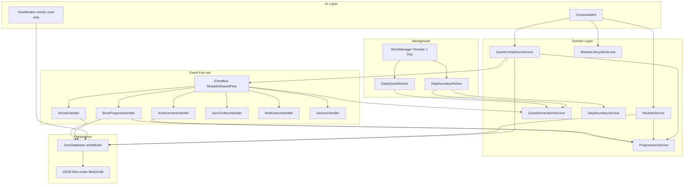
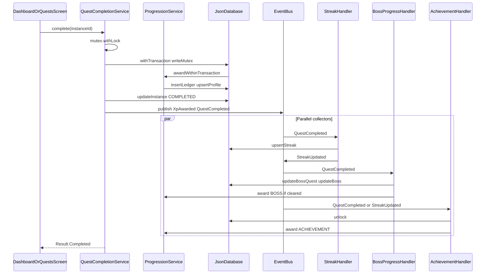
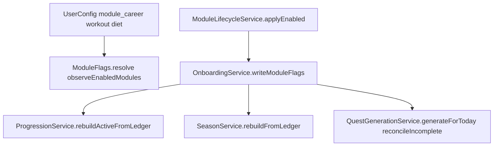
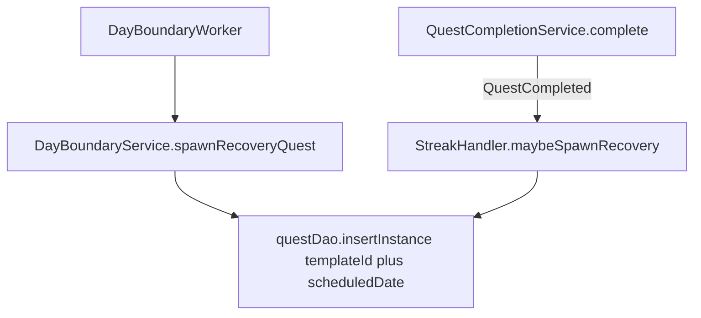
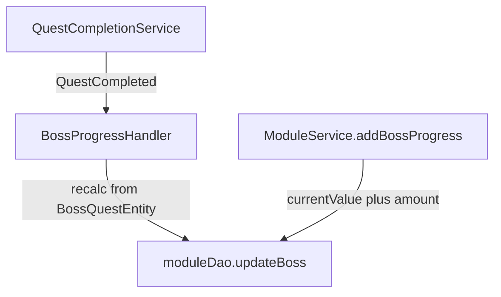
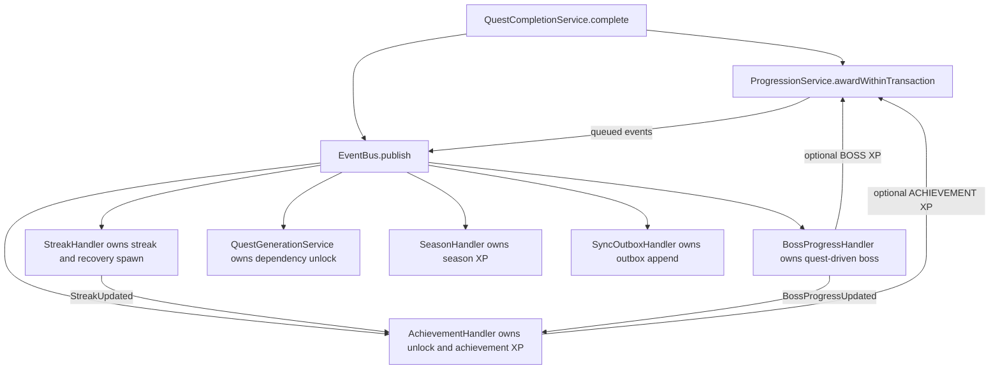

# Architecture Risk Analysis

Evidence-based assessment of architectural risks in the Solo Levelling Android codebase. All claims cite runtime source unless noted. Prior findings are challenged, not repeated.

**Scope:** Analysis only. No remediation was implemented.

**Verdict legend:** Correct | Partially correct | Incorrect | Already fixed | No longer applicable | Unable to determine

---

## 1. Executive Summary

The app is a local-first Compose client with a custom JSON persistence layer (`JsonDatabase`), an in-process `EventBus` for side effects, and WorkManager for periodic jobs. Domain logic is concentrated in services and event handlers. ViewModels are mostly read models; Composables often call services directly.

**Overall posture:** Functionally coherent for a single-player offline RPG shell, with real correctness risks in day-boundary scheduling and recovery-quest quota accounting, and structural risks around incomplete module isolation on read/export surfaces and unordered post-completion handler cascades.

| Prior finding | Verdict | Severity after validation |
|---------------|---------|---------------------------|
| Event cascade / nested awards | **Correct** | High (architectural); core quest XP is idempotent |
| Module isolation incomplete | **Correct** | High for History/Character/export; Low for active progression |
| Dual recovery spawn paths | **Correct** | High for weekly quota; Low for duplicate instances |
| Dual boss progress paths | **Partially correct** | Medium (semantic drift if mixed); not double-award from one action |
| ViewModels optional for writes | **Correct** | Medium (maintainability), not a data-corruption bug |
| WorkManager ≠ player midnight | **Correct** | High (streak / missed-quest timing) |
| Sync outbox unbounded | **Correct** | Medium operational; no functional sync impact |
| ModuleService large surface | **Correct** | Medium maintainability |
| NavHost start locked | **Partially correct** | Low; intentional FTUE tradeoff |
| Unused Room/DataStore | **Correct** | Low (catalog noise) |
| Documentation contradictions | **Correct** | Medium (onboarding/confusion cost) |
| PriorityEngine unused by dashboard UI | **Correct** | Low (dead ViewModel path) |
| Hardcoded colors outside theme | **Partially correct** | Low (few leftovers) |

**What is not as “critical” as previously framed**

- Boss progress is **not** double-applied by a single quest completion. Two write models exist with incompatible semantics; mixing them is the risk.
- NavHost start locking is **by design** and covered by tests; it is not a silent navigation trap for normal module toggles.
- Quest completion idempotency for XP + status is **strong**; the cascade risk is partial side-effect failure after commit, not double quest XP.

**Highest-priority real risks**

1. Recovery quota double-burn when `StreakHandler.maybeSpawnRecovery` runs after DayBoundary already spawned today’s recovery.
2. WorkManager ~24h period + rarely-updated profile timezone vs local midnight domain logic.
3. Disabled-module data still visible in History/Character ledgers and JSON export; attributes not rebuilt on module disable.

---

## 2. Current Architecture Overview



**Primary write entry points**

| Entry | Class | Role |
|-------|-------|------|
| Manual quest complete | `QuestCompletionService.complete` | Quest XP + status, then events |
| Module activity | `ModuleService.*` | Logs → XP → `QuestVerificationService.tryAutoComplete` |
| Module flags | `ModuleLifecycleService` / `OnboardingService.writeModuleFlags` | Config + XP rebuild + quest reconcile |
| Day boundary | `DayBoundaryService.runDailyBoundary` | Missed quests + streak decay + recovery spawn |
| Event handlers | `StreakHandler`, `BossProgressHandler`, `AchievementHandler` | Side effects after domain events |

**Persistence truth:** There is no Room database at runtime. `JsonDatabase` implements DAO-shaped interfaces and serializes JSON files via Gson.

---

## 3. Critical Architectural Risks

### 3.1 Event Cascade / Nested Awards

**Prior claim:** Streak → Achievement XP → Boss XP cascade with implicit ordering and hard failure reasoning.

**Verdict: Correct** (with nuance: in-transaction quest XP ordering is explicit; cross-handler ordering is not).

#### Entry points

| Path | File | Method | Lines |
|------|------|--------|-------|
| Dashboard tap | `ui/dashboard/DashboardScreen.kt` | `container.questCompletion.complete` | ~136–138 |
| Quests screen | `ui/quests/QuestsScreen.kt` | `completeQuest` → `questCompletion.complete` | ~98–101 |
| Auto-complete | `domain/service/QuestVerificationService.kt` | `tryAutoComplete` → `complete` | ~39–79 |
| Domain entry | `domain/service/QuestCompletionService.kt` | `complete(instanceId)` | 47–161 |

ViewModels do **not** own completion. Screens call `AppContainer.questCompletion` on `Dispatchers.IO`.

#### Exact execution order

**Phase A — synchronous under `mutex.withLock` (caller coroutine)**

1. Load instance; reject `NotFound` / `AlreadyCompleted` / invalid status  
   File: `QuestCompletionService.kt` Method: `complete` Lines: 51–57  
2. Module gate via `ModuleScope.allowsQuestTemplate` Lines: 59–64  
3. Milestone / day-policy validation Lines: 66–88  
4. `db.withTransaction { progression.awardWithinTransaction(...); updateInstance(COMPLETED) }` Lines: 109–130  
5. Queue `DomainEvent`s (from progression + `QuestCompleted`) Lines: 134–140  

**Phase B — after mutex release**

6. `pending.events.forEach { eventBus.publish(it) }` Lines: 159–160  
7. Return `Result` to UI — **does not wait for handlers**

**Phase C — asynchronous parallel collectors** (`AppContainer.start` Lines: 112–119)

| Handler | File | Trigger | Side effects |
|---------|------|---------|--------------|
| `StreakHandler` | `domain/handler/StreakHandler.kt` | `QuestCompleted` | Streak upsert; maybe recovery; `StreakUpdated` |
| `BossProgressHandler` | `domain/handler/BossProgressHandler.kt` | `QuestCompleted` | Boss quest flags + recalc; optional `progression.award("BOSS")` |
| `AchievementHandler` | `domain/handler/AchievementHandler.kt` | `QuestCompleted`, `StreakUpdated`, `LevelUp`, `BossProgressUpdated` | Unlock + optional `progression.award("ACHIEVEMENT")` |
| `QuestGenerationService` | `domain/service/QuestGenerationService.kt` | `QuestCompleted` | Unlock dependent quests |
| `SeasonHandler` | `domain/handler/SeasonHandler.kt` | `XpAwarded` / `XpReversed` | Season XP |
| `SyncOutboxHandler` | `domain/handler/SyncOutboxHandler.kt` | All events | Outbox insert |
| `NotificationHandler` | `domain/handler/NotificationHandler.kt` | Level/Achievement/Boss events | Notifications |



#### Sync vs async

| Step | Sync relative to `complete()` return? |
|------|----------------------------------------|
| Validation + XP + quest status | Yes |
| `EventBus.publish` emit | Yes (emit only) |
| Handler body execution | No — separate `Dispatchers.IO` collectors |
| Nested XP from boss/achievement | No — after `complete` returns |

`EventBus.publish` calls `MutableSharedFlow.emit` with `extraBufferCapacity = 64`  
File: `core/event/EventBus.kt` Lines: 7–13  
It does **not** wait for collectors to finish processing.

#### Failure if step N succeeds and N+1 fails

| Failure point | Quest status | Quest XP | Handlers |
|---------------|--------------|----------|----------|
| Validation fail | Unchanged | None | None |
| Award fails (`CapReached`, `AlreadyAwarded`, `ModuleDisabled`) | Unchanged | None | No `QuestCompleted` |
| Ledger write succeeds, crash before `updateInstance` | Likely AVAILABLE | **Awarded** | No saga / no rollback |
| Commit OK, crash mid-publish list | COMPLETED | Awarded | Partial events only |
| Handler fails after commit | COMPLETED | Awarded | Streak/boss/achievement may be stale |

`JsonDatabase.withTransaction` is **not** ACID rollback:

```146:155:app/src/main/java/com/example/solo_levelling/data/db/JsonDatabase.kt
    suspend fun <R> withTransaction(block: suspend () -> R): R {
        // ...
        return withContext(context) {
            writeMutex.withLock { block() }
        }
    }
```

Each DAO write persists JSON immediately under the write lock. Handler writes (streak, boss, achievements) run **outside** the quest completion lock scope.

#### Idempotency / double awards

| Mechanism | Evidence |
|-----------|----------|
| Status gate | `AlreadyCompleted` if status is COMPLETED (`QuestCompletionService.kt` ~52–53) |
| Process mutex | `Mutex` serializes concurrent `complete` calls (L24, L48) |
| Ledger uniqueness | `(sourceType, sourceId)` unique insert; family check in `ProgressionService.resolveAwardSourceId` |
| Achievement XP | Fixed `ACH_${key}` source ids — re-award blocked |
| Boss clear XP | `sourceId = "boss_${id}"` — blocked on retry |

**Can the same quest completion trigger rewards twice?** Core quest XP: no (idempotent). Nested achievement/boss XP from a **single** successful publish: once per event. Re-publish of the same logical completion does not happen on retry of `complete` after success. Undo + re-complete intentionally creates a new source id suffix.

#### Is “implicit ordering” valid?

**Yes for handler fan-out.** Start order in `AppContainer.start` only registers collectors; parallel `collect` loops provide no cross-handler happens-before. Nested publishes (`StreakUpdated` → `AchievementHandler.evaluate`) create multi-hop cascades without a saga or orchestrator.

**No for core award path.** Within one `complete()` call, validation → award → status → publish list order is explicit and sequential.

#### Architectural risk (precise)

The system uses a **two-phase commit of convenience**: durable quest XP+status first, then best-effort parallel side effects. Partial persistence is possible; there is no compensating transaction. Reasoning about “what the player has after a crash mid-cascade” requires inspecting streak, boss, achievements, and season independently of quest status.

---

### 3.2 Module Isolation

**Prior claim:** Attributes and some UI surfaces leak disabled-module history/state.

**Verdict: Correct.** Design is “pause, don’t purge.” Active writes and many aggregates are gated; several read/export surfaces are not.

#### Enable / disable flow



Evidence: `OnboardingService.writeModuleFlags` persists flags, then rebuilds XP/season, then regenerates today’s quests  
File: `domain/service/OnboardingService.kt` Method: `writeModuleFlags` Lines: ~131–140  

Classifier: `ModuleScope.allowsLedgerEntry` / `allowsQuestTemplate` / `allowsAchievement`  
File: `domain/service/ModuleScope.kt`

#### Isolation matrix

| Data / Surface | Module filtered? | Source | Consumer | Risk |
|----------------|------------------|--------|----------|------|
| New XP awards | Yes | `ProgressionService.awardWithinTransaction` + `ModuleScope` | All award callers | Low |
| Profile totalXp / level / rank | Yes (rebuild) | `rebuildActiveFromLedger` | Dashboard, Character, export profile | Low |
| Attribute storage values | No rebuild | `playerDao.upsertAttribute` | DAO | Medium |
| Attribute UI | Yes | `AnalyticsService.isAttributeActionable` | Dashboard, Character | Low |
| Incomplete quests on disable | Deleted | `QuestGenerationService.reconcileIncomplete` | Quest DAO | Low |
| Completed historical quests | Retained in DB | Quest DAO | Hidden from active lists | By design |
| Home / Quests lists | Yes | `HomeQuestPresentation` / quest filters | UI | Low |
| History “Recent XP” | **No** | `HistoryViewModel` → `observeLedger` | HistoryScreen | **High** |
| Character XP ledger | **No** | `CharacterViewModel.ledgerHistory` | CharacterScreen | **High** |
| Export `xpLedger` / attrs / achievements | **No** | `AnalyticsService.exportJson` | Settings export | **High** |
| Analytics period scores | Yes | `AnalyticsService` nullables | AnalyticsScreen | Low |
| Boss `currentValue` | No recalc on disable | Boss entity | Analytics / Modules | Medium |
| Boss quest checklist UI | Yes | `bossQuestsForModules` | QuestsScreen | Low |
| Achievement defs UI | Yes | visible defs filter | AchievementsScreen | Low |
| Streak increments | Yes (module-allowed quests) | `StreakHandler` | Global streak | Low |
| Season XP | Yes (rebuild) | `SeasonService` | Analytics | Low |
| Career routes when disabled | Redirect | `ModuleNavigation.redirectForDisabledModuleRoute` | Nav | Low |

Evidence — ledger not filtered:

```17:20:app/src/main/java/com/example/solo_levelling/ui/history/HistoryViewModel.kt
    val recentXp: StateFlow<List<XpLedgerEntryEntity>> =
        container.db.xpDao().observeLedger()
            .map { entries -> entries.sortedByDescending { it.createdAtEpochMs }.take(20) }
```

Evidence — attributes not rebuilt:

`ProgressionService.rebuildActiveFromLedger` updates `totalXp` / `level` / `rank` only  
File: `domain/service/ProgressionService.kt` Method: `rebuildActiveFromLedger` Lines: ~235–257  

#### Where isolation should live

| Layer | Recommendation |
|-------|----------------|
| Storage | Keep unfiltered (re-enable restores history) |
| Domain writes | Keep `ModuleScope` gates (already correct) |
| Domain active aggregates | Keep rebuild/sum; **add attribute rebuild** symmetric to XP |
| Domain export | Filter or split “active” vs “archive” export |
| ViewModel | History/Character should filter ledger like analytics |
| UI alone | Insufficient if domain export/ledger remain mixed |

---

### 3.3 Recovery Quest Duplication

**Prior claim:** Dual paths via DayBoundaryService and StreakHandler risk duplicate recovery quests.

**Verdict: Correct** — real risk for **weekly quota**, mostly mitigated for **duplicate instances**.

#### Paths that create recovery instances

| # | File | Method | Lines |
|---|------|--------|-------|
| 1 | `domain/service/DayBoundaryService.kt` | `spawnRecoveryQuest` | 79–98 |
| 1a | same | `applyStreakDecayIfMissed` → spawn | ~54–77 |
| 1b | same | `runDailyBoundary` | ~23–28 |
| 1c | `work/DayBoundaryWorker.kt` | `doWork` | ~17–25 |
| 2 | `domain/handler/StreakHandler.kt` | `maybeSpawnRecovery` | 123–145 |
| 2a | same | `onQuestCompleted` when streak broken | ~42–88 |

`QuestGenerationService` **skips** `RECOVERY` templates during normal generation.



#### Duplicate prevention

`JsonDatabase` `insertInstance` returns `-1L` if `(templateId, scheduledDate)` already exists  
File: `data/db/JsonDatabase.kt` Lines: ~628–644  

| Path | On duplicate insert | `recoveryUsedThisWeek` |
|------|---------------------|------------------------|
| DayBoundary `spawnRecoveryQuest` | Returns null; **no** increment (L95–97) | Safe |
| Streak `maybeSpawnRecovery` | Skips event (L140–142); **still increments** (L143–144) | **Unsafe** |

#### Same-day dual execution

Typical sequence:

1. Worker marks streak broken → DayBoundary spawns recovery for today → increments quota once.  
2. User completes a quest later → `StreakHandler` still sees broken streak before updating `lastCompletedDate` → calls `maybeSpawnRecovery` → insert fails (`-1`) → **quota increments again**.

Worker retries: `DayBoundaryWorker` returns `Result.success()` always — WorkManager does not retry “failure.” Same-day periodic re-run is idempotent for DayBoundary spawn.

Timezone: both use `profile.timezone` via `AppClock.today(zone)` when invoked — consistent date keys, but worker **when** it runs is not midnight-aligned (see §4.2).

**Conclusion:** Dual paths are independent triggers with duplicated spawn logic and **asymmetric failure handling**. Duplicate quest rows are largely prevented; **quota burn is a real bug risk**.

---

### 3.4 Boss Progress Duplication

**Prior claim:** Handler-based progression and `ModuleService.addBossProgress()` risk duplicate/inconsistent boss progress.

**Verdict: Partially correct.** Two write paths exist with **different semantics**. One user action does **not** invoke both. Risk is **semantic inconsistency**, not automatic double-increment on quest complete.

#### Write paths

| Path | File | Method | Lines | Model |
|------|------|--------|-------|-------|
| A | `domain/handler/BossProgressHandler.kt` | `onQuestCompleted` | ~33–67 | Absolute: weighted quest flags × target |
| A′ | same | `onQuestUndone` | ~70–116 | Recalc + possible BOSS XP reverse |
| B | `domain/service/ModuleService.kt` | `addBossProgress` | ~706–723 | Additive `currentValue + amount` |
| C | `domain/service/ModuleService.kt` | `createBoss` | ~685–703 | Initialize at 0 |

UI for path B: `ModulesScreen` “+25% PROGRESS” → `container.modules.addBossProgress(25f)`.



#### Answers

| Question | Answer |
|----------|--------|
| How many write paths? | Two runtime mutators of `currentValue` (handler + `addBossProgress`), plus create/reset |
| Canonical owner? | `BossProgressHandler` + `BossProgressLogic` for gameplay |
| One action trigger both? | **No** |
| Double increment from one complete? | **No** — quest path is recalculation from flags; completion is idempotent |
| Idempotent clear XP? | **Yes** — ledger `(BOSS, boss_${id})` |
| DB constraint on currentValue? | Coerce to target only |
| Transaction across boss updates? | Handler uses separate DAO writes; outside quest txn |
| Retry duplicate progress? | Quest path safe; concurrent `addBossProgress` can race (no mutex) |

**Precise risk:** Manual additive progress is **erased** on the next linked quest completion because the handler recomputes absolute value from quest completion flags. Ownership is ambiguous only because UI exposes the additive escape hatch alongside the quest-driven model.

---

## 4. Medium Architectural Risks

### 4.1 ViewModel Mutation Boundaries

**Prior claim:** Business logic reachable from many UI call sites; ViewModels optional for writes.

**Verdict: Correct.**

Domain services centralize rules; **UI composition owns the call**. Most ViewModels only expose `StateFlow` from DAO observers.

| Mutation | UI Direct? | ViewModel? | Service? | Recommended owner |
|----------|------------|------------|----------|-------------------|
| Complete quest | Yes (`DashboardScreen`, `QuestsScreen`) | No | `QuestCompletionService` | Thin VM method wrapping service |
| Undo quest | Yes | No | `QuestCompletionService.undo` | Same |
| Log food / workout | Yes (`FitnessScreen`) | No (`FitnessViewModel` UI state only) | `ModuleService` | `FitnessViewModel` facade |
| Focus / journal / DSA | Yes (`ModulesScreen`, `CareerScreen`) | No | `ModuleService` | Screen VM or keep service + fewer call sites |
| Toggle modules | Yes (`SettingsScreen`, `ModuleSetupScreen`) | No | `ModuleLifecycleService` | Settings VM |
| Config upserts | Yes (`SettingsScreen` → DAO) | No | Bypasses service | Settings VM / small settings API |
| Award XP | Never from UI | No | `ProgressionService` via services/handlers | Keep out of UI |
| Day boundary | Worker | No | `DayBoundaryService` | Keep |

**Architectural stance:** Forcing *everything* into ViewModels is not required. A thin use-case / mutation API on `AppContainer` (or per-feature facades) would improve testability of UI call sites without stuffing domain into AndroidX ViewModels. The real issue is **many Composables knowing which service methods to call**, not the absence of ViewModels per se.

---

### 4.2 Day Boundary / Timezone

**Prior claim:** WorkManager 1-day period ≠ player timezone midnight.

**Verdict: Correct.**

| Aspect | Evidence |
|--------|----------|
| Schedule | `DayBoundaryWorker.schedule` / `DailyQuestWorker.schedule`: `PeriodicWorkRequestBuilder<>(1, TimeUnit.DAYS)` — no `setInitialDelay` to local midnight |
| Enqueue | `MainActivity.onCreate` |
| Domain timezone | `DayBoundaryService.runDailyBoundary(timezone)` uses `ZoneId.of(timezone)` + `clock.today(zone)` |
| Profile default | `PlayerProfileEntity.timezone = "Asia/Kolkata"` |
| Profile updates | Production onboarding preserves existing timezone; rarely synced from device |

**Periodic 24h ≠ local midnight.** Domain code is calendar-day aware **when it runs**; scheduling is install-relative periodic. DST is handled by `ZoneId` math if the ID is correct, but **execution time** still drifts from midnight.

Edge cases:

| Case | Impact |
|------|--------|
| DST | Zone math OK; fire time still wrong |
| Travel / TZ change | Stale profile timezone dominates |
| Reboot / battery | WorkManager delay/skip → late missed/streak |
| Missed execution | Boundary logic waits until next successful run |
| Dual workers | Both may call `generateForToday` — usually idempotent |

**Severity: High** for streak decay and marking yesterday’s quests MISSED.

---

### 4.3 Sync Outbox

**Prior claim:** Outbox grows indefinitely; no transport/flush.

**Verdict: Correct.**

| Stage | Status |
|-------|--------|
| Create | `SyncOutboxHandler` inserts on **every** `DomainEvent` |
| Store | `SyncOutboxEntity` in `sync_outbox.json` |
| Read for sync | `getUnsynced` / `markSynced` defined, **unused** in app code |
| Transport | `NoOpSyncTransport.push` returns `0` (`domain/port/SyncTransportPort.kt`) |
| Worker | None |
| Delete / TTL / max size | None — `markSynced` only flips flag; nothing deletes |

Trace stops at Outbox. There is no Backend stage.

**Impact:** Functional sync: none. Operational: unbounded JSON growth and slower persist of the outbox list under write lock. Payload is `event.toString()`, unsuitable for real transport even if wired.

---

### 4.4 ModuleService

**Prior claim:** Very large surface area / SRP pressure.

**Verdict: Correct.**

| Metric | Value |
|--------|-------|
| File | `domain/service/ModuleService.kt` |
| Approx LOC | ~764 |
| Approx public methods | ~42 |
| Dependencies | `JsonDatabase`, `EventBus`, `AppClock`, `ProgressionService`, `QuestVerificationService` |

**Responsibility groups:** Career/DSA, System Design, Workout routine, Workout logging, Nutrition, Focus/Journal, Career nodes, Boss create/progress, Skills.

**Callers:** Primarily `FitnessScreen`, `ModulesScreen`, `CareerScreen`, `SettingsScreen` — not other services.

This is a **facade-of-everything** over `moduleDao` plus XP/verification. It is a maintainability smell, not by itself a correctness bug.

---

### 4.5 NavHost Start Route

**Prior claim:** Start route locked once initialized; edge cases if profile/module state changes.

**Verdict: Partially correct** — intentional, residual low risk.

```119:145:app/src/main/java/com/example/solo_levelling/ui/SoloLevellingAppRoot.kt
fun startRoute(onboardingDone: Boolean): String =
    if (onboardingDone) AppRoute.Dashboard.route else AppRoute.SystemConsent.route

fun lockStartRoute(locked: String?, onboardingDone: Boolean): String =
    locked ?: startRoute(onboardingDone)
// ...
val start = remember { lockStartRoute(null, onboardingDone) }
```

| Scenario | Behavior |
|----------|----------|
| Onboarding completes mid-session | Start stays Consent; explicit navigates to Dashboard (`popUpTo(0)`) |
| Module enable/disable | Start unchanged; `LaunchedEffect` redirects disabled module routes; Settings navigates to Dashboard |
| Process death | New `remember` recomputes from current `onboardingDone` |
| In-session reset | Explicit nav to Consent; graph `findStartDestination` may still be Dashboard while bar hidden on gate routes |

**Not a critical bug** for normal play. The “lock” prevents NavHost rebuild during FTUE — covered by unit tests in the welcome-gate suite.

---

## 5. Minor Architectural Issues

| Issue | Verdict | Evidence | Severity |
|-------|---------|----------|----------|
| Unused Room/DataStore catalog | **Correct** | `gradle/libs.versions.toml` defines Room/DataStore; `app/build.gradle.kts` does not apply them; zero Room/DataStore imports | Low |
| PriorityEngine unused by dashboard UI | **Correct** | `DashboardViewModel.nextAction` calls `PriorityEngine.nextAction`; `DashboardScreen` collects `suggestions` from AdaptiveService only | Low |
| Hardcoded colors | **Partially correct** | Most UI uses theme tokens; leftovers e.g. `Color(0xFF05070D)` in FAB/`SovereignChrome`, splash `Color.White` | Low |
| `QuestStatus.IN_PROGRESS` unused as write state | **Correct** | Enum defined; never assigned in production writers; only read/sort/route branches | Low |
| `QuestType.BOSS` unused on templates | **Correct** | Enum exists; bosses use `BossEntity`/`BossQuestEntity`, not quest type BOSS | Low |

### Hardcoded color sample

| File | Location | Hardcoded value | Should use theme token? | Severity |
|------|----------|-----------------|-------------------------|----------|
| `SoloLevellingAppRoot.kt` | FAB contentColor | `Color(0xFF05070D)` | Yes → `SystemOnPrimary` | Low |
| `SovereignChrome.kt` | Action button / energy field | `Color(0xFF05070D)` | Yes | Low |
| `SovereignChrome.kt` | Progress highlight | `Color.White.copy(0.75f)` | Optional | Low |
| `WelcomeSplash.kt` | ARISE / scanlines | `Color.White` | Optional | Low |
| Various overlays | Scrims | `Color.Transparent` | No | None |

---

## 6. Technical Debt Analysis

| Item | Status | Evidence | Severity | Blocks future work? | Cleanup priority |
|------|--------|----------|----------|---------------------|------------------|
| PRD / coverage still mention Room/backend/auth | **Correct** | Stale product docs vs `JsonDatabase` + `NoOpSyncTransport` + no auth | Medium | Confusion only | P2 |
| README flat `workouts.json` | **Partial** | README table lists flat files; runtime uses `workouts/logs/{date}.json` with legacy migration | Low–Med | No | P2 |
| 6-tab vs 5-tab IA | **Correct** | `ModuleNavigation.buildMainTabs` returns 5 fixed tabs | Medium doc debt | No | P2 |
| No CI | **Correct** | No `.github/workflows` or other CI configs | Medium | Yes for regression safety | P2 |
| No ProGuard/R8 minify | **Correct** | `isMinifyEnabled = false` in release | Low | Release size/obfuscation later | P3 |
| No coverage tooling | **Correct** | No JaCoCo/Kover | Low | No | P3 |
| Compose UI test deps unused | **Correct** | androidTest Compose deps present; only scaffold instrumented test | Low | No | P3 |
| `QuestStatus.IN_PROGRESS` | **Correct** | Dead write state | Low | No | P3 |
| `QuestType.BOSS` | **Correct** | Dead enum value | Low | No | P3 |

---

## 7. Documentation Consistency Analysis

Canonical truth is **source code**. Document filenames appear only as contradiction evidence.

| Topic | Documentation A | Documentation B | Actual Code | Canonical Truth |
|-------|-----------------|-----------------|-------------|-----------------|
| Tabs | Some UI specs: 6 tabs / module-gated primary | Newer notes: 5 tabs | `buildMainTabs` → Dashboard, Quests, Analytics, Character, More | **5 fixed primary tabs** |
| Fonts | Cascadia everywhere | Mixed | `Type.kt`: Inter + JetBrains Mono (`CascadiaCode` alias → Mono) | **Inter + JetBrains Mono** |
| Persistence | Room in coverage/PRD | README: not Room | `JsonDatabase` Gson files | **JsonDatabase** |
| Backend | REST/auth in PRD | README: offline | No INTERNET auth; `NoOpSyncTransport` | **No backend** |
| Workouts | Flat `workouts.json` in README | Per-day in some UI notes | `workouts/logs/{date}.json` + routine.json | **Per-day logs + routine** |
| Auth | PRD register/login | README none | Hardcoded `PLAYER_ID` | **No auth** |
| Dashboard priority | Spec “TODAY’S PRIORITY” via PriorityEngine | — | Adaptive suggestions UI; PriorityEngine VM flow unused | **AdaptiveService suggestions** |

**Authoritative sources for engineers:** `ModuleNavigation.kt`, `Type.kt`, `JsonDatabase.kt`, `Entities.kt`, `SoloLevellingAppRoot.kt`, `AndroidManifest.xml`, workers under `work/`.

---

## 8. Data Ownership Analysis

| Data | Owner (write) | Owner (read model) | Notes |
|------|---------------|--------------------|-------|
| Quest instances | `QuestGenerationService`, `QuestCompletionService`, DayBoundary/Streak recovery | Quests/Dashboard VMs | Status lifecycle explicit |
| XP ledger | `ProgressionService` | Analytics, History, Character | Module filter on write/aggregates only |
| Profile level/rank | `ProgressionService` (+ rebuild) | Dashboard/Character | Rebuilt on module flag change |
| Attributes | `ProgressionService` on award | UI filters actionable | No rebuild on disable |
| Streak | `StreakHandler`, `DayBoundaryService` | Dashboard | Dual writers |
| Boss | `BossProgressHandler` (canonical), `ModuleService.addBossProgress` (escape) | Quests/Dashboard | Dual models |
| Achievements | `AchievementHandler` | Achievements UI | Unlocked rows retained |
| Module logs | `ModuleService` | Fitness/Career/Modules | Pause-not-purge |
| Outbox | `SyncOutboxHandler` | Settings debug only | No transport owner |
| Config / modules | `OnboardingService` / lifecycle / Settings DAO | `ModuleFlags` | |

---

## 9. Event Ownership Analysis



**Ownership of nested awards:** Quest XP owned by `QuestCompletionService`/`ProgressionService`. Streak owned by `StreakHandler`. Boss gameplay progress owned by `BossProgressHandler`. Achievement XP owned by `AchievementHandler`. There is **no single orchestrator** after publish.

---

## 10. State Ownership Analysis

| State | Held where | Mutable by | Reactive? |
|-------|------------|------------|-----------|
| Nav start destination | `remember` in `SoloLevellingAppRoot` | First composition only | No |
| Current route | `NavController` | Explicit navigates + redirects | Yes |
| Enabled modules | `UserConfig` + `ModuleFlags` Flow | Lifecycle / onboarding / settings | Yes |
| Onboarding done | `PlayerProfileEntity` | Onboarding / reset | Yes (VM) |
| Today’s quests | Quest instance files | Generation / completion / boundary | Yes (DAO Flow) |
| Pending FTUE input | `remember` in root | Onboarding screens | Lost on process death |

---

## 11. Module Isolation Analysis

See §3.2 matrix.

**Summary judgment:** Write-path and active-aggregate isolation is **Good**. Read-path isolation for History/Character/export and attribute rebuild is **Needs Attention / High Risk** for user-visible leakage of disabled-module history.

---

## 12. Navigation Analysis

| Concern | Finding |
|---------|---------|
| Primary tabs | Fixed 5; `modules` param unused in `buildMainTabs` |
| Secondary routes | Career / Fitness / Nutrition under More; redirected when disabled |
| Start destination | Locked once post-splash |
| Module change mid-session | Redirect `LaunchedEffect` + Settings pop to Dashboard |
| Logout/login | N/A — no auth |

**Rating:** Good for current single-player FTUE; Low residual risk on start-lock after reset.

---

## 13. Persistence Analysis

| Concern | Finding |
|---------|---------|
| Technology | Custom `JsonDatabase` + Gson files |
| Transactions | Write mutex only; no rollback |
| Concurrency | `writeMutex` serializes writers |
| Room/DataStore | Catalog-only unused |
| Outbox | Append-only unbounded |
| Legacy migration | Flat workouts/nutrition → per-day logs |

**Rating:** Needs Attention for transactional semantics; Good enough for single-player local store if failure modes are understood.

---

## 14. Scheduling Analysis

| Worker | Period | Domain TZ | Midnight-aligned? |
|--------|--------|-----------|-------------------|
| `DayBoundaryWorker` | 1 day | Yes at execution | **No** |
| `DailyQuestWorker` | 1 day | Yes at execution | **No** |

Also: app open / bootstrap / dashboard init regenerate today’s quests (usually idempotent).

**Rating:** High Risk for calendar-correct day boundary behavior.

---

## 15. Testability Analysis

**Strengths**

- Broad JVM unit tests for domain services, module isolation, quest completion idempotency, navigation helpers.
- Pure logic tests for streak/day-boundary predicates.

**Gaps**

- No CI to run `./gradlew test` automatically.
- No Worker tests for schedule semantics.
- Few ViewModel tests for mutation paths (mutations live in Composables).
- Compose instrumentation deps unused.
- No dual-path recovery integration test for quota double-burn.
- No coverage tooling.

**Rating:** Good domain-test base; Needs Attention for wiring/UI/worker/CI.

---

## 16. Recommended Improvements

Evaluations only — not implemented.

### A. Finish module isolation

1. **Necessary?** Yes, if product promise is “disabled module invisible everywhere.”  
2. **Problem:** History/Character/export leak; attributes not rebuilt.  
3. **Evidence:** §3.2 matrix; `rebuildActiveFromLedger` skips attributes.  
4. **Simplest direction:** Filter ledger/export via `ModuleScope.allowsLedgerEntry`; add attribute rebuild from allowed ledger awards.  
5. **Tradeoffs:** Hiding vs archiving history; export completeness.  
6. **Wrong implementation risk:** Deleting storage on disable breaks re-enable.  
7. **Priority:** P1  

### B. Unify recovery quest ownership

1. **Necessary?** Yes for quota correctness.  
2. **Problem:** Dual spawn + asymmetric increment.  
3. **Evidence:** `StreakHandler` L143–144 vs DayBoundary L95–97.  
4. **Simplest direction:** Single owner (prefer DayBoundary for proactive; Streak only if none exists **and** share helper that increments only on successful insert).  
5. **Tradeoffs:** Reactive recovery if worker delayed.  
6. **Wrong risk:** Removing both paths without replacement leaves users without recovery.  
7. **Priority:** P0  

### C. Unify boss-progress ownership

1. **Necessary?** Yes for semantic clarity; not an urgent double-XP bug.  
2. **Problem:** Additive vs recalculated models.  
3. **Evidence:** Handler vs `addBossProgress`.  
4. **Simplest direction:** Remove or debug-gate UI `addBossProgress`; keep handler canonical.  
5. **Tradeoffs:** Loses debug shortcut.  
6. **Wrong risk:** Changing recalc formula without migrating stored values.  
7. **Priority:** P1  

### D. Move mutations behind ViewModels or thin use-case API

1. **Necessary?** For maintainability/testability — yes; not for fixing cascade bugs.  
2. **Problem:** Many Composable call sites.  
3. **Evidence:** §4.1.  
4. **Simplest direction:** Prefer **thin use-case API** on container/services; wrap hot paths in VMs where UI state + mutation cohere (Fitness, Quests).  
5. **Tradeoffs:** Boilerplate vs call-site chaos.  
6. **Wrong risk:** Fat ViewModels duplicating domain rules.  
7. **Priority:** P2  

### E. Align day-boundary scheduling with player timezone

1. **Necessary?** Yes for streak/missed correctness.  
2. **Problem:** Periodic 24h ≠ midnight; timezone stale.  
3. **Evidence:** §4.2.  
4. **Simplest direction:** Compute delay to next local midnight from profile TZ; reschedule; sync profile TZ from device on start/onboarding.  
5. **Tradeoffs:** WorkManager exactness limits; Doze.  
6. **Wrong risk:** Double boundary runs if KEEP policy mishandled.  
7. **Priority:** P0  

### F. Implement or remove sync outbox

1. **Necessary?** Yes — currently pure cost.  
2. **Problem:** Unbounded growth, no transport.  
3. **Evidence:** §4.3.  
4. **Simplest direction:** **Remove handler + storage** until a real sync exists; or prune aggressively if debugging needed.  
5. **Tradeoffs:** Loses debug event trail.  
6. **Wrong risk:** Implementing fake sync that pretends remote authority.  
7. **Priority:** P2  

### G. Refresh stale documentation

1. **Necessary?** Yes for contributor accuracy.  
2. **Problem:** Room/backend/6-tab/flat workouts contradictions.  
3. **Evidence:** §7.  
4. **Simplest direction:** Point README + PRD status pages at code truth; mark PRD backend as future.  
5. **Tradeoffs:** Doc churn.  
6. **Wrong risk:** Overwriting PRD intent with implementation without labeling “current vs target.”  
7. **Priority:** P2  

### H. Add Worker / ViewModel / Compose tests

1. **Necessary?** Selective yes.  
2. **Problem:** Untested schedule and UI mutation wiring.  
3. **Evidence:** §15.  
4. **Simplest direction:** Worker unit tests with fake clock; VM tests for Fitness/Quests facades once introduced; one Compose smoke per primary tab later.  
5. **Tradeoffs:** Slow androidTest CI.  
6. **Wrong risk:** Brittle screenshot-heavy suites.  
7. **Priority:** P2  

### I. Add CI

1. **Necessary?** Yes.  
2. **Problem:** No automated `./gradlew test`.  
3. **Evidence:** No workflow files.  
4. **Simplest direction:** GitHub Action running unit tests on PR.  
5. **Tradeoffs:** Runner setup for Android.  
6. **Wrong risk:** Flaky instrumented tests blocking merges — start with JVM `test` only.  
7. **Priority:** P2  

---

## 17. Prioritized Remediation Roadmap

| Priority | Problem | Evidence | Impact | Effort | Recommended Action |
|----------|---------|----------|--------|--------|--------------------|
| P0 | Recovery weekly quota double-burn | `StreakHandler.maybeSpawnRecovery` increments after failed insert | Users exhaust recovery limit incorrectly | Small | Share spawn helper; increment only on `instanceId > 0`; ideally single owner |
| P0 | Day boundary not at local midnight + stale TZ | Periodic 1-day workers; default `Asia/Kolkata` | Wrong MISSED/streak timing | Medium | Midnight-aligned schedule + sync profile timezone |
| P1 | Module isolation leaks on ledger/export; no attribute rebuild | History/Character VMs; `exportJson`; rebuild XP only | Disabled-module history/attrs visible | Medium | Domain-level active ledger views + attribute rebuild |
| P1 | Boss dual write models | Handler recalc vs `addBossProgress` | Progress jumps/resets when mixed | Small | Gate/remove additive UI path |
| P1 | Cascade partial failure after commit | EventBus parallel handlers; no rollback txn | Streak/boss/achievements diverge from quest | Large | Document guarantees; optionally serialize critical handlers or post-commit orchestrator |
| P2 | Unbounded sync outbox | `SyncOutboxHandler` + NoOp transport | Disk/memory growth | Small | Remove or prune |
| P2 | Mutation call-site sprawl | Screens → services | Harder UI testing | Medium | Thin use-case API / selective VMs |
| P2 | ModuleService god object | ~42 public methods | Harder changes | Large | Split only when feature boundaries hurt |
| P2 | No CI / stale docs | No workflows; README/PRD drift | Regression + confusion | Small–Med | `./gradlew test` CI + doc refresh |
| P3 | Dead enums / catalog Room / unused Compose androidTest / colors / coverage | Models.kt; libs.versions.toml; build.gradle | Noise | Small | Prune or use intentionally |

---

## 18. Architectural Risk Matrix

| Risk | Likelihood | Impact | Detected in code? | Mitigations today | Residual |
|------|------------|--------|-------------------|-------------------|----------|
| Cascade partial side effects | Medium | Medium–High | Yes | Quest XP idempotent; mutex | High residual on handlers |
| Recovery quota double burn | High (after boundary + first quest) | Medium | Yes | Instance uniqueness | High residual on counter |
| Duplicate recovery instance | Low | Low | Mitigated | `(templateId, date)` unique | Low |
| Boss double XP on clear | Low | Medium | Mitigated | Ledger uniqueness | Low |
| Boss semantic drift | Medium if debug UI used | Medium | Yes | None | Medium |
| Module history leak | High when modules disabled | Medium | Yes | UI gates on some screens | High on ledger/export |
| Midnight mismatch | High | High | Yes | Domain TZ when run | High |
| Outbox growth | High over months | Low–Med | Yes | None | Medium |
| Nav start lock surprise | Low | Low | Intentional | Explicit FTUE nav | Low |

---

## 19. Overall Architecture Assessment

| Category | Rating | Evidence |
|----------|--------|----------|
| Architecture Quality | **Needs Attention** | Clear layers exist, but dual owners (recovery, boss) and god `ModuleService` |
| State Management | **Good** | DAO Flows + Compose state; FTUE pending state is ephemeral |
| Data Integrity | **Needs Attention** | Strong quest XP idempotency; weak cross-handler atomicity; JSON “transactions” lack rollback |
| Module Isolation | **Needs Attention** | Strong writes/aggregates; weak History/Character/export/attributes |
| Navigation | **Good** | 5-tab IA + redirects; start lock intentional |
| Persistence | **Needs Attention** | JsonDatabase works; no ACID; outbox unbounded |
| Scheduling | **High Risk** | Periodic day ≠ midnight; timezone rarely updated |
| Testability | **Good** | Domain tests solid; CI/worker/UI mutation gaps |
| Maintainability | **Needs Attention** | Large `ModuleService`; UI→service sprawl; dead PriorityEngine path |
| Scalability | **Needs Attention** | Fine for single local player; outbox/event fan-out not sync-ready |
| Documentation Quality | **High Risk** | Multiple contradictions vs code on tabs/fonts/Room/backend/workouts |

---

## 20. Open Questions / Unknowns

1. **Product intent for disabled modules:** Hide everywhere, or keep History/export as archive? Code implements archive-in-storage + partial UI hide — intent not encoded as a single policy object.  
2. **Is `addBossProgress` intentional debug-only?** Wired in production `ModulesScreen` without obvious debug gate.  
3. **Grace days configuration:** If `STREAK_GRACE_DAYS` is raised above 0, DayBoundary and `StreakLogic.isStreakBroken` diverge — current default is 0; non-default behavior under-tested.  
4. **Profile timezone ownership:** No production writer found syncing device zone — confirm whether JSON seed/manual edit is expected.  
5. **Whether PriorityEngine should drive UI or be deleted:** Currently computed in VM with no subscribers (`WhileSubscribed`), so likely never runs in production.  
6. **Desired sync future:** Keep outbox scaffolding or delete until transport exists — product decision.  
7. **Exact WorkManager fire-time distribution on real devices:** Analysis is based on schedule API; field timing under Doze was not measured in this pass.

---

## Appendix A — Finding Verdict Index

| # | Finding | Verdict |
|---|---------|---------|
| 1 | Event cascade / nested awards | Correct |
| 2 | Module isolation incomplete | Correct |
| 3 | Dual recovery spawn paths | Correct (quota bug risk) |
| 4 | Dual boss progress paths | Partially correct |
| 5 | ViewModels optional for writes | Correct |
| 6 | WorkManager ≠ midnight | Correct |
| 7 | Sync outbox unbounded | Correct |
| 8 | ModuleService large surface | Correct |
| 9 | NavHost start locked | Partially correct |
| 10 | Unused Room/DataStore | Correct |
| 11 | Documentation contradictions | Correct |
| 12 | PriorityEngine unused by dashboard UI | Correct |
| 13 | Hardcoded colors | Partially correct |

---

## Appendix B — Key File Index

| Area | Primary files |
|------|----------------|
| Quest completion | `domain/service/QuestCompletionService.kt`, `ProgressionService.kt` |
| Events | `core/event/EventBus.kt`, `domain/handler/*` |
| Persistence | `data/db/JsonDatabase.kt`, `data/db/dao/Daos.kt` |
| Modules | `ModuleScope.kt`, `ModuleFlags.kt`, `ModuleLifecycleService.kt`, `ModuleService.kt` |
| Recovery | `DayBoundaryService.kt`, `StreakHandler.kt`, `DayBoundaryWorker.kt` |
| Boss | `BossProgressHandler.kt`, `BossProgressLogic.kt`, `ModuleService.addBossProgress` |
| Navigation | `SoloLevellingAppRoot.kt`, `ModuleNavigation.kt` |
| Priority | `PriorityEngine.kt`, `DashboardViewModel.kt`, `DashboardScreen.kt` |
| Scheduling | `work/DayBoundaryWorker.kt`, `work/DailyQuestWorker.kt` |
| Outbox | `SyncOutboxHandler.kt`, `SyncTransportPort.kt` |
