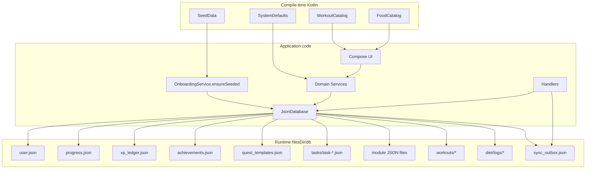

# Solo Levelling — JSON & Data Reference

> Complete inventory of JSON in this repository and the **runtime JSON file database** used by the app.  
> See also: [APP_DOCUMENTATION.md](./APP_DOCUMENTATION.md) · [SYSTEM_DESIGN.md](./SYSTEM_DESIGN.md)

**Critical fact:** The application does **not** ship checked-in application data `.json` files. Persistence files are created at runtime under `{context.filesDir}/db/`. Static catalogs live in Kotlin (`SeedData`, `WorkoutCatalog`, `FoodCatalog`).

---

## 1. Inventory Summary

| Scope | Count | Notes |
|-------|------:|-------|
| Source-tree `.json` (excluding `build/` / `.git` / `.gradle`) | **1** | `.vscode/settings.json` only |
| Build-output `.json` under `app/build/` | **~100** | Gradle/Android merge blame & resource intermediates — not app data |
| Design-app `.json` | **0** | HTML/PNG/DESIGN.md only |
| Runtime app JSON file **patterns** | **20+** | Created on device; listed below |
| Application-relevant checked-in JSON | **0** | — |

**Totals used in status reports:**

- JSON files discovered in repo (incl. build artifacts when counted): **~101**  
- Application-relevant **checked-in** JSON: **0**  
- Application-relevant **runtime** JSON schemas: **documented in §4**

---

## 2. JSON Classification Table (Repository Files)

| File | Category | Used By | Purpose | Runtime Required | Structure | Relationships |
|------|----------|---------|---------|------------------|-----------|---------------|
| `.vscode/settings.json` | Build/tooling / IDE | VS Code / Cursor Java extension | `java.configuration.updateBuildConfiguration` | No | IDE settings object | None |
| `app/build/**/*.json` (~100) | Generated / tooling | Android Gradle Plugin | Resource merge blame, locale values intermediates | No | AGP-specific | Generated from `res/` |
| *(none in `app/src`)* | — | — | No assets/raw JSON | — | — | — |

### Runtime files (not in git; created on device)

All paths relative to `{filesDir}/db/` unless noted. Consumer: `JsonDatabase` / `JsonFileIO` via Gson.

| File | Category | Used By | Purpose | Runtime Required | Mutable | Source of truth? |
|------|----------|---------|---------|------------------|---------|------------------|
| `user.json` | Runtime application data | PlayerDao, ConfigDao, onboarding/settings | Profile identity + configs | Yes (defaults if missing) | Yes | Identity + settings |
| `progress.json` | Runtime application data | PlayerDao, ID allocation | Level, XP, rank, attributes, streak, nextIds | Yes (defaults if missing) | Yes | Progression snapshot (ledger is XP audit) |
| `xp_ledger.json` | Runtime application data | XpDao, ProgressionService | Append-only XP events | Yes for awards | Yes (append) | **XP source of truth** |
| `achievements.json` | Runtime application data | AchievementDao, seed, handler | Defs + unlocked | Seeded if empty | Yes | Achievements |
| `quest_templates.json` | Runtime application data | QuestDao, generation, seed | Templates | Seeded if empty | Yes | Template catalog |
| `tasks/task-{id}.json` | Runtime application data | QuestDao | One quest instance each | Created as quests spawn | Yes | Instance truth |
| `seasons.json` | Runtime application data | ModuleDao, SeasonService | Seasons | Created on ensure | Yes | Seasons |
| `skills.json` | Runtime application data | ModuleDao | Skills | Optional | Yes | Skills |
| `bosses.json` | Runtime application data | ModuleDao, handlers | Bosses | Optional | Yes | Bosses |
| `boss_quests.json` | Runtime application data | ModuleDao | Boss↔template links | Optional | Yes | Boss quests |
| `career_nodes.json` | Runtime application data | ModuleDao, seed | Career roadmap | Seeded if empty | Yes | Career nodes |
| `dsa.json` | Runtime application data | ModuleDao, seed | DSA problems | Seeded if career | Yes | DSA |
| `career/system-design/topics.json` | Runtime application data | ModuleDao, seed | System design topics | Seeded if career | Yes | SD topics |
| `focus.json` | Runtime application data | ModuleDao | Focus sessions | Optional | Yes | Focus |
| `journal.json` | Runtime application data | ModuleDao | Journal entries | Optional | Yes | Journal |
| `metrics.json` | Runtime application data | ModuleDao, verification | Weight/steps/etc. | Optional | Yes | Metrics |
| `routines.json` | Runtime application data | ModuleDao | Routine logs | Optional | Yes | Routines |
| `dismissed.json` | Runtime application data | ModuleDao, AdaptiveService | Dismissed suggestions | Optional | Yes | Dismissals |
| `sync_outbox.json` | Runtime application data | OutboxDao, SyncOutboxHandler | Future sync queue | Written on events | Yes | Outbox (transport unused) |
| `workouts/routine.json` | Runtime application data | ModuleDao, fitness/onboarding | Weekly workout plan | Defaults empty routine | Yes | Routine |
| `workouts/logs/{date}.json` | Runtime application data | ModuleDao | Per-day workout log | Optional | Yes | Workout day |
| `diet/logs/{date}.json` | Runtime application data | ModuleDao | Per-day diet log | Optional | Yes | Diet day |
| `workouts.json` | Legacy | Migration only | Old workout list | Migrated then deleted | — | Legacy |
| `workout_exercises.json` | Legacy | Migration only | Old exercises | Migrated then deleted | — | Legacy |
| `nutrition.json` | Legacy | Migration only | Old nutrition | Migrated then deleted | — | Legacy |

### Ephemeral JSON (not a file)

| Source | Category | Consumer |
|--------|----------|----------|
| `AnalyticsService.exportJson()` | Generated export string | Share intents in Analytics/Settings |
| `attributeRewardsJson` fields | Embedded JSON string | `AttributeRewardsParser` (regex) |
| `metadataJson` on ledger | Embedded | XP entries |
| `payloadJson` on outbox | Embedded | `event.toString()` |
| `schedule_json` config value | Embedded in user configs | Settings / onboarding |

---

## 3. JSON Dependency Map



**There are no JSON→JSON foreign-key files.** Relationships are IDs/keys inside Gson entity fields (e.g. `QuestInstanceEntity.templateId`, `BossQuestEntity.templateKey`).

---

## 4. Runtime File Schemas

Loader: `JsonDatabase.loadAll()` + Gson. Writer: DAO methods / `persistAll()` via `JsonFileIO.writeText` (temp + rename).

### 4.1 `user.json` — `UserJson`

```json
{
  "profile": {
    "id": 1,
    "name": "Hunter",
    "timezone": "Asia/Kolkata",
    "onboardingDone": false,
    "prioritiesCsv": "",
    "createdAtEpochMs": 0
  },
  "configs": [
    { "key": "calorie_target", "value": "2200" }
  ]
}
```

| Field | Required | Notes |
|-------|----------|-------|
| `profile` | Optional (defaults) | Identity only — not level/XP |
| `configs[]` | Optional | Key/value bag |

**Important config keys (non-exhaustive):**  
`calorie_target`, `protein_target`, `step_target`, `notifications_enabled`, `schedule_days_csv`, `goal_title`, `schedule_json`, `module_career`, `module_workout`, `module_diet`, career/fitness onboarding keys (`height_cm`, `weight_kg`, …), `STREAK_GRACE_DAYS` (if set).

**Missing file:** empty `UserJson()`.  
**Malformed:** Gson may throw on DB init.  
**Reset:** Profile name/timezone/priorities/configs preserved; `onboardingDone` set false.

### 4.2 `progress.json` — `ProgressJson`

```json
{
  "level": 1,
  "totalXp": 0,
  "rank": "E",
  "attributes": [{ "code": "STR", "currentValue": 0, "lifetimeXp": 0 }],
  "streak": {
    "id": 1,
    "current": 0,
    "best": 0,
    "lastCompletedDate": null,
    "recoveryUsedThisWeek": 0,
    "weekStartDate": null
  },
  "nextIds": { "questTemplate": 1, "questInstance": 1, "xpLedger": 1 }
}
```

`nextIds` includes counters for templates, instances, ledger, boss, skill, dsa, workouts, focus, metrics, seasons, outbox, diet meals, etc. (`NextIdsJson`).

### 4.3 `xp_ledger.json` — `List<XpLedgerEntryEntity>`

```json
[
  {
    "id": 1,
    "amount": 40,
    "sourceType": "QUEST",
    "sourceId": "42",
    "metadataJson": "{}",
    "createdAtEpochMs": 0
  }
]
```

Uniqueness: `(sourceType, sourceId)`.

### 4.4 `achievements.json` — `AchievementsJson`

```json
{
  "defs": [
    {
      "key": "FIRST_QUEST",
      "name": "First Quest",
      "description": "Complete your first quest",
      "criteriaType": "QUESTS_COMPLETED",
      "criteriaValue": 1,
      "rewardXp": 10
    }
  ],
  "unlocked": [
    { "achievementKey": "FIRST_QUEST", "unlockedAtEpochMs": 0 }
  ]
}
```

Seeded defs from `SeedData.achievements()` when empty.

### 4.5 `quest_templates.json` — `List<QuestTemplateEntity>`

Key fields: `id`, `key`, `type` (DAILY/WEEKLY/MILESTONE/RECOVERY/…), `title`, `description`, `baseXp`, `attributeRewardsJson`, `scheduleDaysCsv`, `active`, `verificationType`, `verificationTarget`, `verificationUnit`, `dependsOnTemplateKey`, `priorityTags`, `difficulty`.

Example `attributeRewardsJson`: `{"INT":30,"DISC":10}` (parsed by regex helper, not nested Gson type).

### 4.6 `tasks/task-{id}.json` — `QuestInstanceEntity`

One file per instance. Malformed files **skipped** on load.

Key fields: `id`, `templateId`, `scheduledDate` (ISO date string), `status`, `title`, `type`, `baseXp`, `attributeRewardsJson`, `completedAtEpochMs`, verification fields.

### 4.7 Module list files

Arrays of entities written as JSON arrays (or object for achievements/user/progress):

| File | Element type |
|------|----------------|
| `seasons.json` | `SeasonEntity` |
| `skills.json` | `SkillEntity` |
| `bosses.json` | `BossEntity` |
| `boss_quests.json` | `BossQuestEntity` |
| `career_nodes.json` | `CareerNodeEntity` |
| `dsa.json` | `DsaProblemEntity` |
| `focus.json` | `FocusSessionEntity` |
| `journal.json` | `JournalEntryEntity` |
| `metrics.json` | `MetricLogEntity` |
| `routines.json` | `RoutineLogEntity` |
| `dismissed.json` | `DismissedSuggestionEntity` |
| `sync_outbox.json` | `SyncOutboxEntity` |

### 4.8 `career/system-design/topics.json`

`List<SystemDesignTopicEntity>` with nested `concepts: List<SystemDesignConceptEntity>`.

### 4.9 Workout / diet

| Path | Type |
|------|------|
| `workouts/routine.json` | `WorkoutRoutineEntity` (Mon–Sun plans) |
| `workouts/logs/{yyyy-MM-dd}.json` | `WorkoutLogEntity` |
| `diet/logs/{yyyy-MM-dd}.json` | `DietLogEntity` |

Malformed logs skipped; missing routine → empty `WorkoutRoutineEntity()`.

---

## 5. How JSON Is Loaded and Used

| When | What |
|------|------|
| `JsonDatabase` init | `ensureRoot()` → `loadAll()` → `emitAllFlows()` |
| App start (`AppContainer.start`) | `ensureSeeded`, module flag migration, career catalogs, season, maybe `generateForToday` |
| UI bootstrap | `BootstrapViewModel.ensureSeeded` again (idempotent seed patterns) |
| Mutations | DAO write memory + specific file(s) |
| Reset | `clearProgressTables` + `persistAll` + re-seed |

### Failure behavior

| Case | Behavior |
|------|----------|
| Missing file | Empty default structure |
| Blank list file | Empty list |
| Bad `tasks/*.json` or day logs | Skip file |
| Bad `workouts/routine.json` | Empty routine |
| Bad `user.json` / `progress.json` / core objects | **(inference)** crash on startup — no try/catch in `loadAll` for those |
| Missing seed | `OnboardingService.ensureSeeded` inserts Kotlin defaults |

---

## 6. Static Data (Not JSON Files)

| Kotlin source | Role | Persisted? |
|---------------|------|------------|
| `data/seed/SeedData.kt` | Templates, achievements, career nodes, DSA, system design | Copied into JSON on seed |
| `data/seed/WorkoutCatalog.kt` | Split/exercise catalog for UI | User selection → `workouts/routine.json` |
| `data/seed/FoodCatalog.kt` | Food picker | Logged meals → `diet/logs/{date}.json` |
| `core/config/SystemDefaults.kt` | Caps, ranks, XP curve | Not persisted |

---

## 7. JSON Data Flow

```
Kotlin SeedData / user input / domain events
        ↓
Domain services (validation + rules)
        ↓
JsonDatabase DAO (in-memory mutation)
        ↓
Gson serialize
        ↓
JsonFileIO (temp write + rename) → filesDir/db/...
        ↓
MutableStateFlow emit
        ↓
ViewModel StateFlow → Compose UI
```

Parallel path: every `DomainEvent` → `SyncOutboxHandler` → append `sync_outbox.json` → **no network flush**.

Export path: DB reads → `org.json` builders → share intent (bypasses Gson file store).

---

## 8. ID / Reference Conventions

| Convention | Detail |
|------------|--------|
| Player | Always `1` (`SystemDefaults.PLAYER_ID`) |
| Monotonic IDs | Stored in `progress.nextIds` |
| Quest template business key | String `key` (e.g. `dsa_daily`, `recovery`) |
| Instance linkage | `templateId` numeric FK to template |
| Dates | ISO-8601 local date strings `yyyy-MM-dd` |
| Achievement linkage | `achievementKey` string |
| XP idempotency | `(sourceType, sourceId)` string pair |
| Module gating | Config keys `module_*` = string flags (typically `"true"`/`"false"`) |

---

## 9. Mutability & Source-of-Truth Rules

| Data | Mutable? | Source of truth |
|------|----------|-----------------|
| XP totals on profile | Yes | Prefer **ledger**; profile `totalXp` is maintained projection |
| Quest instances | Yes | Task files |
| Templates / achievement defs | Yes after seed | JSON after first seed (Kotlin seed only if empty) |
| Workout/food catalogs | No (code) | Kotlin |
| Sync outbox | Yes | Local only until transport exists |
| Export JSON | Ephemeral | Derived |

---

## 10. What Depends on Runtime JSON

| Feature | Depends on |
|---------|------------|
| Onboarding / Settings | `user.json` |
| Level/rank UI | `progress.json` (+ ledger) |
| Quests | templates + `tasks/*` |
| Character ledger | `xp_ledger.json` |
| Achievements screen | `achievements.json` |
| Career | `career_nodes.json`, `dsa.json`, SD topics |
| Fitness | routine + workout logs |
| Nutrition | diet logs |
| Streak recovery | streak in progress + recovery instances |
| Future sync | `sync_outbox.json` |

If the entire `db/` directory is deleted, the app recreates defaults on next launch and behaves like a fresh install (until onboarding completes again).

---

## 11. Non-Application JSON Notes

- **Do not treat** `app/build/**/*.json` as product data.  
- **Do not commit** device `filesDir` dumps with personal health/journal content.  
- **`.vscode/settings.json`** is editor-only.

---

## 12. Cross-Check Notes vs Older Docs

| Older wording | Current code |
|---------------|--------------|
| Room database | Replaced by `JsonDatabase` |
| Flat `workouts.json` / `nutrition.json` as primary | Legacy; migrated to `workouts/logs/` and `diet/logs/` |
| Bundled JSON assets | None |

---

*When adding a new persisted entity, update `JsonDatabase` file constants, this reference, and seed/migration behavior in the same change.*
