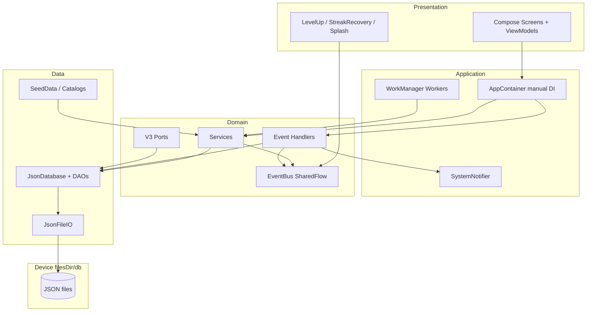
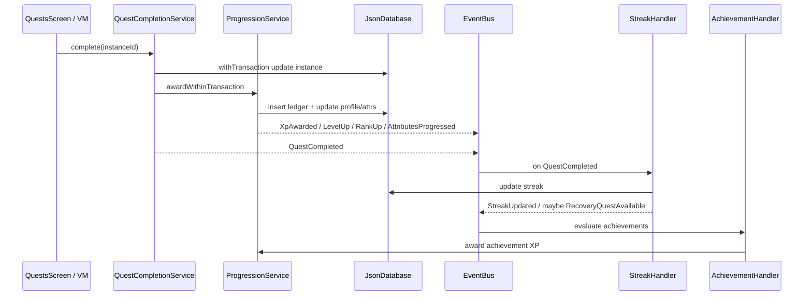
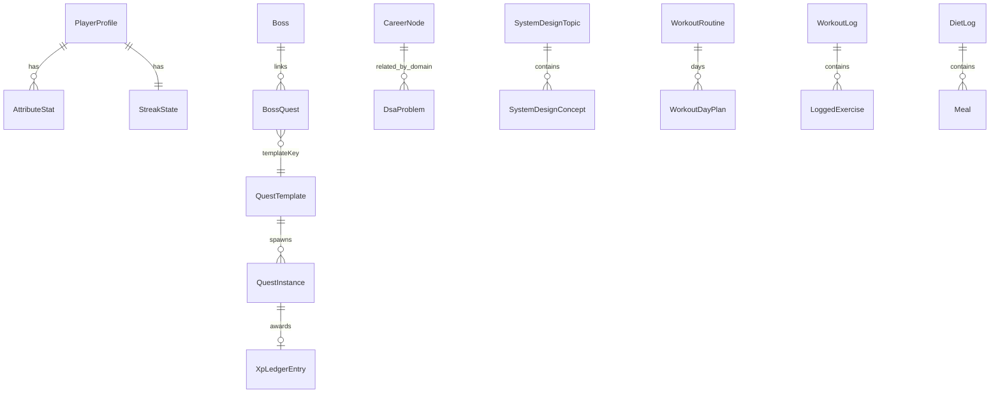
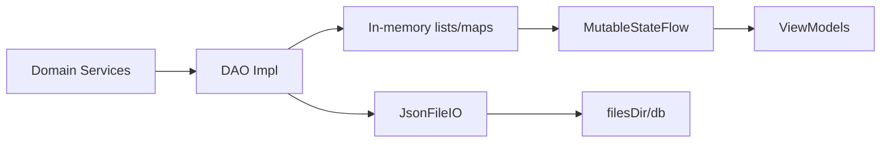

# Solo Levelling — System Design

> **Canonical onboarding reference:** [architecture-and-system-design.md](./architecture-and-system-design.md)  
> This file remains a shorter system-design summary. Prefer the canonical doc for full module/data/navigation maps.
>
> Product behavior: [APP_DOCUMENTATION.md](./APP_DOCUMENTATION.md) · Data/JSON: [JSON_DATA_REFERENCE.md](./JSON_DATA_REFERENCE.md) · Deep change map: [ARCHITECTURE_ANALYSIS.md](./ARCHITECTURE_ANALYSIS.md)

**Legend:** Unlabeled claims are verified from code. **(inference)** / **Not determined from the repository** used where needed.

---

## 1. System Overview

Solo Levelling is a **single-process Android monolith**: Jetpack Compose UI, manual dependency injection (`AppContainer`), domain services + event handlers, and a custom **JSON file database** under private app storage. There is no server, no multi-tenant model, and no network stack in the shipping app.

**Problem solved:** Make personal discipline (career practice, fitness, nutrition, focus) sticky via RPG loops while keeping all state local and inspectable as JSON files.

---

## 2. Architecture Goals

Observed goals embodied by the code (not a separate ADR set):

| Goal | How it shows up |
|------|-----------------|
| Offline-first | No INTERNET permission; all features work locally. |
| Auditable progression | Append-only `xp_ledger.json` as XP source of truth. |
| Anti-farming | Daily XP cap, idempotent awards, undo window. |
| Decoupled side effects | Critical post-quest via `PostQuestCompletionCoordinator`; EventBus for notifications/UI. |
| No fake sync | Sync outbox removed until a real transport exists. |
| Testable domain | Pure logic modules + services with injectable clock/DB. |
| Calendar midnight | `DayBoundaryCoordinator` schedules next local midnight (not 24h periodic). |
| Module pause | Storage archival; `ActiveProgressionReader` filters active views/export. |

---

## 3. High-Level Architecture



---

## 4. Application Components

| Component | Path | Responsibility |
|-----------|------|----------------|
| `SoloLevellingApp` | `AppContainer.kt` | Process entry; builds container; notification channel. |
| `AppContainer` | `AppContainer.kt` | Wires DB, services, handlers, ports; `start()`. |
| `MainActivity` | `MainActivity.kt` | Compose host; schedules workers. |
| `JsonDatabase` | `data/db/JsonDatabase.kt` | In-memory store + Gson persistence + Flow observes. |
| `JsonFileIO` | `data/db/JsonFileIO.kt` | Atomic temp+rename writes; task/log file helpers. |
| Domain services | `domain/service/*` | Mutations + rules. |
| Handlers | `domain/handler/*` | React to `DomainEvent`. |
| `EventBus` | `core/event/EventBus.kt` | `MutableSharedFlow` buffer 64. |
| UI root | `ui/SoloLevellingAppRoot.kt` | NavHost, chrome, overlays. |
| Workers | `work/*` | Daily generation + day boundary. |
| Ports | `domain/port/*` | Future external systems. |

---

## 5. Component Interactions

### Quest completion (representative)



### Bootstrap

`Application.onCreate` → `AppContainer.start()` starts handlers + async seed/migrate/season/generate.  
`MainActivity` schedules WorkManager.  
UI waits on `BootstrapViewModel` + minimum splash duration.

---

## 6. Frontend Architecture

| Concern | Implementation |
|---------|----------------|
| Framework | Jetpack Compose + Material 3 |
| Entry | `MainActivity.setContent` → `SololevellingTheme` → `SoloLevellingAppRoot` |
| Navigation | Navigation Compose; sealed `AppRoute`; `mainTabs` = 5 primary destinations |
| State | Per-screen ViewModels; `stateIn(WhileSubscribed(5000))` over DAO Flows |
| Global UI events | Collect `EventBus` in root / overlay VMs |
| DI into UI | `LocalContext.current.appContainer` |
| Forms | Local Compose state + `EntryValidation` |
| Styling | Sovereign OS tokens in `Color.kt` / `Type.kt` (Inter + JetBrains Mono); `SovereignChrome` components |
| Theme mode | Defaults to dark (`darkTheme = true`); light scheme exists but unused in default path |
| Responsive | Bottom bar vs rail at ≥840dp |
| Error boundaries | **Not determined / not present** as Compose error boundary API usage |

Typical action path: Composable → ViewModel → `AppContainer` service → DAO → Flows emit → UI recomposes; side effects via EventBus.

---

## 7. Backend Architecture

**No backend process exists in this repository.**

“Server-like” responsibilities are performed on-device by domain services inside the same app process.

---

## 8. API Architecture

**No HTTP API.**

Outbound future API is abstracted as:

- `SyncTransportPort` — currently `NoOpSyncTransport`
- Outbox rows in `sync_outbox.json` with `payloadJson` from `event.toString()`

Local “APIs” are Kotlin service methods, not REST.

---

## 9. Data Architecture

### Layers

1. **Domain enums/models** — `domain/model/Models.kt`  
2. **Persistence entities** — `data/db/entity/Entities.kt`  
3. **JSON wrappers** — `UserJson`, `ProgressJson`, `AchievementsJson`, `NextIdsJson`  
4. **DAO interfaces** — Room-like interfaces in `dao/Daos.kt`, implemented inside `JsonDatabase`

### Profile split

Identity fields live in `user.json`; progression fields in `progress.json`; reads merge via `mergeProfile()`.

### Relationships (logical)



IDs are monotonic counters in `progress.json` → `nextIds`.

---

## 10. Storage Architecture



| Mechanism | Role |
|-----------|------|
| JSON files | Durable source |
| In-memory collections | Working set |
| Flows | Reactive projection |
| Mutex + `withTransaction` | Serialize writes; offload main-thread IO |
| Temp file rename | Best-effort atomicity |

**Not used:** Room, SQLite (except throwing `SQLiteConstraintException` for uniqueness), SharedPreferences, DataStore, remote DB.

---

## 11. Authentication & Authorization

| Concern | Status |
|---------|--------|
| AuthN | Absent |
| AuthZ | Absent (single player) |
| Route guards | Module enablement redirects only |
| Secrets | None in app code |

Security boundary = Android app sandbox + optional notification permission.

---

## 12. External Integrations

| Integration | Required? | Notes |
|-------------|-----------|-------|
| WorkManager | Yes (for scheduled jobs) | AndroidX |
| NotificationManager | Optional UX | Channel `system_events` |
| Share sheet | Optional | Export |
| Health Connect / Calendar / Backend | No | Ports are no-ops / local |

---

## 13. Configuration & Environment

| Layer | Contents |
|-------|----------|
| Build | `minSdk 23`, `targetSdk 37`, Compose BOM via version catalog, Gson 2.11.0 |
| Gradle | No product flavors for env; release minify **disabled** |
| Runtime game rules | `SystemDefaults` |
| Runtime user settings | `UserConfigEntity` key/values |
| SDK path | `local.properties` (gitignored) — not app config |

---

## 14. Important Data Flows

### Onboarding seed → quests

`ensureSeeded` writes templates/achievements/attributes/career catalogs → `completeOnboarding` sets flags/profile/routine → `generateForToday`.

### Metric auto-complete

`LocalMetricIngest` writes metrics → callback `questVerification.tryAutoComplete(today)`.

### Export

`AnalyticsService.exportJson()` builds `org.json` objects in memory → share; **not** written to `filesDir`.

---

## 15. Major User Flows

See [APP_DOCUMENTATION.md §8](./APP_DOCUMENTATION.md). Architecturally:

1. Gate: splash + onboarding flag  
2. Core loop: generate → complete → progress → events  
3. Boundary: worker → miss/decay/recovery  
4. Meta: settings wipe → re-onboard  

---

## 16. Error Handling Architecture

| Layer | Strategy |
|-------|----------|
| Domain services | Typed results / booleans / exceptions (`SQLiteConstraintException` for dup XP) |
| UI | Snackbars + disabled controls |
| File load | Defaults for missing; skip bad task/log files; weak handling for corrupt core JSON |
| Workers | **Not fully enumerated here** — see worker `doWork` implementations for retry policy |
| Coroutines | `SupervisorJob` on app scope |

No centralized error reporting (Crashlytics etc.) found.

---

## 17. Security Architecture

**Implemented**

- Private app storage for all JSON  
- No network permission  
- Wipe confirmation phrase  
- Runtime notification permission (API 33+)  

**Absent / not verified**

- Encryption at rest beyond OS defaults  
- Authenticated sync  
- Input sanitization beyond simple validation (local-only risk)  
- Precise backup exclusion of sensitive JSON — `backup_rules.xml` is an empty sample stub; with `allowBackup="true"`, exclusion policy is effectively unset in-repo  

---

## 18. Testing Architecture

```
app/src/test          → JVM unit (JUnit + Robolectric + coroutines-test)
app/src/androidTest   → Device smoke
```

Pattern: heavy **pure logic** and **service** tests with temp `JsonDatabase` directories; few Compose tests.

CI/CD: **No CI/CD configuration found** in the repository (no `.github/workflows` or similar).

---

## 19. Deployment / Runtime Architecture

| Aspect | Detail |
|--------|--------|
| Artifact | Android APK via `./gradlew assembleDebug` / release build type |
| Install | `installDebug` or Android Studio |
| Runtime | Single Activity app |
| Background | WorkManager constraints **as coded in workers** |
| Distribution | **Not determined** (no Play Store / CI release pipeline in repo) |

---

## 20. Dependencies

**Runtime (app module):** AndroidX Core/Lifecycle/Activity Compose, Compose Material3 + icons, Navigation Compose, Gson, Kotlin Coroutines, WorkManager, desugar JDK libs.

**Test:** JUnit, coroutines-test, Robolectric, AndroidX test core; instrumented Espresso + Compose UI test.

Catalog may list unused libraries (Room/DataStore) — **do not assume they are wired**.

---

## 21. Scalability Considerations

**Current design:** single player, single device, file-backed store.

| Topic | Reality | Recommendation (labeled) |
|-------|---------|---------------------------|
| Concurrent writers | Mutex serializes | Adequate for one UI + workers |
| Quest instance files | One file per instance | May grow; **recommendation:** periodic compaction/archive if retention expands |
| Sync | Outbox only | **recommendation:** real transport + conflict policy before multi-device |
| Multi-user | Not supported | Would require identity model rewrite |

---

## 22. Reliability / Failure Scenarios

| Failure | Observed behavior |
|---------|-------------------|
| Process kill mid-write | Temp+rename reduces partial write risk; not a full transactional FS |
| Corrupt task JSON | Skipped |
| Corrupt user/progress JSON | Likely init failure |
| Worker fails | Depends on WorkManager result from worker code |
| Daily cap / undo expiry | Soft failures to UI |
| Duplicate awards | Rejected |

---

## 23. Technical Debt / Architectural Risks

1. **Documentation drift** (Room / flat workout files / XP cap wording).  
2. **No-op sync** may mislead readers into thinking sync exists.  
3. **Gson + mutable lists** without schema versioning — migrations are ad hoc (`migrateLegacyFitnessIfNeeded`, module flags).  
4. **Outbox payload** uses `event.toString()` — fragile for future servers.  
5. **UI test gap** relative to domain coverage.  
6. **`allowBackup=true`** vs sensitive life data — needs explicit policy.  
7. **Version catalog dead entries** increase onboarding confusion.

---

## 24. Architectural Summary

Solo Levelling is an **offline Android layered monolith** with:

- Compose UI + Navigation  
- Manual DI  
- Domain services as the write API  
- In-process event bus for secondary effects  
- Custom JSON persistence (not Room)  
- WorkManager for calendar-day automation  
- Explicit ports for a future networked V3 — currently inert  

The architecture optimizes for **local clarity and testable game rules**, not for multi-device sync or multi-user SaaS.

---

*Prefer implementation over outdated PRD text when maintaining this document.*
