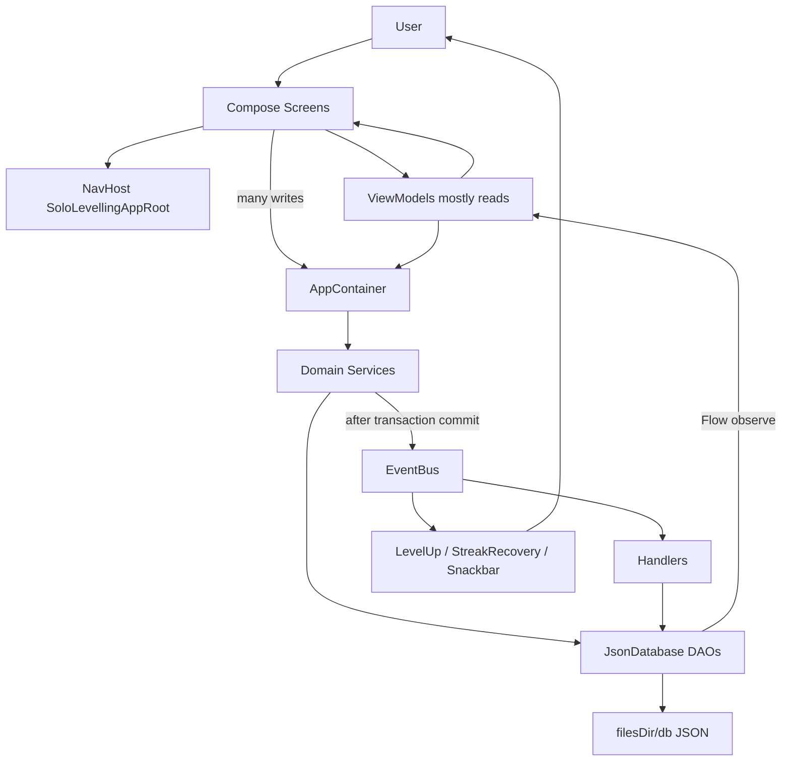
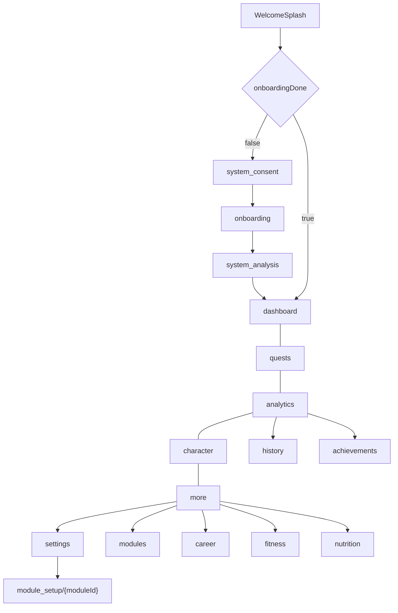
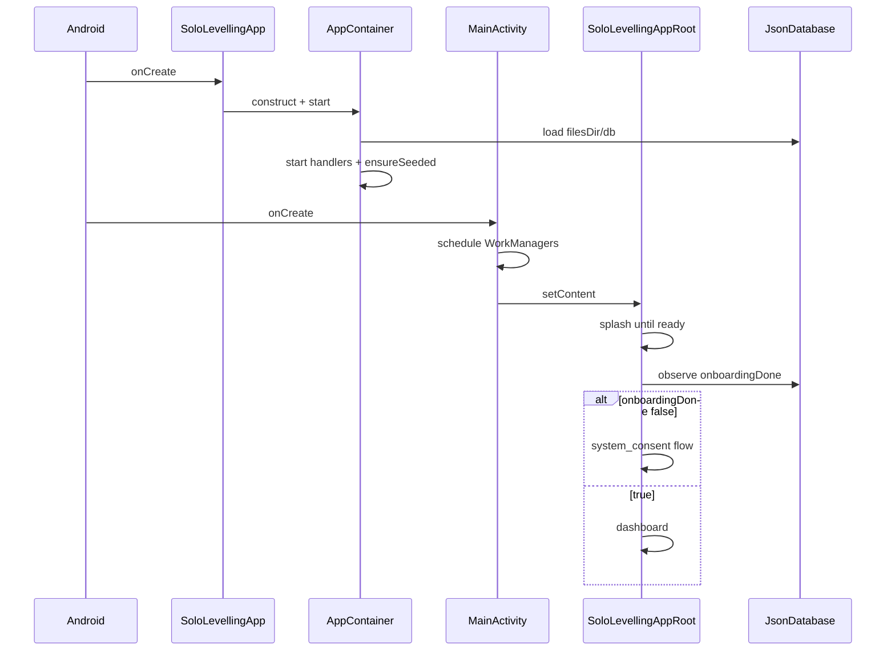
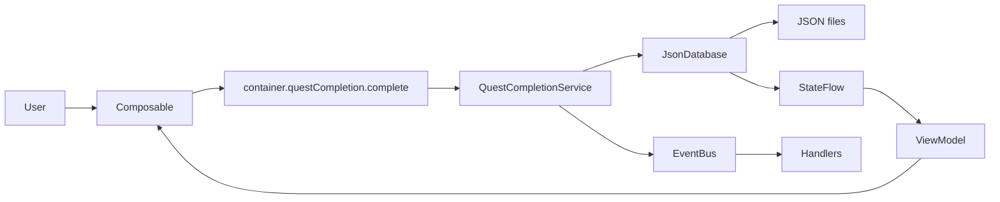
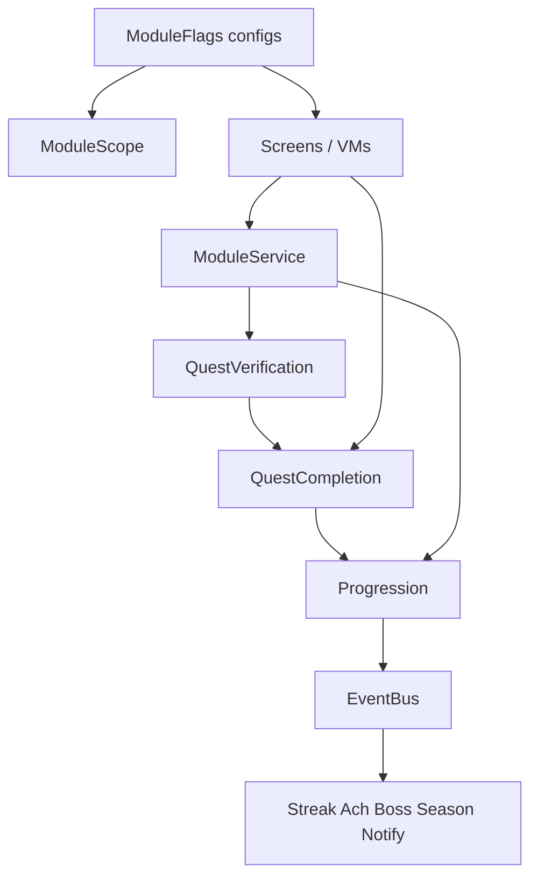
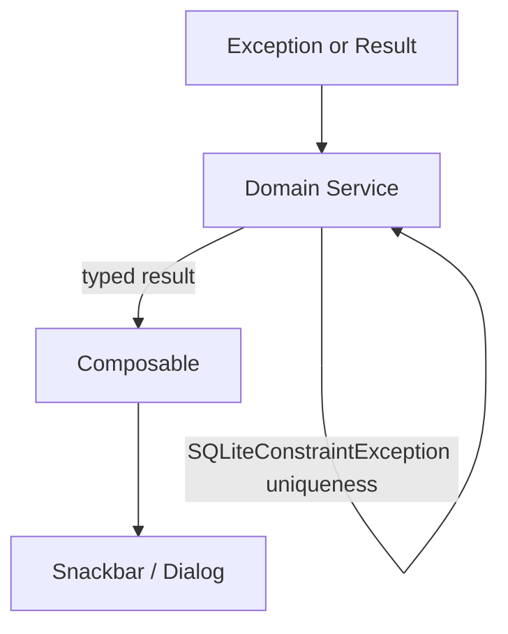
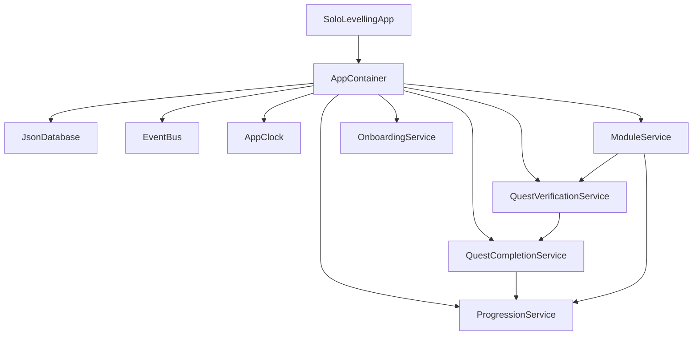
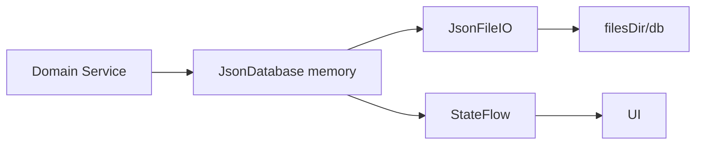

# Solo Levelling — Architecture & System Design

> **Canonical technical reference** for the running application.  
> Prefer this document for onboarding and architectural decisions.  
> Related: [SYSTEM_DESIGN.md](./SYSTEM_DESIGN.md) · [ARCHITECTURE_ANALYSIS.md](./ARCHITECTURE_ANALYSIS.md) · [APP_DOCUMENTATION.md](./APP_DOCUMENTATION.md) · [JSON_DATA_REFERENCE.md](./JSON_DATA_REFERENCE.md) · [README.md](../README.md)

**Generated:** 2026-08-20 from repository inspection + architecture analysis.  
**Source of truth:** Kotlin under `app/src/main/java/com/example/solo_levelling/`.  
**Rule:** When any document disagrees with code, **code wins**.

---

## CURRENT vs FUTURE

### CURRENT IMPLEMENTATION

| Topic | Owner / fact |
|-------|----------------|
| Persistence | `JsonDatabase` + Gson JSON files (not Room) |
| Product | Offline single-player; no auth/backend |
| Day boundary | `DayBoundaryCoordinator` → next local midnight one-time WorkManager |
| Timezone | Device timezone authoritative; synced into profile |
| Active modules | `ActiveProgressionReader` + `ModuleScope` (pause, don't purge) |
| Boss progress | `BossProgressHandler` + `BossProgressLogic` only |
| Quest completion | `QuestCompletionService` (core XP/status) |
| Post-completion critical | `PostQuestCompletionCoordinator` |
| Optional side effects | EventBus (notifications, UI overlays) |
| Sync | None — outbox removed |
| Recovery Quest | Removed from product |

### FUTURE PRODUCT INTENT

Auth, remote backend, Room/DataStore, real sync transport — not present in production code.

---

## Important correction (read first)

This is **not** a Flutter / Dart / BLoC application.

| Assumed (generic brief) | Actual implementation |
|-------------------------|------------------------|
| Flutter / `lib/` | Android single-module app (`:app`) |
| Dart + BLoC/Cubit | Kotlin + Jetpack Compose + `ViewModel` |
| Repository pattern | **No repositories** — domain **services** talk to DAOs |
| Remote REST API | **No network stack** — no `INTERNET` permission |
| Auth / sessions / tokens | **None** — single local player `PLAYER_ID = 1` |
| Room / SQLite / Hive | Custom **`JsonDatabase`** (Gson JSON files) |

Sections titled for BLoC / Repository / API below map those concepts to **what actually exists**.

---

## Table of contents

1. [Application overview](#1-application-overview)
2. [Architecture overview](#2-architecture-overview)
3. [Project structure](#3-project-structure)
4. [Feature / module inventory](#4-feature--module-inventory)
5. [Navigation architecture](#5-navigation-architecture)
6. [Authentication and session flow](#6-authentication-and-session-flow)
7. [State management architecture](#7-state-management-architecture-viewmodels--not-bloc)
8. [State ownership](#8-state-ownership)
9. [Data architecture](#9-data-architecture)
10. [Data models](#10-data-models)
11. [Data relationships / linking](#11-data-relationships--linking)
12. [Data storage architecture](#12-data-storage-architecture)
13. [API / backend architecture](#13-api--backend-architecture)
14. [Repository architecture](#14-repository-architecture)
15. [Data source architecture](#15-data-source-architecture-daos)
16. [Cross-module communication](#16-cross-module-communication)
17. [Single sources of truth](#17-single-sources-of-truth)
18. [Error handling](#18-error-handling)
19. [Theme and design system](#19-theme-and-design-system)
20. [Shared components](#20-shared-components)
21. [Dependency injection](#21-dependency-injection)
22. [Testing architecture](#22-testing-architecture)
23. [Build / environment](#23-build--environment-architecture)
24. [Security architecture](#24-security-architecture)
25. [Performance architecture](#25-performance-architecture)
26. [Complete data-flow examples](#26-complete-data-flow-examples)
27. [Architecture diagrams](#27-architecture-diagrams)
28. [Architectural risks](#28-architectural-risks)
29. [Technical debt](#29-technical-debt)
30. [Future scalability](#30-future-scalability)
31. [Developer onboarding guide](#31-developer-onboarding-guide)
32. [How to add a new feature](#32-how-to-add-a-new-feature)
33. [How to debug](#33-how-to-debug-the-application)
34. [Glossary](#34-glossary)
35. [Documentation vs code](#35-documentation-vs-code)
36. [Checklist](#36-documentation-checklist)

---

## 1. Application overview

### Purpose

**Solo Levelling** turns real-life discipline into an RPG loop: quests, XP, ranks, attributes, streaks, and achievements for career practice, fitness, nutrition, focus, and journaling.

UI branding uses a dark cyber “**Sovereign OS** / SYSTEM” voice; product inspiration is Solo Leveling.

### Core problem

Habit apps feel disposable. This app makes actions stick by:

1. Logging evidence (workout sets, meals, DSA solves, focus sessions, …)
2. Completing / auto-completing quests from that evidence
3. Awarding XP into an **append-only ledger**
4. Updating level, rank, attributes, streaks, achievements

All state stays local and inspectable as JSON under `filesDir/db/`.

### Primary user

A **single local player** on one device. There are no accounts. Identity is `SystemDefaults.PLAYER_ID = 1L` plus a display name in `user.json`.

### Major capabilities

| Area | Capability |
|------|------------|
| FTUE | Consent → dynamic onboarding → System Analysis ritual → Dashboard |
| Dashboard | Level, rank, XP, streak, today’s missions, FAB shortcuts |
| Quests | Today / weekly / milestone / recovery / bosses; complete & undo |
| Character | Attributes (STR, END, INT, VIT, DISC, FOC, WIS), ledger |
| Analytics | Weekly review, personal score, season, JSON export |
| Career module | DSA, system design, career nodes (opt-in) |
| Workout module | Routine, daily logs, rest days (opt-in) |
| Diet module | Meal / food logs (opt-in) |
| Life hub | Focus timer, journal, metrics, bosses, skills |
| Settings | Targets, modules, notifications, rebuild, wipe, export |
| Background | `DailyQuestWorker`, `DayBoundaryWorker` |

### Main user journey

```text
Install / cold start
  → SoloLevellingApp.onCreate → AppContainer.start (seed, handlers)
  → MainActivity → WelcomeSplash (≥3.2s)
  → if !onboardingDone: SystemConsent → Onboarding → SystemAnalysis → Dashboard
  → else: Dashboard
  → daily actions (log evidence / complete quests) → XP / streak / overlays
  → midnight-ish workers: miss quests, streak decay, regenerate quests
```

### Technology stack (actual)

| Layer | Technology |
|-------|------------|
| Language | Kotlin |
| UI | Jetpack Compose + Material 3 |
| Navigation | Navigation Compose (`NavHost`) |
| Async | Kotlin Coroutines + Flow |
| State (UI) | `ViewModel` + `StateFlow` + Compose `remember` |
| DI | Manual `AppContainer` (no Hilt/Koin) |
| Persistence | `JsonDatabase` + Gson + `JsonFileIO` under `filesDir/db/` |
| Background | WorkManager |
| Events | In-process `EventBus` (`MutableSharedFlow`) |
| Notifications | Local `SystemNotifier` (`POST_NOTIFICATIONS`) |
| Tests | JUnit 4, Robolectric, coroutines-test |

**Not present:** Flutter, Dart, BLoC, Room (runtime), DataStore, SharedPreferences, Firebase, Retrofit/OkHttp, remote auth.

---

## 2. Architecture overview

### Pattern summary

**Layered offline monolith** with:

- Compose presentation (screens + optional ViewModels)
- Manual composition-root DI
- Domain **command services** as the write API
- DAO interfaces over an in-memory + JSON file store
- EventBus for post-commit side effects

### Overall diagram



### Layers

| Layer | Responsibility | Allowed to access | Should NOT access |
|-------|----------------|-------------------|-------------------|
| **UI (`ui/`)** | Render, collect user input, navigate | ViewModels, `AppContainer` services, theme, chrome | File I/O, invent XP rules |
| **ViewModels** | Observe DAO Flows, hold ephemeral UI session state | `AppContainer`, DAOs via container, pure logic | Direct file writes |
| **Domain services** | Transactions, XP, quests, modules, onboarding | `JsonDatabase`, `EventBus`, `AppClock`, other services | Compose / Activity |
| **Handlers** | React to `DomainEvent` | DB, progression, notifier, season | UI widgets |
| **Data (`JsonDatabase`)** | Load/save JSON, DAO CRUD, mutex | `JsonFileIO`, entities | Domain rules beyond persistence |
| **Ports** | Future integrations | DB (metric), stubs for calendar/sync | Production network |
| **Workers** | Periodic quest gen / day boundary | `appContainer` services | UI |

### Documented vs actual

| Topic | Some older docs claim | Actual code |
|-------|----------------------|-------------|
| Persistence | Room (implementation-coverage) | `JsonDatabase` |
| Backend | Node/Postgres (PRD) | None |
| Primary tabs | 6 tabs / module-gated tabs (UI specs) | Fixed 5 tabs |
| Architecture | Clean + repositories | Services → DAOs |

---

## 3. Project structure

```text
solo-levelling/
├── app/                                 # Only Android application module
│   ├── build.gradle.kts
│   └── src/
│       ├── main/
│       │   ├── AndroidManifest.xml
│       │   ├── java/com/example/solo_levelling/
│       │   │   ├── AppContainer.kt      # Application + DI graph
│       │   │   ├── MainActivity.kt
│       │   │   ├── core/                # Defaults, clock, EventBus
│       │   │   ├── data/                # JsonDatabase, entities, seed
│       │   │   ├── domain/              # services, handlers, logic, ports
│       │   │   ├── ui/                  # Compose by feature folder
│       │   │   ├── work/                # WorkManager workers
│       │   │   ├── notifications/
│       │   │   └── docs/                # In-package PRD / UI specs (aspirational drift)
│       │   └── res/                     # fonts, raw audio, drawables, themes
│       ├── test/                        # JVM unit tests
│       └── androidTest/                 # 1 smoke instrumented test
├── docs/                                # Code-backed product/tech docs (this file lives here)
├── gradle/libs.versions.toml
└── README.md
```

There is **no** `lib/`, `features/` Flutter tree, `bloc/`, `repositories/`, or `datasources/` package naming.

### Package details

#### `core/`

| Path | Role |
|------|------|
| `core/config/SystemDefaults.kt` | `PLAYER_ID`, XP curve, ranks, daily cap, undo window |
| `core/event/EventBus.kt` | `MutableSharedFlow` bus |
| `core/event/DomainEvent.kt` | Sealed past-tense domain facts |
| `core/time/AppClock.kt` | `SystemAppClock` / `FakeAppClock` |

Depends on: nothing app-specific. Used by: domain, UI, data, tests.

#### `data/db/`

| Path | Role |
|------|------|
| `JsonDatabase.kt` | In-memory store + DAO impls + load/persist |
| `JsonFileIO.kt` | Atomic temp+rename writes |
| `JsonDatabaseModels.kt` | `UserJson`, `ProgressJson`, wrappers |
| `dao/Daos.kt` | `PlayerDao`, `QuestDao`, `XpDao`, `ConfigDao`, `AchievementDao`, `ModuleDao`, `OutboxDao` |
| `entity/Entities.kt` | All persistence entities |

#### `data/seed/`

| Path | Role |
|------|------|
| `SeedData.kt` | Templates, achievements, career/DSA/SD seed |
| `WorkoutCatalog.kt` | Splits/workouts/exercises (Kotlin only, not JSON files) |
| `FoodCatalog.kt` | Food macros reference (Kotlin only) |

#### `domain/service/`

Command API: `ProgressionService`, `QuestCompletionService`, `QuestVerificationService`, `QuestGenerationService`, `OnboardingService`, `ModuleService`, `ModuleLifecycleService`, `DayBoundaryService`, `AnalyticsService`, `SeasonService`, `MilestoneVerificationService`, `NutritionFeedbackService`, `PriorityEngine`, module progress helpers, etc.

#### `domain/handler/`

`StreakHandler`, `AchievementHandler`, `BossProgressHandler`, `NotificationHandler`, `SyncOutboxHandler`, `SeasonHandler` — started in `AppContainer.start()`.

#### `domain/logic/`

Pure policies: `ActivityDatePolicy`, `MealCompletionPolicy`, `StreakLogic`, `DayBoundaryLogic`, `BossProgressLogic`.

#### `domain/port/`

| Port | Impl | Used? |
|------|------|-------|
| `MetricIngestPort` | `LocalMetricIngest` | Yes (`ModulesScreen`) |
| `CalendarPort` | `NoOpCalendarPort` | **No call sites** |
| `SyncTransportPort` | `NoOpSyncTransport` | **Never pushed** |

#### `ui/`

Feature folders: `dashboard`, `quests`, `analytics`, `character`, `fitness`, `career`, `modules`, `settings`, `onboarding`, `consent`, `analysis`, `more`, `history`, `achievements`, `levelup`, `streak`, `navigation`, `theme`, `components`.

Root: `SoloLevellingAppRoot.kt`, `BootstrapViewModel.kt`, `WelcomeSplash.kt`.

#### `work/`

`DailyQuestWorker.kt`, `DayBoundaryWorker.kt` — scheduled from `MainActivity.onCreate`.

---

## 4. Feature / module inventory

| Module | Purpose | Main screens | State holder | Service(s) | Storage | Navigation |
|--------|---------|--------------|--------------|------------|---------|------------|
| Bootstrap | Seed + splash gate | `WelcomeSplash` | `BootstrapViewModel` | `OnboardingService`, `QuestGenerationService` | All seed tables | Outside NavHost |
| Consent | FTUE accept/decline | `SystemConsentScreen` | Compose local | — | Not persisted | `system_consent` |
| Onboarding | Name + modules + profiles | `OnboardingScreen` | Compose local → `OnboardingInput` | — (complete in analysis) | — | `onboarding` |
| System Analysis | Ritual + persist onboarding | `SystemAnalysisScreen` | `SystemAnalysisViewModel` | `OnboardingService.completeOnboarding` | user/progress/configs | `system_analysis` |
| Dashboard | Home missions | `DashboardScreen` | `DashboardViewModel` | Adaptive, PriorityEngine, modules | profile, quests, modules | `dashboard` (HOME) |
| Quests | Complete / undo | `QuestsScreen` | `QuestsViewModel` | `QuestCompletionService`, `MilestoneVerificationService` | `tasks/` | `quests` |
| Analytics | Score / export | `AnalyticsScreen` | Screen `remember` + service | `AnalyticsService` | ledger + modules | `analytics` (PROGRESS) |
| Character | Attributes / ledger | `CharacterScreen` | `CharacterViewModel` | DAO (+ ModuleFlags) | progress, ledger | `character` (SELF) |
| More | Hub | `MoreScreen` | Props only | — | — | `more` |
| Career | DSA / SD / roadmap | `CareerScreen` | `CareerViewModel` | `ModuleService` | dsa, topics, nodes | `career` |
| Fitness | Workout + diet | `FitnessScreen` | `FitnessViewModel` | `ModuleService`, `NutritionFeedbackService` | workouts/, diet/ | `fitness`, `nutrition` |
| Life modules | Focus / journal / metrics / bosses | `ModulesScreen` | `ModulesViewModel` + local timer | `ModuleService`, `LocalMetricIngest` | focus, journal, metrics, bosses | `modules` |
| Settings | Config / wipe | `SettingsScreen` | Screen local + DAO observe | `ModuleLifecycleService`, `OnboardingService` | `user.json` configs | `settings` |
| Module setup | Post-enable wizards | `ModuleSetupScreen` | Screen local | `ModuleLifecycleService` | configs + routine | `module_setup/{moduleId}` |
| History | XP history | `HistoryScreen` | `HistoryViewModel` | DAO | ledger | `history` |
| Achievements | Unlocks | `AchievementsScreen` | `AchievementsViewModel` | DAO + ModuleScope | achievements.json | `achievements` |
| Level-up overlay | Celebrate | `LevelUpHost` | `LevelUpViewModel` | EventBus, Analytics | — | Overlay |
| Streak recovery | Broken streak UI | `StreakRecoveryHost` | `StreakRecoveryViewModel` | EventBus | — | Overlay |

### Life modules (product)

| Flag / scope | Contents |
|--------------|----------|
| `module_career` | DSA, system design, career-tagged quests |
| `module_workout` | Workouts, `workout_daily`, steps quest |
| `module_diet` | Nutrition logs, `nutrition_daily` |
| **GLOBAL** (always) | Focus, journal, deep_work, recovery, bosses, achievements, untagged quests |

---

## 5. Navigation architecture

### Owner

- Routes: [`ui/navigation/AppRoute.kt`](../app/src/main/java/com/example/solo_levelling/ui/navigation/AppRoute.kt)
- Tab / bar / redirects: [`ui/navigation/ModuleNavigation.kt`](../app/src/main/java/com/example/solo_levelling/ui/navigation/ModuleNavigation.kt)
- Quest → screen: [`ui/navigation/QuestDestinationResolver.kt`](../app/src/main/java/com/example/solo_levelling/ui/navigation/QuestDestinationResolver.kt)
- Graph host: [`ui/SoloLevellingAppRoot.kt`](../app/src/main/java/com/example/solo_levelling/ui/SoloLevellingAppRoot.kt)

### Route catalog

| `AppRoute` | String | Bottom bar? | Tab family |
|------------|--------|-------------|------------|
| `SystemConsent` | `system_consent` | No | FTUE |
| `Onboarding` | `onboarding` | No | FTUE |
| `SystemAnalysis` | `system_analysis` | No | FTUE |
| `Dashboard` | `dashboard` | Yes | HOME |
| `Quests` | `quests` | Yes | QUESTS |
| `Analytics` | `analytics` | Yes | PROGRESS |
| `Character` | `character` | Yes | SELF |
| `More` | `more` | Yes | MORE |
| `Career` | `career` | Yes | MORE |
| `Fitness` | `fitness` | Yes | MORE |
| `Nutrition` | `nutrition` | Yes | MORE |
| `Modules` | `modules` | Yes | MORE |
| `Settings` | `settings` | Yes | MORE |
| `History` | `history` | Yes | PROGRESS |
| `Achievements` | `achievements` | Yes | PROGRESS |
| `ModuleSetup` | `module_setup/{moduleId}` | No | MORE |

### Navigation diagram



### Behavior notes

- **Root navigator:** single `NavHost` in `SoloLevellingAppRoot`.
- **Start destination:** locked once from `onboardingDone` (`dashboard` or `system_consent`). Completing onboarding later navigates with `popUpTo(0)` rather than rebuilding the graph.
- **Primary tabs:** HOME / QUESTS / PROGRESS / SELF / MORE — **not** module-filtered.
- **Wide layout:** NavigationRail at width ≥ 840dp.
- **Redirects:** disabled career/fitness/nutrition → dashboard. `modules` is **not** redirected when modules are off.
- **Auth guards:** none.
- **Deep links:** no Android App Links / URI deep links found. Cross-screen intent uses root Compose state (`modulesSection`, `careerSection`, `fitnessReviewDate`).
- **Parameters:** only `moduleId` on setup route; quest routing uses resolver + callbacks.
- **Overlays:** `LevelUpHost`, `StreakRecoveryHost` sit above NavHost (not routes).
- **Back:** standard Compose back stack; primary tab nav uses `popUpTo(startDestination)` with selective `restoreState`.

---

## 6. Authentication and session flow

### Status

**Authentication is not implemented.**

There is no login, logout, token store, refresh, OAuth, Firebase Auth, or multi-user switching.

### What exists instead



| Concern | Behavior |
|---------|----------|
| Session restoration | Local JSON reload at process start |
| “Logout” | Not applicable |
| Wipe | Settings → `OnboardingService.resetAllProgress()` → consent again |
| User switching | Not supported |
| Local data after wipe | Progress/logs/quests/XP cleared; name/configs/routine kept |

Consent acceptance is **not persisted** (shown on FTUE and after wipe).

---

## 7. State management architecture (ViewModels — not BLoC)

### Mapping

| BLoC concept | Actual |
|--------------|--------|
| Bloc / Cubit | `ViewModel` + `StateFlow` / Compose state |
| Event | Method call / coroutine from UI |
| State | `StateFlow` properties or `mutableStateOf` |
| Repository | Domain service / DAO |

### ViewModel inventory

| ViewModel | Feature | “Events” (methods / triggers) | State owned | Depends on | UI consumers |
|-----------|---------|-------------------------------|-------------|------------|--------------|
| `BootstrapViewModel` | Boot | init seed | `ready`, `onboardingDone` | `OnboardingService`, quest gen | `SoloLevellingAppRoot` |
| `DashboardViewModel` | Home | observe + dismiss suggestion | Home presentation flows | ModuleFlags, PriorityEngine, adaptive | `DashboardScreen` |
| `QuestsViewModel` | Quests | tab select, observe | `selectedTab`, quest lists | ModuleScope, MilestoneVerification | `QuestsScreen` |
| `FitnessViewModel` | Fitness/Diet | date select, post-meal feedback | selected dates, feedback | ModuleFlags, policies, NutritionFeedback | `FitnessScreen` |
| `CareerViewModel` | Career | observe | career flows | DAO | `CareerScreen` |
| `ModulesViewModel` | Life hub | observe | module flows | DAO | `ModulesScreen` |
| `CharacterViewModel` | Character | observe | profile/attrs | ModuleFlags | `CharacterScreen` |
| `HistoryViewModel` | History | observe | ledger | DAO | `HistoryScreen` |
| `AchievementsViewModel` | Achievements | observe | filtered defs | ModuleScope | `AchievementsScreen` |
| `SystemAnalysisViewModel` | FTUE | `start()` | phase, progress, finished | `OnboardingService` | `SystemAnalysisScreen` |
| `LevelUpViewModel` | Overlay | EventBus collect | pending level/rank event | EventBus, Analytics | `LevelUpHost` |
| `StreakRecoveryViewModel` | Overlay | EventBus collect | `StreakBroken` pending | EventBus | `StreakRecoveryHost` |

**Screens without ViewModels:** `SettingsScreen`, `AnalyticsScreen`, `MoreScreen`, `OnboardingScreen`, `SystemConsentScreen`, `ModuleSetupScreen` (service/DAO calls from composables).

### Typical write path (not BLoC)



### Side effects

After successful DB commits, services publish `DomainEvent`s. Handlers update streaks, achievements, bosses, season XP, notifications, sync outbox. UI overlays listen on the same bus.

---

## 8. State ownership

| State | Owner | Mutable by | Consumers | Persisted? | Source of truth |
|-------|-------|------------|-----------|------------|-----------------|
| Player identity / name | `user.json` profile | Onboarding / settings | Most screens | Yes | `user.json` |
| `onboardingDone` | profile | `OnboardingService` | Bootstrap, NavHost | Yes | `user.json` |
| Level / totalXp / rank | `progress.json` | `ProgressionService` | Dashboard, Character | Yes (snapshot) | Ledger is XP truth |
| Attributes | `progress.json` | Progression awards | Character | Yes | progress attributes |
| Streak | `progress.json` | StreakHandler, DayBoundary | Dashboard, overlays | Yes | streak entity |
| Module flags | `user.json` configs | Onboarding, ModuleLifecycle, Settings | Everywhere via `ModuleFlags` | Yes | config keys |
| Quest instances | `tasks/` | QuestGeneration / Completion | Quests, Dashboard | Yes | task files |
| Workout selected date | `FitnessViewModel` | User | FitnessScreen | No | VM |
| Quest tab | `QuestsViewModel` | User | QuestsScreen | No | VM |
| Nav start route | `SoloLevellingAppRoot` lock | First composition | NavHost | No | Derived from profile |
| FAB expanded | Root Compose | User | Scaffold | No | Root |
| Pending onboarding input | Root Compose | OnboardingScreen | SystemAnalysis | No | Root |
| Level-up overlay | `LevelUpViewModel` | EventBus | Host | No | Event stream |
| Consent accepted | — | — | Consent screen | **No** | N/A |
| Auth session | — | — | — | N/A | Not applicable |

### Duplicated / derived state

- `progress.totalXp` duplicates ledger sum (rebuild available).
- Profile merge at read time combines `user.json` + `progress.json`.
- `NutritionLogEntity` is a projection of `DietLogEntity`, not a separate file.

---

## 9. Data architecture

### Actual pipeline

```text
UI (Compose)
  ↓  observe
ViewModel / Screen  ←── DAO Flow (memory)
  ↓  command
Domain Service
  ↓  withTransaction
JsonDatabase DAO
  ↓  write-through
JsonFileIO → filesDir/db/*.json
  ↓  after commit
EventBus → Handlers → more DAO writes
```

### Layer contracts

| Layer | Input | Output | Errors |
|-------|-------|--------|--------|
| UI | User gestures | Service calls / navigation | Snackbars, dialogs |
| Service | IDs, entities, dates | Result types / Unit + events | Typed results, thrown constraints |
| DAO | Entities / queries | Entities / Flow | Mutex; uniqueness exceptions |
| Disk | Strings/JSON | Files | IO failures — limited UI mapping (**partial**) |

There is **no** Repository or remote DataSource layer in code.

---

## 10. Data models

Primary definitions: [`data/db/entity/Entities.kt`](../app/src/main/java/com/example/solo_levelling/data/db/entity/Entities.kt), wrappers in `JsonDatabaseModels.kt`, enums in [`domain/model/Models.kt`](../app/src/main/java/com/example/solo_levelling/domain/model/Models.kt).

| Model | Purpose | Key fields | Relationships | Created by | Stored in | Used by |
|-------|---------|------------|---------------|------------|-----------|---------|
| `PlayerProfileEntity` | Merged player view | id, name, level, totalXp, rank, timezone, onboardingDone, prioritiesCsv | Links to progress + user | Onboarding / Progression | Split user+progress | UI, services |
| `AttributeStatEntity` | Attribute scores | code, currentValue, lifetimeXp | Player | Seed / award | progress.json | Character, Progression |
| `StreakStateEntity` | Streak | current, best, lastCompletedDate, recoveryUsedThisWeek | Player | Seed / handlers | progress.json | Streak flows |
| `UserConfigEntity` | KV settings | key, value | User | Onboarding / Settings | user.json | ModuleFlags, targets |
| `QuestTemplateEntity` | Quest definition | id, key, type, baseXp, verification*, priorityTags, dependsOnTemplateKey | 1:N instances | Seed | quest_templates.json | Generation |
| `QuestInstanceEntity` | Scheduled quest | id, templateId, scheduledDate, status, denormalized fields | N:1 template; XP via sourceId | QuestGeneration | tasks/task-*.json | Completion UI |
| `XpLedgerEntryEntity` | XP fact | id, amount, sourceType, sourceId, metadataJson | Unique (sourceType, sourceId) | Progression | xp_ledger.json | All progression |
| `WorkoutRoutineEntity` | Weekly plan | mon–sun day plans | Planned exercises | Onboarding / split change | workouts/routine.json | Fitness |
| `WorkoutLogEntity` | Day log | date, exercises, restKind | Logged sets | ModuleService | workouts/logs/{date}.json | Fitness, verification |
| `DietLogEntity` | Day diet | date, meals, dailyTotals | Meals → foods | ModuleService | diet/logs/{date}.json | Fitness, verification |
| `DsaProblemEntity` | DSA bank | id, status, solvedAt… | — | Seed / ModuleService | dsa.json | Career |
| `SystemDesignTopicEntity` | SD curriculum | id, concepts[] | Concepts | Seed / ModuleService | career/system-design/topics.json | Career |
| `CareerNodeEntity` | Roadmap | track, orderIndex, status | — | Seed | career_nodes.json | Career |
| `BossEntity` / `BossQuestEntity` | Boss progress | target/current; bossId+templateKey | Boss ↔ template | Seed / handlers | bosses.json, boss_quests.json | Modules, handlers |
| `FocusSessionEntity` | Focus log | date, duration… | — | ModuleService | focus.json | Modules |
| `JournalEntryEntity` | Journal | date (1/day) | — | ModuleService | journal.json | Modules |
| `MetricLogEntity` | Steps/weight… | date, metricType, value | — | LocalMetricIngest | metrics.json | Modules, quests |
| `SeasonEntity` | Season window | seasonXp, status | Rebuilt from ledger | SeasonService | seasons.json | Analytics |
| `AchievementDef/Unlocked` | Achievements | key / achievementKey | — | Seed / AchievementHandler | achievements.json | Achievements UI |
| `SyncOutboxEntity` | Future sync | payload string | — | SyncOutboxHandler | sync_outbox.json | Settings observe |

Domain enums: `QuestStatus`, `QuestType`, `VerificationType`, `AttributeCode`.

Full field schemas: [JSON_DATA_REFERENCE.md](./JSON_DATA_REFERENCE.md).

---

## 11. Data relationships / linking

```text
PLAYER_ID = 1 (hardcoded)
 ├── user.json (identity + configs including module_* flags)
 ├── progress.json (level, XP snapshot, attributes, streak, nextIds)
 ├── xp_ledger.json  ← XP source of truth
 ├── quest_templates.json
 │      └── tasks/task-{id}.json  (templateId + scheduledDate unique)
 ├── achievements.json
 ├── seasons / skills / bosses / boss_quests
 ├── career_nodes / dsa / system-design topics
 ├── focus / journal / metrics / routines / dismissed / sync_outbox
 ├── workouts/routine.json
 └── workouts/logs/{date}.json
 └── diet/logs/{date}.json
```

| Relationship | How linked |
|--------------|------------|
| Instance → Template | `templateId` |
| Template dependency | `dependsOnTemplateKey` |
| XP → Quest | `sourceType=QUEST_INSTANCE`, unique `sourceId` family |
| Boss ↔ Template | `BossQuestEntity.templateKey` |
| Module enablement | String config keys (not FKs) |
| Day logs | ISO date string as file key |
| Nav “IDs” | Mostly callbacks + root remembered strings |

**IDs:** Monotonic counters in `progress.nextIds` (via DAO insert helpers).

---

## 12. Data storage architecture

### Technology: JsonDatabase only

| Aspect | Detail |
|--------|--------|
| Root | `{context.filesDir}/db/` |
| Format | UTF-8 JSON via Gson |
| Atomicity | Write `*.tmp` then rename (`JsonFileIO`) |
| Concurrency | Coroutine `writeMutex` / `withTransaction` |
| Cache | Full in-memory mirror + per-observe `MutableStateFlow` |
| Encryption | **None** |
| Remote | **None** |

**Not used:** SharedPreferences, DataStore, Room, SQLite DB, Hive, SecureStorage, Firebase.

### Storage table

| Data | Storage | Key/ID | Writer | Reader | Lifetime | Sensitive? |
|------|---------|--------|--------|--------|----------|------------|
| Profile identity | user.json | player id | Onboarding/Settings | PlayerDao | Until uninstall / wipe partial | Name only |
| Configs / modules | user.json configs | key | Lifecycle/Onboarding | ConfigDao | Survives reset | Body metrics etc. |
| Progress snapshot | progress.json | player | Progression | PlayerDao | Cleared on reset | No |
| XP ledger | xp_ledger.json | entry id | Progression | XpDao | Cleared on reset | No |
| Quests | tasks/ | instance id | Generation/Completion | QuestDao | Cleared on reset | No |
| Workout routine | workouts/routine.json | singleton | Onboarding/split | ModuleDao | **Survives reset** | No |
| Workout logs | workouts/logs/{date}.json | date | ModuleService | ModuleDao | Cleared on reset | No |
| Diet logs | diet/logs/{date}.json | date | ModuleService | ModuleDao | Cleared on reset | No |
| Sync outbox | sync_outbox.json | id | SyncOutboxHandler | OutboxDao | Cleared on reset; never flushed | Event strings |

### Reset vs reinstall

| Event | Result |
|-------|--------|
| Settings wipe | Keep name/timezone/priorities/configs/routine; clear progress/XP/quests/logs; `onboardingDone=false` |
| Uninstall | Entire `filesDir` gone |
| Upgrade | Files persist; legacy flat workout/nutrition migrated once |

---

## 13. API / backend architecture

### Status

**No HTTP API, no base URL, no endpoints, no auth headers, no pagination, no remote caching.**

PRD (`app/.../docs/app-architecture.md`) describes a Node/Postgres backend — **not present in this repository**.

### Future hooks only

| Piece | Behavior today |
|-------|----------------|
| `SyncOutboxHandler` | Appends every `DomainEvent.toString()` to outbox |
| `SyncTransportPort.push` | `NoOpSyncTransport` returns 0; **not called** |
| `CalendarPort` | Empty busy blocks; **unused** |

### Endpoint table

| Endpoint | Method | Purpose | Request | Response | Auth | Consumer |
|----------|--------|---------|---------|----------|------|----------|
| — | — | **Not determinable / none exist** | — | — | — | — |

---

## 14. Repository architecture

### Status

**There is no Repository layer.**

Closest equivalents:

| “Repository” role | Actual class |
|-------------------|--------------|
| Quest writes | `QuestCompletionService`, `QuestGenerationService` |
| Progression | `ProgressionService` |
| Module activity | `ModuleService` |
| Settings / flags | `OnboardingService`, `ModuleLifecycleService`, `ConfigDao` |
| Analytics reads | `AnalyticsService` |

| Logical area | Responsibility | Data access | Consumers | Source of truth |
|--------------|----------------|-------------|-----------|-----------------|
| Progression “repo” | Award/reverse XP | XpDao, PlayerDao | Completion, ModuleService, handlers | xp_ledger |
| Quest “repo” | Instances/templates | QuestDao | Generation, Completion, UI | tasks + templates |
| Module “repo” | Fitness/career/life writes | ModuleDao | UI screens, verification | module JSON files |

---

## 15. Data source architecture (DAOs)

DAOs are interfaces in `Daos.kt`, implemented as private inner classes inside `JsonDatabase`.

| DAO | External system | Responsibility | Consumers |
|-----|-----------------|--------------|-----------|
| `PlayerDao` | user.json + progress.json | Profile merge, attributes, streak | Progression, onboarding, VMs |
| `QuestDao` | templates + tasks/ | Template/instance CRUD | Quest services |
| `XpDao` | xp_ledger.json | Append-only ledger | Progression, History |
| `ConfigDao` | user.json configs | KV get/set/observe | ModuleFlags, Settings |
| `AchievementDao` | achievements.json | Defs + unlocks | Handlers, UI |
| `ModuleDao` | module JSON tree | Fitness/diet/career/life | ModuleService, Fitness, metrics |
| `OutboxDao` | sync_outbox.json | Outbox append/list | SyncOutboxHandler, Settings |

**Local vs remote:** all local. No remote data source classes.

---

## 16. Cross-module communication



| Mechanism | Used for |
|-----------|----------|
| Direct service calls | Logging, complete/undo, onboarding |
| Shared DB Flows | Live UI refresh across screens |
| EventBus | Side effects + overlays |
| Config keys | Module enable/disable |
| Navigation callbacks + root state | Open Fitness/Career/Modules with section |
| ModuleScope | Filter quests/XP/achievements |

### Circular dependencies

No hard constructor cycle A→B→A. Soft runtime cascades: `ModuleService` → `QuestVerification` → `QuestCompletion` → events → handlers → more `ProgressionService.award`.

---

## 17. Single sources of truth

| Data | Source of truth | Cached elsewhere? | Sync mechanism |
|------|-----------------|-------------------|----------------|
| XP | `xp_ledger.json` | `progress.totalXp` | `rebuildActiveFromLedger` / award path |
| Level / rank | Derived from allowed XP | progress.json | Recomputed on award/rebuild |
| Quest state | `tasks/task-*.json` | Denormalized fields on instance | Direct updates |
| Module on/off | `user.json` config keys | In-memory Flows | `writeModuleFlags` |
| Workout history | `workouts/logs/{date}.json` | — | Direct |
| Nutrition | `diet/logs/{date}.json` | NutritionLog projection | Direct |
| Workout plan | `workouts/routine.json` | Built from WorkoutCatalog at setup | Direct |
| Catalogs | Kotlin seed objects | — | Compile-time |
| Auth | N/A | — | — |

### Sync issues

- Attributes / some Character & History views are **not fully module-isolated** when modules toggle.
- Export / unfiltered ledger can disagree with module-scoped analytics sums.
- Season XP rebuilt from ledger; outbox never transported.

---

## 18. Error handling



| Kind | Handling |
|------|----------|
| Quest complete failures | Result types → dialogs (e.g. milestone not ready) / messages |
| Module disabled | Completion rejected |
| Date policy | Writes/completes blocked for non-writable dates |
| Validation | `EntryValidation` in UI forms |
| Storage IO | Limited centralized mapping — **partial / TBD for all paths** |
| Network | N/A |
| Auth | N/A |

No global `UiState.Error` sealed hierarchy across all screens.

---

## 19. Theme and design system

| Token | File | Notes |
|-------|------|-------|
| Colors | `ui/theme/Color.kt` | Deep Space; primary `#A2C9FF` |
| Theme | `ui/theme/Theme.kt` | Forced dark; dynamic color ignored |
| Typography | `ui/theme/Type.kt` | Inter (human) + JetBrains Mono (system); `CascadiaCode` alias → Mono |
| Shape | `ui/theme/Shape.kt` | Chip 20 / button 8 / card 12 / hero 24 |
| Spacing | `ui/theme/Spacing.kt` | 4dp grid |

Entry: `MainActivity` → `SololevellingTheme` → `SoloLevellingAppRoot`.

Older UI docs saying “Cascadia everywhere” / primary `#4DA3FF` are **stale** relative to `Type.kt` / `Color.kt`.

---

## 20. Shared components

| Component area | Location | Purpose | Consumers |
|----------------|----------|---------|-----------|
| `SovereignChrome.kt` | `ui/components/` | Glass surfaces, headers, buttons, progress, cards, dialogs | Most screens |
| `SovereignHelpers.kt` | `ui/components/` | Pure helpers (nav family, greetings, attribute display) | UI + unit tests |
| `SystemMessages` | `domain/copy/` | RPG copy strings | UI, NutritionFeedback, LevelUp |
| Theme tokens | `ui/theme/` | Design tokens | All Compose |

Many screens still define local `*Card` helpers — shared library is **partial**, not exhaustive.

---

## 21. Dependency injection

### Registration

Single composition root: [`AppContainer.kt`](../app/src/main/java/com/example/solo_levelling/AppContainer.kt)

```text
SoloLevellingApp.onCreate
  → AppContainer(this)
  → container.start()  // handlers + async seed
Context.appContainer extension for Activity/Workers
```

### Lifetime

| Object | Lifetime |
|--------|----------|
| `AppContainer` and all wired services | Application singleton |
| Handlers | Started once; collect forever on IO scope |
| ViewModels | `ViewModelStore` / navigation back stack |
| `JsonDatabase` | One per process (loads all JSON at init) |

### ViewModel factories

Hand-written `ViewModelProvider.Factory` taking `AppContainer` (e.g. `BootstrapViewModel.factory(container)`).

### Dependency diagram



---

## 22. Testing architecture

| Kind | Location | Approach |
|------|----------|----------|
| Unit | `app/src/test/` (~82 files) | Real `JsonDatabase` temp dirs, `FakeAppClock`, real EventBus |
| Pure logic | same | No Android |
| Robolectric | subset | Application context |
| Instrumented | `androidTest/ExampleInstrumentedTest` | Package name smoke only |
| Compose UI | **None exercised** despite deps | Helper-function tests instead |

### Coverage snapshot

| Feature | Unit | ViewModel | Widget/Compose | Integration-style |
|---------|------|-----------|----------------|-------------------|
| Progression / quests | Strong | Weak | No | Strong isolation tests |
| Module policies | Strong | — | Helpers | Yes |
| JsonDatabase | Yes | — | — | Yes |
| Navigation helpers | Yes | — | — | — |
| Workers | **No** | — | — | Thin touch only |
| Handlers (notify/sync) | **Mostly no** | — | — | Partial via undo tests |
| Dashboard/Fitness VMs | Helpers only | **Mostly no** | No | No |

**Mocking:** No Mockito/MockK in the dominant pattern.

---

## 23. Build / environment architecture

| Item | Value |
|------|-------|
| AGP | 9.1.0 (see version catalog) |
| Kotlin | 2.0.21 |
| compileSdk / targetSdk | 37 |
| minSdk | 23 |
| Java | 11 + desugaring |
| Flavors | **None** (debug/release only) |
| ProGuard minify | Disabled in release |
| Firebase | **Absent** |
| CI/CD | **Absent** (no `.github/workflows`) |
| Environments | No staging/prod config split |
| Signing | Standard Android debug; release signing **Not fully documented in-repo** |

Commands:

```bash
./gradlew assembleDebug
./gradlew test
./gradlew :app:testDebugUnitTest
```

---

## 24. Security architecture

| Topic | Status |
|-------|--------|
| AuthN/AuthZ | None |
| Token storage | N/A |
| Encryption at rest | None — plain JSON in app-private storage |
| Network secrets | No INTERNET; no API keys in app code found |
| Sensitive data | Body metrics, journal text in local files |
| Notifications permission | Runtime `POST_NOTIFICATIONS` |
| Backup | `data_extraction_rules` / backup rules in `res/xml` — inspect for export surface |

### Risks

- Device compromise / backup can expose all progress and personal logs.
- Sync outbox stores event `toString()` locally forever.
- Wipe is in-app only; no remote revoke.

Do not commit secrets. None are required for the offline MVP.

---

## 25. Performance architecture

| Area | Current approach | Concern |
|------|------------------|---------|
| Persistence | Full DB in memory | Growth of logs/ledger increases RAM + startup load |
| Lists | Compose Lazy lists in screens | Large ledger History may get heavy |
| Images | Minimal (launcher, silhouette) | N/A network images |
| Rebuilds | `WhileSubscribed(5_000)` on Flows | Generally fine |
| API | None | — |
| Pagination | None for ledger | May need later |
| Workers | 1-day periodic | Not precise midnight |
| Event storm | One complete → many handlers | Cascade cost on main IO scope |

---

## 26. Complete data-flow examples

### 26.1 Cold start → Dashboard

```text
Android launches SoloLevellingApp
  → AppContainer constructed (db load from filesDir/db)
  → container.start(): handlers + ensureSeeded + maybe generateForToday
MainActivity.onCreate
  → schedule DailyQuestWorker + DayBoundaryWorker
  → setContent(SoloLevellingAppRoot)
BootstrapViewModel: ensureSeeded → ready=true
WelcomeSplash until ready && 3.2s
NavHost startDestination from onboardingDone
  → DashboardScreen + DashboardViewModel observe DAO Flows
```

### 26.2 Onboarding complete

```text
OnboardingScreen builds OnboardingInput
  → SoloLevellingAppRoot.pendingOnboardingInput
  → navigate system_analysis
SystemAnalysisViewModel.start
  → OnboardingService.completeOnboarding(input)
      → writeModuleFlags, applyModuleConfiguration, onboardingDone=true
      → questGeneration.generateForToday → DailyQuestsReady event
  → navigate dashboard popUpTo(0)
```

### 26.3 Complete quest (manual)

```text
QuestsScreen / DashboardScreen
  → container.questCompletion.complete(instanceId)
QuestCompletionService (mutex)
  → ModuleScope check, milestone check, ActivityDatePolicy
  → transaction: ProgressionService.awardWithinTransaction + mark COMPLETED
  → publish QuestCompleted + XpAwarded + LevelUp?/RankUp?
Handlers: Streak, Boss, Achievement, Season, Notification, Outbox
QuestGenerationService may unlock dependents
UI Flows recompose; LevelUpHost may show
```

### 26.4 Log workout → auto-complete

```text
FitnessScreen saves sets
  → container.modules.upsertWorkoutLog(...)
ModuleService
  → persist workouts/logs/{date}.json
  → ProgressionService.award(WORKOUT, ...)
  → questVerification.tryAutoComplete(date)
      → may questCompletion.complete(workout_daily)
```

### 26.5 Log meals → nutrition quest

```text
FitnessScreen (Diet tab)
  → modules.upsertDietLog / addMeal / upsertFood
  → if MealCompletionPolicy complete (≥3 valid meals): award NUTRITION XP
  → tryAutoComplete → nutrition_daily
FitnessViewModel may show NutritionFeedbackService copy
```

### 26.6 Day boundary

```text
DayBoundaryWorker.doWork
  → dayBoundary.runDailyBoundary(timezone)
      → mark yesterday incomplete → MISSED + QuestMissed events
      → streak decay / StreakBroken + maybe recovery quest
  → questGeneration.generateForToday
```

### 26.7 Module disable

```text
SettingsScreen → moduleLifecycle.applyModuleChanges
  → OnboardingService.writeModuleFlags
  → progression.rebuildActiveFromLedger
  → season.rebuildFromLedger
  → questGeneration.generateForToday (reconcile orphans)
  → redirect disabled routes to dashboard
```

### 26.8 Wipe progress

```text
Settings CONFIRM_WIPE
  → onboarding.resetAllProgress
  → clearProgressTables + ensureSeeded
  → navigate system_consent popUpTo(0)
```

---

## 27. Architecture diagrams

### Overall (see also §2)

Already covered in §2 Mermaid.

### Navigation

See §5 Mermaid.

### Authentication

See §6 — onboarding gate only; no auth.

### State / write flow

See §7 Mermaid.

### Storage



### Module dependencies

See §16 Mermaid.

---

## 28. Architectural risks

### Critical

| Problem | Location | Why it matters | Impact | Direction |
|---------|----------|----------------|--------|-----------|
| Event cascade + nested XP awards | Handlers + ProgressionService | Hard to reason about partial failure / ordering | Incorrect XP/streak/achievements under races | Serialize side effects or single orchestrator |
| Incomplete module isolation | Attributes, Character, History, export | Disabled modules still “feel” present | Confusing progress / trust | Rebuild attributes; filter all surfaces |
| Dual recovery quest spawn | DayBoundaryService + StreakHandler | Same template, two triggers | Duplicate recovery quests | One owner |
| Dual boss progress paths | BossProgressHandler vs ModuleService.addBossProgress | Two writers | Double awards / inconsistent progress | Unify |

### High

| Problem | Location | Impact | Direction |
|---------|----------|--------|-----------|
| UI writes bypass ViewModels | Many screens | Harder testing / inconsistent validation | Thin use-case API |
| WorkManager 1-day ≠ TZ midnight | workers | Missed boundary timing | Exact alarm / TZ-aware schedule |
| Sync outbox unbounded | SyncOutboxHandler | Disk growth | Cap / implement transport / disable |

### Medium

| Problem | Location | Impact | Direction |
|---------|----------|--------|-----------|
| Large `ModuleService` | domain/service | Change risk | Split by module later |
| Nav start route lock | SoloLevellingAppRoot | Edge remount cases | Document / remount on wipe |
| Doc drift | PRD / UI specs | Wrong mental model | Point to this doc |

### Low

| Problem | Location | Impact | Direction |
|---------|----------|--------|-----------|
| Unused Room/DataStore catalog | gradle | Confusion | Remove or use |
| PriorityEngine unused in UI | Dashboard | Dead computation | Wire or remove |
| Cascadia alias leftover | Type.kt | Naming confusion | Docs already note alias |

---

## 29. Technical debt

- PRD still describes Room / backend / auth MVP items.
- README still mentions flat `workouts.json` / `nutrition.json` in places.
- UI specs describe 6-tab / module-gated primary nav.
- `QuestStatus.IN_PROGRESS` never written in production paths.
- `QuestType.BOSS` unused on templates (bosses are entities).
- Compose UI test artifacts unused.
- No CI, no coverage tooling, ProGuard off.
- Copy-pasted card helpers across screens.
- `calendarPort` / `syncTransport` wired but unused.

---

## 30. Future scalability

| Growth | Current fitness | Likely change needed |
|--------|-----------------|----------------------|
| More features | Service monolith grows | Split ModuleService; clearer UI command layer |
| More data years | Full in-memory JSON | Pagination, archival, or real DB |
| Multi-device / users | Single PLAYER_ID | Real auth + sync transport |
| Backend | Outbox stub only | Implement `SyncTransportPort` + conflict rules |
| Platforms | Android only | Shared KMP domain possible later |
| Notifications | Local only | Push would need backend |
| Analytics product | Local export | Privacy-preserving telemetry if ever added |

Offline-first design is a strength for single-player; networked multiplayer would be a **new architecture**, not a small patch.

---

## 31. Developer onboarding guide

### How a new developer should understand this project

1. Read **this file** (`docs/architecture-and-system-design.md`)
2. Skim [README.md](../README.md) for build commands
3. Read [JSON_DATA_REFERENCE.md](./JSON_DATA_REFERENCE.md) when touching persistence
4. Open [`AppContainer.kt`](../app/src/main/java/com/example/solo_levelling/AppContainer.kt) — entire DI graph
5. Open [`SoloLevellingAppRoot.kt`](../app/src/main/java/com/example/solo_levelling/ui/SoloLevellingAppRoot.kt) — navigation shell
6. Open [`AppRoute.kt`](../app/src/main/java/com/example/solo_levelling/ui/navigation/AppRoute.kt) + `ModuleNavigation.kt`
7. Trace one write: `QuestCompletionService` → `ProgressionService` → `EventBus` → `StreakHandler`
8. Trace one module write: `ModuleService.upsertWorkoutLog` → verification → completion
9. Read `SystemDefaults.kt` for game rules
10. Run `./gradlew test` and open a failing test pattern under `app/src/test/.../domain/service/`

### Treat as historical / aspirational

- `app/.../docs/app-architecture.md` (server PRD)
- `implementation-coverage.md` (Room claims)
- `ui-design.md` (older IA)

---

## 32. How to add a new feature

Adapt to **this** codebase (not Flutter feature folders):

```text
Requirement
  ↓
Decide module scope (CAREER / WORKOUT / DIET / GLOBAL) via ModuleFlags / ModuleScope
  ↓
Entity + JsonDatabase field + DAO methods + persist path (if new storage)
  ↓
SeedData if catalog needed
  ↓
Domain service method (prefer existing ModuleService or small new service wired in AppContainer)
  ↓
Optional DomainEvent + handler (only for cross-cutting side effects)
  ↓
ViewModel observe Flows (reads) + screen calls service (writes) — match local pattern
  ↓
AppRoute + SoloLevellingAppRoot entry + More/Dashboard links
  ↓
SystemMessages copy if user-facing SYSTEM voice
  ↓
Unit tests: positive / negative / edge with temp JsonDatabase + FakeAppClock
```

**Do not** add a Repository/BLoC layer unless the project explicitly adopts that migration.

Keep changes simple: prefer extending existing services over new abstraction layers.

---

## 33. How to debug the application

### UI problem

```text
Screen composable
  → ViewModel StateFlow / remember state
  → SovereignChrome / theme
  → SoloLevellingAppRoot callbacks (navigation props)
```

### State / quest / XP problem

```text
Service entry (QuestCompletion / ModuleService / Progression)
  → db.withTransaction
  → xp_ledger.json + progress.json on device
  → EventBus subscribers (handlers)
```

Inspect device files: `adb shell run-as com.example.solo_levelling ls files/db/`.

### “Data source” problem

```text
DAO method in JsonDatabase
  → in-memory collection
  → JsonFileIO write
  → corrupt/partial JSON (loadAll behavior)
```

### Navigation problem

```text
AppRoute string
  → SoloLevellingAppRoot NavHost
  → ModuleNavigation redirects (disabled modules)
  → QuestDestinationResolver for quest taps
  → root remembered section/date params
```

### Worker / streak overnight problem

```text
DayBoundaryWorker / DailyQuestWorker
  → DayBoundaryService / QuestGenerationService
  → profile.timezone
  → WorkManager constraints (1-day period drift)
```

### Overlay not showing

```text
Event published after commit?
  → LevelUpViewModel / StreakRecoveryViewModel collecting?
  → Host composed in SoloLevellingAppRoot Box?
```

---

## 34. Glossary

| Term | Meaning in this project |
|------|-------------------------|
| **AppContainer** | Manual DI composition root / service locator |
| **Attribute** | One of STR/END/INT/VIT/DISC/FOC/WIS progression stats |
| **DAO** | Interface over JsonDatabase collections (not Room) |
| **DomainEvent** | Past-tense fact on EventBus after commit |
| **EventBus** | In-process `SharedFlow` of domain events |
| **GLOBAL module** | Always-on life systems (focus, journal, recovery, …) |
| **JsonDatabase** | Custom Gson file DB under `filesDir/db/` |
| **Ledger** | Append-only `xp_ledger.json` — XP source of truth |
| **ModuleFlags** | Config-driven enablement of career/workout/diet |
| **ModuleScope** | Maps quests/XP/achievements to a module id |
| **PLAYER_ID** | Hardcoded `1L` local player |
| **Quest instance** | Scheduled concrete quest file in `tasks/` |
| **Quest template** | Definition in `quest_templates.json` |
| **Service** | Domain command orchestrator (replaces “repository” role) |
| **Sovereign OS** | UI brand / chrome language |
| **SYSTEM** | Mentor-tone copy voice (`SystemMessages`) |
| **ViewModel** | AndroidX UI state holder (not BLoC) |
| **Worker** | WorkManager periodic job |
| **Repository** | **Not used** in this codebase |
| **BLoC** | **Not used** in this codebase |

---

## 35. Documentation vs code

| Topic | Documented elsewhere | Actual |
|-------|---------------------|--------|
| Flutter/BLoC architecture | Generic external briefs | Kotlin Compose + services |
| Room database | implementation-coverage | JsonDatabase |
| Backend authoritative | app-architecture.md PRD | No backend |
| 6 primary tabs | ui-design.md | 5 fixed tabs |
| Cascadia-only type | older UI docs | Inter + JetBrains Mono |
| Daily XP cap 300 | PRD example | **500** in SystemDefaults |
| Nutrition quest = macros | PRD | **≥3 valid meals** (`MealCompletionPolicy`) |

---

## 36. Documentation checklist

- [x] Application overview
- [x] Technology stack (actual)
- [x] Project structure
- [x] Architecture
- [x] Feature map
- [x] Navigation
- [x] Authentication (absent — documented)
- [x] State management (ViewModels)
- [x] State ownership
- [x] Data models
- [x] Data relationships / linking
- [x] “Repositories” (mapped to services)
- [x] Data sources (DAOs)
- [x] API (none)
- [x] Local storage
- [x] Persistence
- [x] Cross-module communication
- [x] Single sources of truth
- [x] Error handling
- [x] Theme / design system
- [x] Shared components
- [x] Dependency injection
- [x] Testing
- [x] Build / environment
- [x] Security
- [x] Performance
- [x] Architecture diagrams
- [x] Data-flow examples
- [x] Storage diagrams
- [x] Module dependency diagrams
- [x] Architectural risks
- [x] Technical debt
- [x] Scalability
- [x] Developer onboarding
- [x] Feature development workflow
- [x] Debugging guide
- [x] Glossary

---

*End of canonical architecture & system design reference. No application code was modified to produce this document.*
